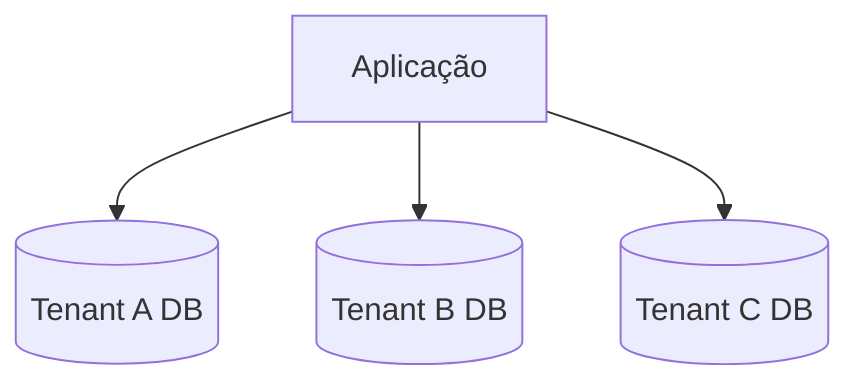
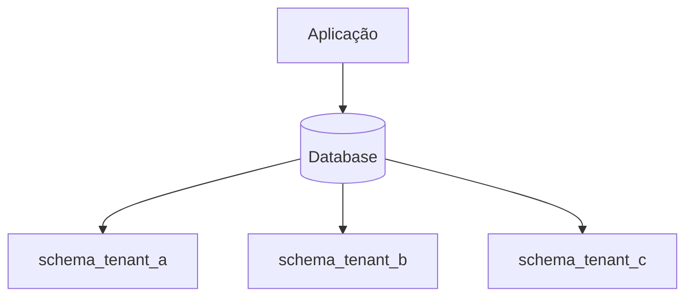
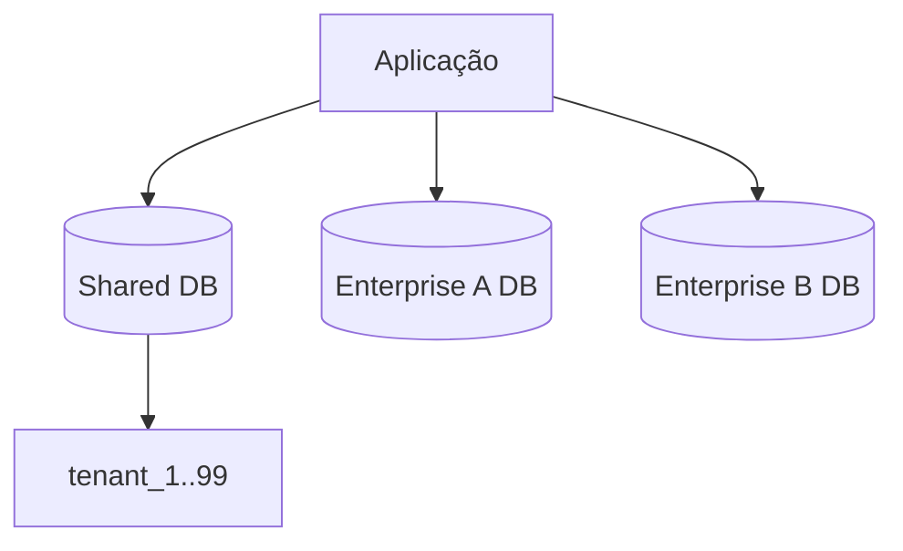

# Guia de Multi-tenancy

> **Prioridade**: 🟡 MÉDIA  
> **Aplicável a**: SaaS, plataformas com múltiplos clientes/organizações

---

## O que é Multi-tenancy?

Multi-tenancy é uma arquitetura onde uma única instância de software serve múltiplos clientes (tenants) com isolamento de dados.

```
┌─────────────────────────────────────────────────────────┐
│                    Aplicação SaaS                       │
├─────────────────────────────────────────────────────────┤
│  Tenant A  │  Tenant B  │  Tenant C  │  Tenant D        │
│  (Empresa X)│ (Empresa Y) │ (Startup Z)│ (Corp W)       │
└─────────────────────────────────────────────────────────┘
```

---

## Modelos de Isolamento

### 1. Database per Tenant

Cada tenant tem seu próprio banco de dados.



| Prós | Contras |
|------|---------|
| Isolamento máximo | Maior custo de infra |
| Fácil backups por tenant | Complexidade operacional |
| Boa para compliance | Migrations em muitos DBs |
| Customização por tenant | Não escala para muitos tenants |

**Usar quando**: Enterprise customers, compliance rígido (HIPAA, PCI), <100 tenants

### 2. Schema per Tenant

Um banco, mas schemas separados por tenant.



| Prós | Contras |
|------|---------|
| Bom isolamento | Migrations por schema |
| Mais barato que DB separado | Limite de schemas |
| Fácil backup por tenant | Consultas cross-tenant complexas |

**Usar quando**: Poucas centenas de tenants, isolamento importante

### 3. Row-Level Security (Shared Database)

Todos os tenants na mesma tabela, filtrados por tenant_id.

```sql
-- Todas as tabelas têm tenant_id
CREATE TABLE orders (
    id UUID PRIMARY KEY,
    tenant_id UUID NOT NULL,
    customer_name VARCHAR(255),
    ...
);

CREATE INDEX idx_orders_tenant ON orders(tenant_id);
```

| Prós | Contras |
|------|---------|
| Escala para milhares de tenants | Risco de vazamento de dados |
| Operação simples | Queries precisam sempre filtrar |
| Migrations únicas | Backup por tenant é complexo |
| Menor custo | Menos isolamento de performance |

**Usar quando**: Muitos tenants pequenos (1000+), dados similares, startups

### 4. Híbrido

Tenants pequenos compartilham, grandes têm DB próprio.



**Usar quando**: Freemium + Enterprise, mix de necessidades

---

## Implementação: Row-Level Security

### PostgreSQL RLS

```sql
-- Habilitar RLS
ALTER TABLE orders ENABLE ROW LEVEL SECURITY;

-- Policy: usuários só veem dados do seu tenant
CREATE POLICY tenant_isolation ON orders
    FOR ALL
    USING (tenant_id = current_setting('app.current_tenant')::uuid);

-- No código, antes de cada requisição:
-- SET app.current_tenant = 'tenant-uuid';
```

### Middleware de Tenant (Node.js)

```typescript
// middleware/tenantContext.ts
import { AsyncLocalStorage } from 'async_hooks';

interface TenantContext {
  tenantId: string;
  tenantConfig?: TenantConfig;
}

export const tenantStorage = new AsyncLocalStorage<TenantContext>();

export function tenantMiddleware(req, res, next) {
  // Extrair tenant de: subdomain, header, JWT, etc.
  const tenantId = extractTenantId(req);
  
  if (!tenantId) {
    return res.status(400).json({ error: 'Tenant not identified' });
  }

  tenantStorage.run({ tenantId }, () => {
    // Setar no Prisma/TypeORM para RLS
    db.$executeRaw`SET app.current_tenant = ${tenantId}`;
    next();
  });
}

function extractTenantId(req): string | null {
  // Opção 1: Subdomain (tenant1.app.com)
  const subdomain = req.hostname.split('.')[0];
  if (subdomain !== 'www' && subdomain !== 'app') {
    return getTenantIdBySubdomain(subdomain);
  }
  
  // Opção 2: Header
  if (req.headers['x-tenant-id']) {
    return req.headers['x-tenant-id'];
  }
  
  // Opção 3: JWT claim
  if (req.user?.tenantId) {
    return req.user.tenantId;
  }
  
  return null;
}

// Helper para acessar tenant em qualquer lugar
export function getCurrentTenant(): TenantContext {
  const context = tenantStorage.getStore();
  if (!context) throw new Error('No tenant context');
  return context;
}
```

### Repository Pattern com Tenant Scope

```typescript
// repositories/BaseRepository.ts
import { getCurrentTenant } from '../middleware/tenantContext';

export abstract class BaseRepository<T> {
  protected abstract tableName: string;

  async findAll(): Promise<T[]> {
    const { tenantId } = getCurrentTenant();
    return db.query(
      `SELECT * FROM ${this.tableName} WHERE tenant_id = $1`,
      [tenantId]
    );
  }

  async findById(id: string): Promise<T | null> {
    const { tenantId } = getCurrentTenant();
    return db.queryOne(
      `SELECT * FROM ${this.tableName} WHERE id = $1 AND tenant_id = $2`,
      [id, tenantId]
    );
  }

  async create(data: Omit<T, 'id' | 'tenant_id'>): Promise<T> {
    const { tenantId } = getCurrentTenant();
    return db.insert(this.tableName, { ...data, tenant_id: tenantId });
  }
}

// Uso
class OrderRepository extends BaseRepository<Order> {
  tableName = 'orders';
  
  async findByStatus(status: string): Promise<Order[]> {
    const { tenantId } = getCurrentTenant();
    return db.query(
      `SELECT * FROM orders WHERE status = $1 AND tenant_id = $2`,
      [status, tenantId]
    );
  }
}
```

---

## Identificação de Tenant

| Método | Exemplo | Prós | Contras |
|--------|---------|------|---------|
| **Subdomain** | `acme.app.com` | Óbvio para usuário | DNS/SSL por tenant |
| **Path** | `app.com/acme/...` | Simples | Polui URLs |
| **Header** | `X-Tenant-ID` | Limpo | Só para APIs |
| **JWT Claim** | `{ tenantId: '...' }` | Seguro, autenticado | Precisa de auth |
| **Query Param** | `?tenant=acme` | Fácil testar | Fácil vazar |

**Recomendação**: Subdomain para apps, Header/JWT para APIs.

---

## Customização por Tenant

### Configurações

```typescript
interface TenantConfig {
  id: string;
  name: string;
  subdomain: string;
  plan: 'free' | 'pro' | 'enterprise';
  features: {
    maxUsers: number;
    customBranding: boolean;
    ssoEnabled: boolean;
    apiAccess: boolean;
  };
  branding?: {
    logo: string;
    primaryColor: string;
  };
}

// Cache de config por tenant
const tenantConfigCache = new Map<string, TenantConfig>();

async function getTenantConfig(tenantId: string): Promise<TenantConfig> {
  if (tenantConfigCache.has(tenantId)) {
    return tenantConfigCache.get(tenantId)!;
  }
  
  const config = await db.tenants.findById(tenantId);
  tenantConfigCache.set(tenantId, config);
  return config;
}
```

### Feature Flags por Tenant

```typescript
async function hasFeature(feature: string): Promise<boolean> {
  const { tenantId } = getCurrentTenant();
  const config = await getTenantConfig(tenantId);
  return config.features[feature] === true;
}

// Uso
if (await hasFeature('ssoEnabled')) {
  // Mostrar opções de SSO
}
```

---

## Segurança

### Checklist de Isolamento

- [ ] Todas as queries filtram por tenant_id
- [ ] Índices incluem tenant_id
- [ ] Uploads/Storage segregados por tenant
- [ ] Logs incluem tenant para auditoria
- [ ] Rate limiting por tenant
- [ ] Testes verificam isolamento

### Testes de Isolamento

```typescript
describe('Tenant Isolation', () => {
  it('should not access data from other tenants', async () => {
    // Setup: criar dados em dois tenants
    await asTenant('tenant-a', async () => {
      await orderRepo.create({ product: 'A' });
    });
    
    await asTenant('tenant-b', async () => {
      await orderRepo.create({ product: 'B' });
    });

    // Verificar isolamento
    await asTenant('tenant-a', async () => {
      const orders = await orderRepo.findAll();
      expect(orders.every(o => o.tenant_id === 'tenant-a')).toBe(true);
      expect(orders.find(o => o.product === 'B')).toBeUndefined();
    });
  });
});
```

---

## Migrations Multi-tenant

### Para Shared Database

```sql
-- Migration normal - aplica para todos
ALTER TABLE orders ADD COLUMN priority INT DEFAULT 0;
```

### Para Schema per Tenant

```bash
# Script para aplicar migration em todos os schemas
for schema in $(psql -t -c "SELECT schema_name FROM information_schema.schemata WHERE schema_name LIKE 'tenant_%'"); do
  psql -c "SET search_path TO $schema; -- migration SQL here;"
done
```

---

## Checklist de Implementação

- [ ] Modelo de isolamento escolhido e documentado
- [ ] Middleware de identificação de tenant
- [ ] Todas as queries incluem tenant_id
- [ ] Testes de isolamento automatizados
- [ ] Config/features por tenant
- [ ] Rate limiting por tenant
- [ ] Logs e métricas por tenant
- [ ] Backup/restore por tenant (se necessário)
- [ ] Provisioning de novo tenant automatizado

---

## Referências

- [Multi-tenancy Patterns (Microsoft)](https://docs.microsoft.com/en-us/azure/architecture/guide/multitenant/overview)
- [PostgreSQL Row-Level Security](https://www.postgresql.org/docs/current/ddl-rowsecurity.html)
- [Multi-tenant SaaS Patterns (AWS)](https://aws.amazon.com/solutions/implementations/saas-tenant-isolation/)
