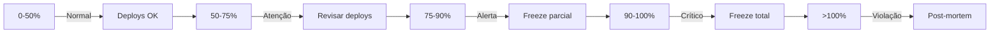

# Guia de SLOs e Error Budgets

> **Aplicável a**: Projetos Nível 2 (Médio) e Nível 3 (Complexo)  
> **Pré-requisitos**: Observabilidade básica configurada (logs, métricas)

---

## O que são SLOs?

**SLO (Service Level Objective)** é uma meta interna de confiabilidade que define "bom o suficiente" para seu serviço.

```
SLI → SLO → SLA → Error Budget

SLI: A métrica que você mede
SLO: A meta que você quer atingir
SLA: O contrato com seu cliente
Error Budget: Quanto você pode errar sem violar o SLO
```

---

## Por que SLOs são Importantes?

### Sem SLOs
- ❌ "O sistema está lento?" - "Depende..."
- ❌ "Podemos fazer deploy?" - "Acho que sim..."
- ❌ "Devemos priorizar feature ou bug?" - "Não sei..."

### Com SLOs
- ✅ "Latência p95 está em 180ms, dentro do SLO de 200ms"
- ✅ "Error budget em 60%, deploys liberados"
- ✅ "Error budget em 85%, priorizar estabilidade"

---

## Como Definir SLOs

### Passo 1: Identificar Jornadas Críticas

Liste as ações mais importantes do usuário:

| Jornada | Criticidade | Frequência |
|---------|-------------|------------|
| Login | Alta | 1000x/dia |
| Checkout | Crítica | 500x/dia |
| Busca de produtos | Média | 5000x/dia |

### Passo 2: Escolher SLIs

Para cada jornada, defina indicadores mensuráveis:

| Jornada | SLI de Disponibilidade | SLI de Latência |
|---------|------------------------|-----------------|
| Login | Logins bem-sucedidos / tentativas | Tempo até token retornado |
| Checkout | Pedidos confirmados / tentativas | Tempo até confirmação |

### Passo 3: Definir Targets

Baseie-se em:
- **Dados históricos**: O que você está entregando hoje?
- **Expectativas do usuário**: O que é aceitável?
- **Custo de melhoria**: Vale o investimento para ir de 99.9% para 99.99%?

| SLO | Custo Aproximado | Justifica para... |
|-----|------------------|-------------------|
| 99% | Baixo | MVPs, ferramentas internas |
| 99.9% | Médio | SaaS, apps consumer |
| 99.99% | Alto | Fintech, healthcare |
| 99.999% | Muito Alto | Infraestrutura crítica |

### Passo 4: Calcular Error Budget

```
Error Budget = 100% - SLO Target

SLO 99.9% → Error Budget = 0.1%
- Por mês (30 dias): 43.2 minutos de downtime permitido
- Por semana: ~10 minutos
```

**Tabela de Referência:**

| SLO | Downtime/mês | Downtime/ano |
|-----|--------------|--------------|
| 99% | 7.2 horas | 3.65 dias |
| 99.5% | 3.6 horas | 1.83 dias |
| 99.9% | 43.2 min | 8.76 horas |
| 99.95% | 21.6 min | 4.38 horas |
| 99.99% | 4.32 min | 52.6 min |

---

## Error Budget Policy

### Níveis de Consumo



### Template de Policy

```markdown
## Error Budget Policy - [SISTEMA]

### 0-50% Consumido (🟢 Normal)
- Deploys normais
- Features priorizadas
- Experimentos permitidos

### 50-75% Consumido (🟡 Atenção)
- Deploys com revisão extra
- Priorizar bugs críticos
- Reduzir experimentos arriscados

### 75-90% Consumido (🟠 Alerta)
- Apenas bug fixes e melhorias de confiabilidade
- Cancelar deploys não-críticos
- Investigar causa do consumo

### 90-100% Consumido (🔴 Crítico)
- Freeze total de features
- Todas as mãos em estabilidade
- Escalar para liderança

### >100% Violação (⚫ Emergência)
- Post-mortem obrigatório em 48h
- Plano de ação documentado
- Revisão de SLOs se necessário
```

---

## Implementação Prática

### Ferramentas de Observabilidade

| Ferramenta | SLI/SLO Features |
|------------|------------------|
| **Prometheus + Grafana** | Recording rules para SLIs, alertas, dashboards |
| **Datadog** | SLO tracking nativo, error budget dashboards |
| **New Relic** | SLI wizard, burn rate alerts |
| **Google Cloud SLO** | Nativo para GCP, integrado com alertas |

### Exemplo: Prometheus Recording Rules

```yaml
# prometheus-rules.yaml
groups:
  - name: slo_slis
    rules:
      # SLI: Disponibilidade
      - record: sli:availability:ratio
        expr: |
          sum(rate(http_requests_total{status!~"5.."}[5m]))
          /
          sum(rate(http_requests_total[5m]))

      # SLI: Latência p99
      - record: sli:latency:p99
        expr: |
          histogram_quantile(0.99,
            sum(rate(http_request_duration_seconds_bucket[5m])) by (le)
          )

      # Error Budget Restante
      - record: slo:error_budget:remaining
        expr: |
          1 - (
            (1 - sli:availability:ratio) 
            / 
            (1 - 0.999)  # SLO target 99.9%
          )
```

### Exemplo: Alertas de Burn Rate

```yaml
# Alerta quando error budget está sendo consumido rapidamente
groups:
  - name: slo_alerts
    rules:
      - alert: HighErrorBudgetBurn
        expr: |
          (
            1 - sli:availability:ratio
          ) > 14.4 * (1 - 0.999)
        for: 1h
        labels:
          severity: critical
        annotations:
          summary: "Error budget sendo consumido 14x mais rápido que o normal"
          
      - alert: ErrorBudgetLow
        expr: slo:error_budget:remaining < 0.25
        for: 5m
        labels:
          severity: warning
        annotations:
          summary: "Menos de 25% do error budget restante"
```

---

## Dashboard Essencial

### Elementos Obrigatórios

1. **Gauge de Error Budget**
   - Cor por nível (verde/amarelo/vermelho)
   - Tendência (subindo/descendo)

2. **SLIs em Tempo Real**
   - Disponibilidade atual
   - Latência p95/p99
   - Taxa de erros

3. **Histórico de 30 dias**
   - Linha do SLO target
   - Área de SLI real
   - Marcadores de incidentes

4. **Projeção**
   - Se mantiver a taxa atual, violaremos em X dias?

---

## Post-Mortem de Violação

### Template

```markdown
# Post-Mortem: Violação de SLO [DATA]

## Resumo
- **SLO Violado**: Disponibilidade < 99.9%
- **Duração**: 2h 15min
- **Error Budget Consumido**: 150% do mensal

## Linha do Tempo
- 14:00 - Primeiro alerta
- 14:15 - Time acionado
- 14:30 - Causa identificada
- 15:45 - Mitigação aplicada
- 16:15 - Sistema estável

## Causa Raiz
[Descrição técnica]

## Impacto
- Usuários afetados: 5000
- Transações perdidas: 120

## Ações Corretivas
1. [Ação imediata - responsável - prazo]
2. [Ação preventiva - responsável - prazo]

## Lições Aprendidas
- O que funcionou bem
- O que pode melhorar
```

---

## Checklist de Adoção

### Semana 1
- [ ] Identificar 3-5 jornadas críticas
- [ ] Definir SLIs mensuráveis
- [ ] Configurar coleta de métricas

### Semana 2
- [ ] Analisar dados históricos
- [ ] Definir SLO targets iniciais
- [ ] Calcular error budgets

### Semana 3
- [ ] Criar dashboard de SLOs
- [ ] Configurar alertas
- [ ] Documentar Error Budget Policy

### Semana 4
- [ ] Treinar time
- [ ] Primeiro ciclo de review
- [ ] Ajustar targets se necessário

---

## Armadilhas Comuns

| Armadilha | Solução |
|-----------|---------|
| SLOs muito ambiciosos | Comece com targets conservadores |
| SLIs difíceis de medir | Simplifique, use métricas disponíveis |
| Ignorar error budget | Automatize alertas e policies |
| Nunca revisar SLOs | Agende revisão trimestral |
| SLOs por componente | Foque em jornadas do usuário |

---

## Referências

- [Google SRE Book - SLOs](https://sre.google/sre-book/service-level-objectives/)
- [Implementing SLOs (Google SRE Workbook)](https://sre.google/workbook/implementing-slos/)
- [The Art of SLOs (Coursera)](https://www.coursera.org/learn/site-reliability-engineering-slos)
