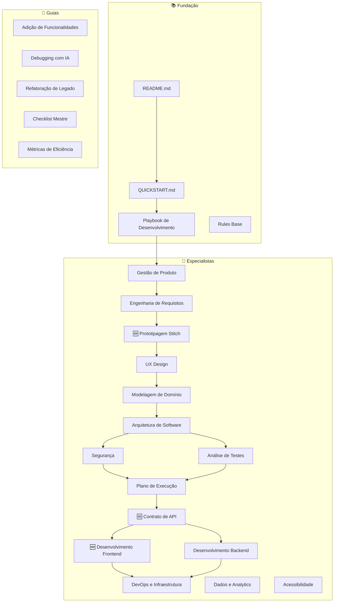
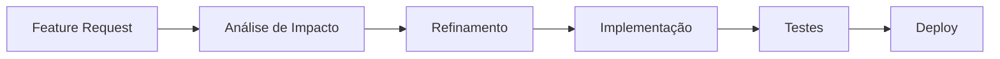
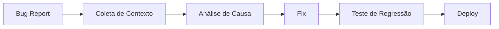
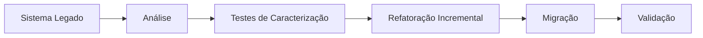

# Guia de Uso - Instruções Completas

Como utilizar o Maestro em diferentes cenários de desenvolvimento.

---

## ⚠️ ANTES DE COMEÇAR

### 1. Classifique seu Projeto

Use o [Sistema de Classificação](./CLASSIFICACAO_PROJETO.md) para determinar o nível:

| Nível | Fases | Especialistas | Quando Usar |
|-------|-------|---------------|-------------|
| **Simples** | 5 | Base (reduzido) | Landing pages, POCs, < 2 semanas |
| **Médio** | 10 | Base (completo) | SaaS simples, apps, 1-3 meses |
| **Complexo** | 14 | Base + Avançados | Multi-tenant, fintech, 3+ meses |

> [!IMPORTANT]
> Não use todos os especialistas em projetos simples.
> Não pule especialistas avançados em projetos complexos.

### 2. Mantenha o Contexto Entre Sessões

O maior problema ao usar IA para desenvolvimento é **perder contexto entre sessões**.

**Solução**: Use o template [CONTEXTO.md](./06-templates/contexto.md)

1. Copie o template para `docs/CONTEXTO.md` no seu projeto
2. Atualize após cada fase concluída
3. No início de cada sessão, cole o CONTEXTO.md como primeiro input

```text
Aqui está o contexto do meu projeto:
[COLE O CONTEÚDO DE docs/CONTEXTO.md]

Continuando da fase [X], preciso [TAREFA].
```

### 3. Use os Gates de Qualidade

Antes de avançar entre fases, valide usando o [Guia de Gates](./03-guias/Gates%20de%20Qualidade.md).

### 4. Configure as Rules da IA

Para que a IA utilize o guia de forma otimizada, configure as rules na sua ferramenta:

| Ferramenta | Como Configurar |
|------------|-----------------|
| **Cursor** | Copie o conteúdo de [RULES_TEMPLATE.md](./RULES_TEMPLATE.md) para `.cursor/rules` |
| **Claude Projects** | Cole nas "Project Instructions" do projeto |
| **MCP** | O resource `guia://system-prompt` é carregado automaticamente |

> [!TIP]
> As rules ensinam a IA a reconhecer comandos como "próximo" e "terminei" para avançar automaticamente entre fases.

---

## Mapa de Relações entre Arquivos



---

## Fluxos de Utilização

### Fluxo 1: Sistema Novo (Do Zero ao MVP)

```mermaid
flowchart LR
    A[Ideia] --> B[Produto] --> C[Requisitos] --> S[🆕 Stitch]
    S --> D[UX] --> E[Modelagem] --> F[Arquitetura]
    F --> G[Segurança] --> H[Testes] --> I[Backlog]
    I --> J[Contrato] --> K[Frontend] --> L[Backend] --> M[Integração]
    M --> N[Deploy]
```



| Fase | Arquivo | Artefato Gerado |
|---|---|---|
| 1. Visão | `Especialista em Gestão de Produto` | PRD |
| 2. Requisitos | `Especialista em Engenharia de Requisitos` | RF/RNF + Gherkin |
| 2.5 🆕 UI Rápida | `Especialista em Prototipagem com Stitch` | Prompts + código UI |
| 3. UX | `Especialista em UX Design` | Fluxos, wireframes |
| 4. Modelagem | `Especialista em Modelagem de Domínio` | Entidades |
| 5. Arquitetura | `Especialista em Arquitetura de Software` | C4, ADRs |
| 6. Segurança | `Especialista em Segurança` | Checklist OWASP |
| 7. Testes | `Especialista em Análise de Testes` | Plano de testes |
| 8. Backlog | `Especialista em Plano de Execução` | Features separadas (FE/BE) |
| **9. Contrato** 🆕 | `Especialista em Contrato de API` | OpenAPI + mocks |
| **10. Frontend** 🆕 | `Especialista em Desenvolvimento Frontend` | Componentes + pages |
| **11. Backend** 🆕 | `Especialista em Desenvolvimento Backend` | Services + controllers |
| 12. Deploy | `Especialista em DevOps` | Pipeline |

**Como começar:**
1. Copie o conteúdo do `Especialista em Gestão de Produto`
2. Cole como contexto na sua IA
3. Descreva sua ideia
4. Siga para o próximo especialista na sequência

---

### Fluxo 2: Adição de Funcionalidades



| Fase | Arquivo Principal |
|---|---|
| 1. Análise | `Guia de Adição de Funcionalidades` |
| 2. Impacto | `Especialista em Arquitetura` |
| 3. Refinamento | `Especialista em Requisitos` |
| 4. Código | `Especialista em Desenvolvimento` |
| 5. Testes | `Especialista em Testes` |
| 6. Deploy | `Especialista em DevOps` |

**Prompt inicial:**
```text
Contexto do sistema existente:
- Arquitetura: [DESCREVA]
- Stack: [DESCREVA]

Nova funcionalidade: [DESCREVA]

Analise impacto no modelo de dados e endpoints necessários.
```

---

### Fluxo 3: Correção de Bugs



| Fase | Arquivo |
|---|---|
| 1. Coleta | `Guia de Debugging com IA` |
| 2. Análise | `Guia de Debugging` + Código |
| 3. Fix | `Especialista em Desenvolvimento` |
| 4. Testes | `Especialista em Testes` |
| 5. Segurança | `Especialista em Segurança` (se aplicável) |

**Prompt de análise:**
```text
Stack trace:
[COLE]

Código relevante:
[COLE]

Analise a causa raiz e sugira correção.
```

---

### Fluxo 4: Readequação Completa (Legado)



| Fase | Arquivo |
|---|---|
| 1. Entendimento | `Guia de Refatoração de Legado` |
| 2. Arquitetura Alvo | `Especialista em Arquitetura` |
| 3. Testes | `Especialista em Testes` |
| 4. Refatoração | `Guia de Refatoração` + `Desenvolvimento` |
| 5. Segurança | `Especialista em Segurança` |
| 6. Deploy | `Especialista em DevOps` |

**Estratégia:**
- Não reescreva tudo de uma vez (Strangler Fig Pattern)
- Adicione testes antes de mudar
- Refatore em pequenos passos
- Valide continuamente com CI/CD

---

## Estrutura de Pastas

```
Maestro/
├── 01-playbook/          → Método completo em 8 etapas
├── 02-especialistas/     → Personas de IA (12 especialistas)
├── 03-guias/             → Guias práticos e catálogos
├── 04-exemplos/          → Exemplos por stack
├── 05-prompts/           → Templates de prompts reutilizáveis
├── QUICKSTART.md         → Onboarding de 5 minutos
├── Glossário.md          → Termos técnicos
├── CONTRIBUTING.md       → Como contribuir
└── CHANGELOG.md          → Histórico de versões
```

---

## Dicas de Uso

1. **Sempre forneça contexto** - Cole arquitetura, modelo, stack antes de pedir código
2. **Trabalhe em blocos pequenos** - Não peça "o sistema todo", peça um serviço por vez
3. **Revise outputs da IA** - Código gerado precisa de revisão humana
4. **Salve prompts úteis** - Documente o que funcionou bem
5. **Use o Checklist Mestre** - Antes de considerar algo "pronto"
