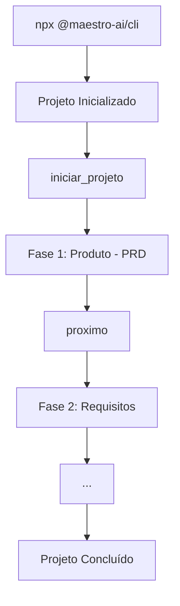

# MCP Maestro v2.1

Servidor **MCP (Model Context Protocol)** para desenvolvimento assistido por IA com **otimizações inteligentes**, **frontend-first** e **gerenciamento de tarefas**.

[](https://maestro.deluna.dev.br/health)
[](https://www.npmjs.com/package/@maestro-ai/cli)
[](LICENSE)
[](CHANGELOG_V2.md)

## 🆕 Novidades v2.1

### 💰 Modos de Operação (Economy / Balanced / Quality)
- Seleção logo no `iniciar_projeto`
- Otimizações automáticas por modo (batch, one-shot, caching, checkpoints)
- Mapeamento automático tipo → modo sugerido

### 🧠 Discovery Agrupado (redução de prompts)
- Nova tool `discovery` para coletar todas as perguntas iniciais em 1 prompt
- Questionário adaptado ao modo (economy/balanced/quality)
- Respostas salvas em `estado.discovery` e usadas pelos especialistas

### 🌐 Multi-IDE consolidado
- Paths dinâmicos via `ide-paths.ts` (Windsurf, Cursor, Antigravity)
- Mensagens de skill com localização correta por IDE

### 🎨 Frontend-First Architecture
- Geração automática de contratos de API (OpenAPI 3.0)
- Schemas TypeScript + Zod para validação
- Mocks realistas com MSW e Faker.js
- Cliente API gerado automaticamente
- Desenvolvimento paralelo Frontend + Backend

### 📋 Sistema de Gerenciamento de Tarefas
- Hierarquia completa: Epic → Feature → Story → Task → Subtask
- Dependências e detecção de ciclos
- Tracking de progresso em tempo real
- Estatísticas e métricas

### ⚡ Otimizações Inteligentes
- **6 estratégias** de economia de prompts
- Cache inteligente de contexto (TTL 1h)
- Validação incremental com early exit
- Batch prompts (consolida perguntas)
- One-shot generation (código completo)
- Differential updates (apenas diffs)

**[Ver CHANGELOG completo](./CHANGELOG_V2.md)** | **[Guia de Migração v1→v2](./docs/MIGRACAO_V1_V2.md)**

## 🚀 Início Rápido

```bash
# 1. Inicialize seu projeto
npx @maestro-ai/cli

# 2. Configure o MCP na sua IDE (veja abaixo)

# 3. Comece a desenvolver!
@mcp:maestro iniciar_projeto
```

---

## 🔧 Configuração MCP via npx (local)

Use sempre a versão mais recente via `npx` (diretório atual):

```json
{
  "mcpServers": {
    "maestro": {
      "command": "npx",
      "args": ["-y", "@maestro-ai/mcp-server@latest"],
      "disabled": false,
      "env": {}
    }
  }
}
```

Para especificar manualmente um diretório, adicione o caminho ao final de `args`:

```json
{
  "mcpServers": {
    "maestro": {
      "command": "npx",
      "args": ["-y", "@maestro-ai/mcp-server@latest", "D:\\Meus\\Projetos"],
      "disabled": false,
      "env": {}
    }
  }
}
```

---


## Fluxo de Desenvolvimento



1. **Inicialize** o projeto com o CLI
2. **Configure** o MCP na sua IDE
3. **Inicie** um projeto com `iniciar_projeto`
4. **Avance** pelas fases com `proximo`
5. **Valide** gates com `validar_gate`

---

## 🛠️ Tools Disponíveis

| Tool | Descrição |
|------|-----------|
| `iniciar_projeto` | Inicia novo projeto com classificação |
| `confirmar_projeto` | Confirma criação do projeto |
| `proximo` | Salva entregável e avança fase |
| `status` | Retorna status do projeto |
| `validar_gate` | Valida checklist da fase |
| `contexto` | Obtém contexto completo |
| `salvar` | Salva artefatos |
| `discovery` | Coleta perguntas iniciais agrupadas e salva no estado |
| `nova_feature` | Fluxo para nova feature |
| `corrigir_bug` | Fluxo para correção de bugs |
| `refatorar` | Fluxo para refatoração |

---

## 📚 Resources

| URI | Descrição |
|-----|-----------|
| `maestro://especialista/{nome}` | Especialistas de IA |
| `maestro://template/{nome}` | Templates de documentos |
| `maestro://guia/{nome}` | Guias práticos |
| `maestro://prompt/{categoria}/{nome}` | Prompts especializados |
| `maestro://system-prompt` | System prompt do Maestro |

---

## 📡 Endpoints

| Endpoint | Método | Descrição |
|----------|--------|-----------|
| `/` | GET | Info do servidor |
| `/health` | GET | Health check |
| `/mcp` | GET | SSE connection (Streamable HTTP) |
| `/mcp` | POST | JSON-RPC endpoint |
| `/resources` | GET | Lista resources |
| `/tools` | GET | Lista tools |

---

## 📁 Estrutura do Repositório

```
├── src/                    # Código do servidor MCP
│   ├── src/               # Código fonte TypeScript
│   ├── package.json
│   └── tsconfig.json
│
├── packages/cli/          # CLI npm (@maestro-ai/cli)
│
├── content/               # Conteúdo para IA
│   ├── specialists/      # Especialistas de IA
│   ├── templates/        # Templates de documentos
│   ├── guides/           # Guias práticos
│   ├── prompts/          # Prompts especializados
│   ├── skills/           # Skills para IA
│   ├── workflows/        # Workflows automatizados
│   └── rules/            # Regras para IDEs
│
├── docs/                  # Documentação técnica
│
├── Dockerfile
├── docker-compose.yml
└── docker-compose.dev.yml
```

---

## 💻 Desenvolvimento Local

### Servidor MCP

```bash
cd src && npm install
npm run dev
```

### CLI

```bash
cd packages/cli && npm install
npm run build
npm run dev -- init --ide gemini
```

### Docker

```bash
# Produção
docker-compose up -d

# Desenvolvimento
docker-compose -f docker-compose.yml -f docker-compose.dev.yml up --build
```

---

## 📖 Documentação

- [Quickstart](docs/QUICKSTART.md)
- [Instruções de Uso](docs/INSTRUCOES_DE_USO.md)
- [Especificação MCP](docs/MCP_ESPECIFICACAO.md)
- [Guia de Desenvolvimento MCP](docs/MCP_GUIA_DESENVOLVIMENTO.md)
- [CLI README](packages/cli/README.md)

---

## 🤝 Contribuição

Contribuições são bem-vindas! Veja [CONTRIBUTING.md](CONTRIBUTING.md).

---

## 📄 Licença

MIT License
