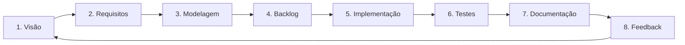

# Maestro

## 🚀 Visão Geral

Este repositório contém um conjunto de guias e templates para **desenvolvimento de software com IA**, focando em:

- boas práticas de engenharia de software
- arquitetura e modelagem bem pensadas
- uso estruturado de IA (ex.: GPT 5.1) do início ao fim do ciclo de vida
- entrega eficiente, com qualidade e segurança.

Os documentos foram projetados para serem usados em conjunto, seguindo um **fluxo lógico de desenvolvimento guiado por IA**.

---

## 📘 Playbook Central

Antes de usar os especialistas individuais, recomenda-se ler:

- [Playbook de Desenvolvimento com IA](./01-playbook/Playbook%20de%20Desenvolvimento%20com%20IA.md)

Ele descreve o método em 8 etapas:

1. Visão & problema
2. Engenharia de requisitos com IA
3. Modelagem & arquitetura com IA
4. Planejamento / backlog
5. Vibe Coding Estruturado (implementação)
6. Testes com IA
7. Documentação & revisão
8. Feedback & evolução

> 💡 **Novo aqui?** Comece pelo [QUICKSTART](./QUICKSTART.md) para um onboarding de 5 minutos.
>
> 📖 **Instruções completas?** Veja o [Guia de Uso](./INSTRUCOES_DE_USO.md) com fluxos detalhados para cada cenário.

---

## 🔄 Fluxo Recomendado de Uso dos Especialistas

Siga esta sequência para aproveitar ao máximo os recursos disponíveis:

1. **Definição do Produto**  
   - [Especialista em Gestão de Produto](./02-especialistas/Especialista%20em%20Gestão%20de%20Produto%20.md)  
   - Define o "o quê" e "por quê" do produto.  
   - Estabelece métricas de sucesso e visão de MVP.

2. **Engenharia de Requisitos com IA**  
   - [Especialista em Engenharia de Requisitos com IA](./02-especialistas/Especialista%20em%20Engenharia%20de%20Requisitos%20com%20IA.md)  
   - Transforma visão e notas soltas em requisitos claros.  
   - Gera critérios de aceitação e reduz ambiguidades.

3. **Design da Experiência**  
   - [Especialista em UX Design](./02-especialistas/Especialista%20em%20UX%20Design.md)  
   - Cria fluxos de usuário e jornada.  
   - Define arquitetura de informação e diretrizes de design.

4. **Modelagem de Domínio e Arquitetura Inicial**  
   - [Especialista em Modelagem e Arquitetura de Domínio com IA](./02-especialistas/Especialista%20em%20Modelagem%20e%20Arquitetura%20de%20Domínio%20com%20IA.md)  
   - Deriva casos de uso, entidades, relacionamentos.  
   - Alimenta o trabalho do Arquiteto de Software.

5. **Arquitetura do Sistema**  
   - [Especialista em Arquitetura de Software](./02-especialistas/Especialista%20em%20Arquitetura%20de%20Software.md)  
   - Define a stack tecnológica.  
   - Modela a arquitetura do sistema (ex.: C4).  
   - Estabelece padrões de código e integrações.

6. **Segurança e Qualidade**  
   - [Especialista em Segurança da Informação](./02-especialistas/Especialista%20em%20Segurança%20da%20Informação.md)  
     - Define políticas de segurança e práticas seguras de desenvolvimento.  
     - Prevê vulnerabilidades comuns e controles mínimos.
   - [Especialista em Análise de Testes](./02-especialistas/Especialista%20em%20Análise%20de%20Testes.md)  
     - Define estratégia de testes.  
     - Estabelece métricas de qualidade.  
     - Garante cobertura adequada e plano de testes.

7. **Plano de Execução**  
   - [Especialista em Plano de Execução com IA](./02-especialistas/Especialista%20em%20Plano%20de%20Execução%20com%20IA.md)  
     - Cria backlog separado por tipo (Contrato, Frontend, Backend, Integração).  
     - Define sprints com ordem de dependências.

8. **Implementação (Frontend First)** 🆕  
   - [Especialista em Contrato de API](./02-especialistas/Especialista%20em%20Contrato%20de%20API.md)  
     - Define OpenAPI antes de implementar.  
     - Gera types para FE e BE.  
     - Configura mock server.
   - [Especialista em Desenvolvimento Frontend](./02-especialistas/Especialista%20em%20Desenvolvimento%20Frontend.md)  
     - Implementa componentes, hooks, pages.  
     - Trabalha contra mock enquanto BE é feito.
   - [Especialista em Desenvolvimento Backend](./02-especialistas/Especialista%20em%20Desenvolvimento%20e%20Vibe%20Coding%20Estruturado.md)  
     - Implementa services, controllers, testes.  
     - Segue contrato definido.

9. **Adição de Novas Funcionalidades**  
   - [Guia de Adição de Novas Funcionalidades](./03-guias/Guia%20de%20Adição%20de%20Novas%20Funcionalidades.md)  
   - Fluxo estruturado para novas features.  
   - Integração com CI/CD.  
   - Garantia de qualidade contínua, com apoio de IA.

---

## 📚 Documentos Base

- [Rules Base](./03-guias/Rules%20base.md) – Diretrizes gerais de desenvolvimento orientadas a um assistente de código/IA.  
- [RULES_TEMPLATE.md](./RULES_TEMPLATE.md) – 🆕 Template de rules para configurar IAs (Cursor, Claude, Copilot) para usar o guia.
- [Playbook de Desenvolvimento com IA](./01-playbook/Playbook%20de%20Desenvolvimento%20com%20IA.md) – Método completo de engenharia com IA.  
- [Catálogo de Stacks para Hospedagem Compartilhada](./03-guias/Catálogo%20de%20Stacks%20para%20Hospedagem%20Compartilhada.md) – Opções de stacks e planos para ambientes PHP/shared hosting.  
- [Guia de Adição de Novas Funcionalidades](./03-guias/Guia%20de%20Adição%20de%20Novas%20Funcionalidades.md) – Fluxo para implementação de novas features.

---

## 🧪 Exemplos por Stack

Para ver exemplos práticos de aplicação do Playbook em tecnologias específicas:

- [Exemplo de Fluxo Completo com Node e NestJS](./04-exemplos/Exemplo%20de%20Fluxo%20Completo%20com%20Node%20e%20NestJS.md)  
- [Exemplo de Fluxo Completo com Java e Spring Boot](./04-exemplos/Exemplo%20de%20Fluxo%20Completo%20com%20Java%20e%20Spring%20Boot.md)  
- [Exemplo de Fluxo Completo com Laravel e Filament](./04-exemplos/Exemplo%20de%20Fluxo%20Completo%20com%20Laravel%20e%20Filament.md)  
- [Exemplo de Fluxo Completo com Laravel e Livewire](./04-exemplos/Exemplo%20de%20Fluxo%20Completo%20com%20Laravel%20e%20Livewire.md)

(Exemplos adicionais podem ser adicionados para outras stacks.)

---

## 🛠️ Como Usar

### Para Novos Projetos

1. Leia o [Playbook de Desenvolvimento com IA](./01-playbook/Playbook%20de%20Desenvolvimento%20com%20IA.md) para entender o método.  
2. Use o [Catálogo de Stacks para Hospedagem Compartilhada](./03-guias/Catálogo%20de%20Stacks%20para%20Hospedagem%20Compartilhada.md) (se aplicável ao seu cenário) para escolher o plano/stack.  
3. Comece pelo documento de Gestão de Produto.  
4. Siga a sequência do fluxo recomendado (requisitos → UX → modelagem → arquitetura → execução).  
5. Use os especialistas como **personas de IA** (cole o conteúdo deles como contexto no seu modelo).  
6. Adapte conforme as necessidades do seu projeto.

### Para Adição de Novas Funcionalidades

1. Consulte o [Guia de Adição de Novas Funcionalidades](./03-guias/Guia%20de%20Adição%20de%20Novas%20Funcionalidades.md).  
2. Consulte os especialistas relevantes (Segurança, Testes, Arquitetura, Desenvolvimento).  
3. Use os prompts sugeridos para planejar, implementar e testar a nova feature.  
4. Siga o fluxo de revisão e aprovação do seu time (PRs, code review, CI/CD).

---

## 🤝 Contribuição

Contribuições são bem-vindas! 

Sugestões de melhoria:
- adicionar exemplos concretos por stack (ex.: PHP puro, outros frameworks)
- novos especialistas (ex.: Data/Analytics com IA, MLOps, etc.)
- mais templates de prompts para cenários específicos.

Sinta-se à vontade para abrir issues ou enviar pull requests com melhorias.
