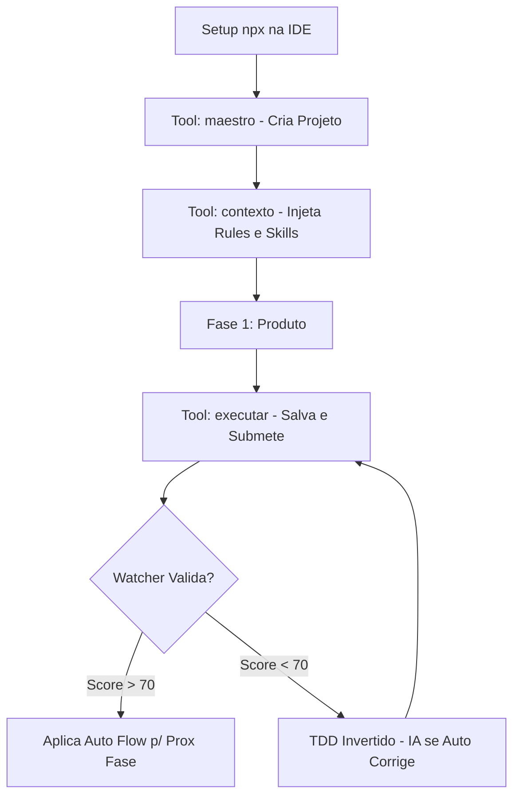

# MCP Maestro v6.0.0

Servidor **MCP (Model Context Protocol)** autônomo. Uma orquestração "Fat MCP" para desenvolvimento assistido por IA com **Zero-API approach**, auto-correção, TDD Invertido e pipelines nativos.

[](https://maestro.deluna.dev.br/health)
[](https://www.npmjs.com/package/@maestro-ai/mcp-server)
[](LICENSE)
[](CHANGELOG.md)

## 🆕 Novidades v6.0.0

### 🚀 Watcher Nativo Event-Driven (Sprint 5)
- Ao invés de paradas bloqueantes a cada arquivo salvo, a `ValidationPipeline` agora corre local em background acionada por eventos `chokidar` do sistema operacional.

### 🛡️ TDD Invertido (Sprint 4)
- Documentos de `.orientacao-gate.md` pré-gerados contendo as métricas de sucesso que a IA lê _antes_ de escrever a funcionalidade. Sucesso ou Rollback compulsório se Score < 70.

### ⚙️ Auto-Correção Injetada (Sprint 1) e Smart Auto-Flow
- Ao falhar um Gate, a IA é orientada ativamente pelo MCP sobre *como* corrigir no próprio erro, dispensando requisições extras.
- Etapas "tecnicas" (Backend/Frontend/Deploy) auto-avançam (`auto_flow`) sem esperar comando do humano se os scores permitirem.

### 💰 5 Tools Paradigm
- Com a abolição das APIs fechadas (Fat MCP), os 17 tools antigos condensaram-se em **5 Core Tools**: `maestro`, `executar`, `validar`, `analisar` e `contexto`. Modos autônomos gerenciam o projeto de forma inteligente.

**[Ver CHANGELOG completo](./src/CHANGELOG.md)** | **[Roadmap Master](./docs/Roadmap_V6_Maestro_ZeroAPI.md)**

## 🚀 Início Rápido

```bash
# 1. Certifique-se de configurar a extensao/MCP da sua IDE.
# 2. Use o tool de maestro para ligar e provisionar o projeto em um prompt
# EX: "Crie um projeto do Maestro neste diretório focado em gerenciar tarefas"
```

---

## 🔧 Configuração MCP via npx (local)

Use sempre a versão mais recente via `npx` (diretório atual):

```json
{
  "mcpServers": {
    "maestro": {
      "command": "npx",
      "args": ["-y", "@maestro-ai/mcp-server@latest"],
      "disabled": false,
      "env": {}
    }
  }
}
```

Para especificar manualmente um diretório, adicione o caminho ao final de `args`:

```json
{
  "mcpServers": {
    "maestro": {
      "command": "npx",
      "args": ["-y", "@maestro-ai/mcp-server@latest", "D:\\Meus\\Projetos"],
      "disabled": false,
      "env": {}
    }
  }
}
```

---


## Fluxo de Desenvolvimento V6 (Fat MCP)


```mermaid
graph TD
    A[Setup npx na IDE] --> B[Tool: maestro - Cria Projeto]
    B --> C[Tool: contexto - Injeta Rules e Skills]
    C --> D[Fase 1: Produto]
    D --> E[Tool: executar - Salva e Submete]
    E --> F{Watcher Valida?}
    F -- Score > 70 --> G[Aplica Auto Flow p/ Prox Fase]
    F -- Score < 70 --> H[TDD Invertido - IA se Auto Corrige]
    H --> E
```

1. **Ative** a MCP na IDE e chame a IA com sua intenção inicial.
2. A IDE invocará o `maestro({ acao: "criar_projeto" })` e injetará as skills e rules base.
3. O desenvolvimento segue com a submissão de artefatos pelo `executar`.
4. Os Gates são auto-checados pela `ValidationPipeline` (background watcher).
5. Se scores forem atingidos, o Node.js assume a transição automaticamente (Zero-Pause) nas fases técnicas.

---

## 🛠️ Tools Disponíveis (V3+)

O número de comandos expostos foi drasticamente reduzido para otimizar overhead de tokens de função no prompt ("The 5 Core Tools").

| Tool | Função Central |
|------|-----------|
| `maestro` | Engine de Iniciação e Status Check do projeto inteiro. |
| `executar` | Responsável pelas mutações (`avancar` com entregável, documentar draft `salvar`, etc). |
| `validar` | Portal manual para rodar a `ValidationPipeline` em qualquer Markdown desejado ou sob demanda de compliance. |
| `analisar` | Auditor de Technical Debt, performance e AI logic integrity |
| `contexto` | Permite à IDE recuperar imediatamente ADRs e a memória histórica contida em `resumo.json` sem desvios. |

---

## 📚 Resources

| URI | Descrição |
|-----|-----------|
| `maestro://especialista/{nome}` | Especialistas de IA |
| `maestro://template/{nome}` | Templates de documentos |
| `maestro://guia/{nome}` | Guias práticos |
| `maestro://prompt/{categoria}/{nome}` | Prompts especializados |
| `maestro://system-prompt` | System prompt do Maestro |

---

## 📡 Endpoints

| Endpoint | Método | Descrição |
|----------|--------|-----------|
| `/` | GET | Info do servidor |
| `/health` | GET | Health check |
| `/mcp` | GET | SSE connection (Streamable HTTP) |
| `/mcp` | POST | JSON-RPC endpoint |
| `/resources` | GET | Lista resources |
| `/tools` | GET | Lista tools |

---

## 📁 Estrutura do Repositório

```
├── src/                    # Código do servidor MCP
│   ├── src/               # Código fonte TypeScript
│   ├── package.json
│   └── tsconfig.json
│
├── packages/cli/          # CLI npm (@maestro-ai/cli)
│
├── content/               # Conteúdo para IA
│   ├── specialists/      # Especialistas de IA
│   ├── templates/        # Templates de documentos
│   ├── guides/           # Guias práticos
│   ├── prompts/          # Prompts especializados
│   ├── skills/           # Skills para IA
│   ├── workflows/        # Workflows automatizados
│   └── rules/            # Regras para IDEs
│
├── docs/                  # Documentação técnica
│
├── Dockerfile
├── docker-compose.yml
└── docker-compose.dev.yml
```

---

## 💻 Desenvolvimento Local

### Servidor MCP

```bash
cd src && npm install
npm run dev
```

### CLI

```bash
cd packages/cli && npm install
npm run build
npm run dev -- init --ide gemini
```

### Docker

```bash
# Produção
docker-compose up -d

# Desenvolvimento
docker-compose -f docker-compose.yml -f docker-compose.dev.yml up --build
```

---

## 📖 Documentação

- [Quickstart](docs/QUICKSTART.md)
- [Instruções de Uso](docs/INSTRUCOES_DE_USO.md)
- [Especificação MCP](docs/MCP_ESPECIFICACAO.md)
- [Guia de Desenvolvimento MCP](docs/MCP_GUIA_DESENVOLVIMENTO.md)
- [Documentação Técnica Completa e Atualizada](docs/architecture/DOCUMENTACAO_TECNICA_COMPLETA_MAESTRO_ATUALIZADA.md)
- [CLI README](packages/cli/README.md)

---

## 🤝 Contribuição

Contribuições são bem-vindas! Veja [CONTRIBUTING.md](CONTRIBUTING.md).

---

## 📄 Licença

MIT License
