# MCP Maestro

Servidor **MCP (Model Context Protocol)** para desenvolvimento assistido por IA.

[](https://maestro.deluna.dev.br/health)
[](https://www.npmjs.com/package/@maestro-ai/cli)
[](LICENSE)

## 🚀 Início Rápido

```bash
# 1. Inicialize seu projeto
npx @maestro-ai/cli

# 2. Configure o MCP na sua IDE (veja abaixo)

# 3. Comece a desenvolver!
@mcp:maestro iniciar_projeto
```

---

## 🌐 Servidor Público

```
https://maestro.deluna.dev.br
```

```bash
# Verificar status
curl https://maestro.deluna.dev.br/health
```

---

## 📦 CLI - Instalação

O CLI injeta automaticamente todo o conteúdo necessário no seu projeto:

```bash
# Instalação completa (todas as IDEs)
npx @maestro-ai/cli

# Apenas para uma IDE específica
npx @maestro-ai/cli --ide gemini
npx @maestro-ai/cli --ide cursor
npx @maestro-ai/cli --ide copilot
npx @maestro-ai/cli --ide windsurf
```

### Opções do CLI

| Opção | Descrição |
|-------|-----------|
| `--ide <ide>` | IDE alvo: `gemini`, `cursor`, `copilot`, `windsurf`, `all` (default: `all`) |
| `--force` | Sobrescreve arquivos existentes |
| `--minimal` | Instala apenas workflows + rules |

### Estrutura Criada

```
projeto/
├── .maestro/
│   ├── config.json          # Configuração do projeto
│   ├── content/             # Especialistas, templates, prompts
│   └── history/             # Histórico de conversas
├── .agent/
│   ├── skills/              # Skills para a IA
│   └── workflows/           # Workflows automatizados
└── [Arquivos de regras por IDE]
```

### Arquivos de Regras por IDE

| IDE | Arquivo Gerado |
|-----|----------------|
| Gemini/Antigravity | `.gemini/GEMINI.md` |
| Cursor | `.cursorrules` |
| GitHub Copilot | `.github/copilot-instructions.md` |
| Windsurf | `.windsurfrules` |

---

## 🔧 Configuração do MCP

### Gemini / Antigravity

```json
{
  "mcpServers": {
    "maestro": {
      "serverUrl": "https://maestro.deluna.dev.br/mcp"
    }
  }
}
```

### VS Code / Cursor / Windsurf

```json
{
  "mcpServers": {
    "maestro": {
      "url": "https://maestro.deluna.dev.br/mcp",
      "transport": "http"
    }
  }
}
```

### HTTP Direto

```bash
curl -X POST https://maestro.deluna.dev.br/mcp \
  -H "Content-Type: application/json" \
  -d '{"jsonrpc":"2.0","id":"1","method":"tools/list","params":{}}'
```

---

## � Fluxo de Desenvolvimento



```mermaid
graph TD
    A[npx @maestro-ai/cli] --> B[Projeto Inicializado]
    B --> C[iniciar_projeto]
    C --> D[Fase 1: Produto - PRD]
    D --> E[proximo]
    E --> F[Fase 2: Requisitos]
    F --> G[...]
    G --> H[Projeto Concluído]
```

1. **Inicialize** o projeto com o CLI
2. **Configure** o MCP na sua IDE
3. **Inicie** um projeto com `iniciar_projeto`
4. **Avance** pelas fases com `proximo`
5. **Valide** gates com `validar_gate`

---

## 🛠️ Tools Disponíveis

| Tool | Descrição |
|------|-----------|
| `iniciar_projeto` | Inicia novo projeto com classificação |
| `confirmar_projeto` | Confirma criação do projeto |
| `proximo` | Salva entregável e avança fase |
| `status` | Retorna status do projeto |
| `validar_gate` | Valida checklist da fase |
| `contexto` | Obtém contexto completo |
| `salvar` | Salva artefatos |
| `nova_feature` | Fluxo para nova feature |
| `corrigir_bug` | Fluxo para correção de bugs |
| `refatorar` | Fluxo para refatoração |

---

## 📚 Resources

| URI | Descrição |
|-----|-----------|
| `maestro://especialista/{nome}` | Especialistas de IA |
| `maestro://template/{nome}` | Templates de documentos |
| `maestro://guia/{nome}` | Guias práticos |
| `maestro://prompt/{categoria}/{nome}` | Prompts especializados |
| `maestro://system-prompt` | System prompt do Maestro |

---

## 📡 Endpoints

| Endpoint | Método | Descrição |
|----------|--------|-----------|
| `/` | GET | Info do servidor |
| `/health` | GET | Health check |
| `/mcp` | GET | SSE connection (Streamable HTTP) |
| `/mcp` | POST | JSON-RPC endpoint |
| `/resources` | GET | Lista resources |
| `/tools` | GET | Lista tools |

---

## 📁 Estrutura do Repositório

```
├── src/                    # Código do servidor MCP
│   ├── src/               # Código fonte TypeScript
│   ├── package.json
│   └── tsconfig.json
│
├── packages/cli/          # CLI npm (@maestro-ai/cli)
│
├── content/               # Conteúdo para IA
│   ├── specialists/      # Especialistas de IA
│   ├── templates/        # Templates de documentos
│   ├── guides/           # Guias práticos
│   ├── prompts/          # Prompts especializados
│   ├── skills/           # Skills para IA
│   ├── workflows/        # Workflows automatizados
│   └── rules/            # Regras para IDEs
│
├── docs/                  # Documentação técnica
│
├── Dockerfile
├── docker-compose.yml
└── docker-compose.dev.yml
```

---

## 💻 Desenvolvimento Local

### Servidor MCP

```bash
cd src && npm install
npm run dev
```

### CLI

```bash
cd packages/cli && npm install
npm run build
npm run dev -- init --ide gemini
```

### Docker

```bash
# Produção
docker-compose up -d

# Desenvolvimento
docker-compose -f docker-compose.yml -f docker-compose.dev.yml up --build
```

---

## 📖 Documentação

- [Quickstart](docs/QUICKSTART.md)
- [Instruções de Uso](docs/INSTRUCOES_DE_USO.md)
- [Especificação MCP](docs/MCP_ESPECIFICACAO.md)
- [Guia de Desenvolvimento MCP](docs/MCP_GUIA_DESENVOLVIMENTO.md)
- [CLI README](packages/cli/README.md)

---

## 🤝 Contribuição

Contribuições são bem-vindas! Veja [CONTRIBUTING.md](CONTRIBUTING.md).

---

## 📄 Licença

MIT License
