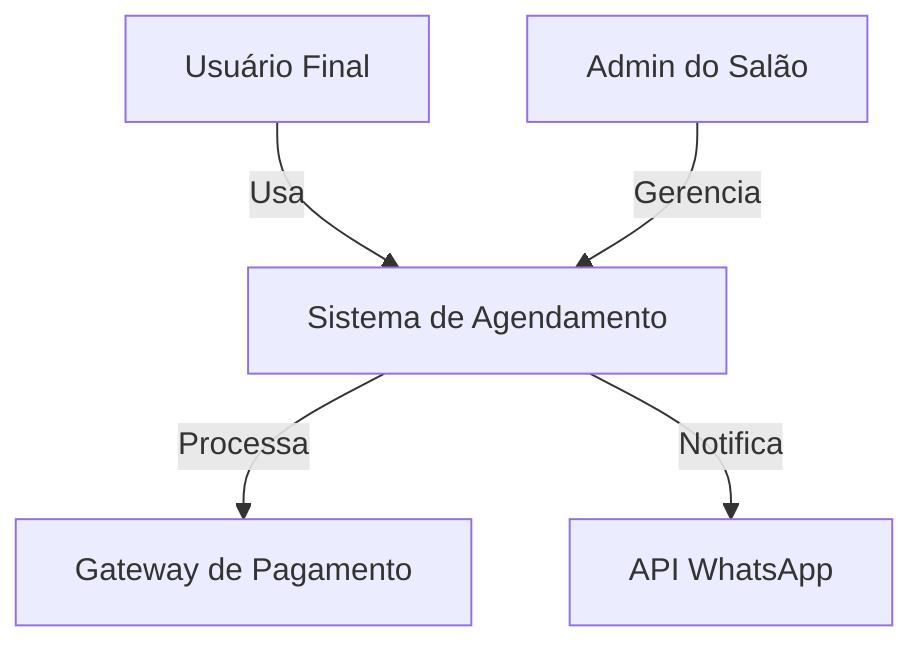
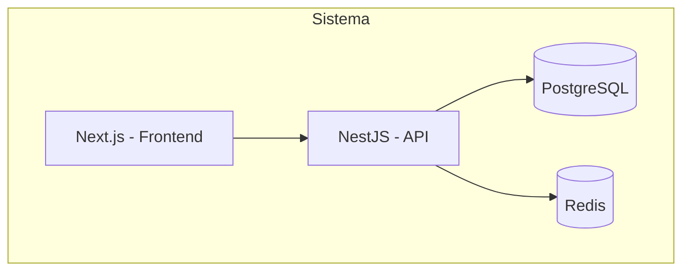

# Prompt: Arquitetura C4 Completa

> **Quando usar**: Início da fase de arquitetura, para definir visão geral do sistema
> **Especialista**: [Arquitetura de Software](../../02-especialistas/Especialista%20em%20Arquitetura%20de%20Software.md)
> **Nível**: Médio a Complexo

---

## Fluxo de Contexto

Antes de usar este prompt, tenha em mãos:
- `docs/CONTEXTO.md` - Entendimento atual do projeto
- `docs/02-requisitos/requisitos.md` - Requisitos funcionais e não-funcionais

Após gerar, salve o resultado em:
- `docs/05-arquitetura/arquitetura-c4.md`

---

## Prompt Completo

```text
Atue como arquiteto de software sênior especializado em arquitetura C4.

## Contexto do Projeto

[COLE O CONTEÚDO DE docs/CONTEXTO.md]

## Requisitos

Requisitos funcionais:
[COLE RFs DE docs/02-requisitos/requisitos.md]

Requisitos não-funcionais:
[COLE RNFs DE docs/02-requisitos/requisitos.md]

Stack sugerida: [DESCREVA A STACK PREFERENCIAL]
Escala esperada: [X usuários simultâneos, Y requests/segundo]
Orçamento de infra: [ORÇAMENTO MENSAL]

---

## Sua Missão

Entregue uma arquitetura completa usando o modelo C4:

### 1. Diagrama C4 Nível 1 (Contexto)
- Atores externos (tipos de usuários)
- Sistemas externos que integram
- O sistema como caixa única
- Gere em formato Mermaid

### 2. Diagrama C4 Nível 2 (Containers)
- Aplicações (web, API, mobile)
- Bancos de dados
- Message brokers (se aplicável)
- Caches
- Para cada container: tecnologia e responsabilidade
- Gere em formato Mermaid

### 3. Diagrama C4 Nível 3 (Componentes) para o container principal
- Módulos/pacotes principais
- Responsabilidades de cada componente
- Dependências entre componentes
- Gere em formato Mermaid

### 4. Decisões Arquiteturais (ADRs)

Para cada decisão, justifique:

**Padrão arquitetural**: [MVC/Hexagonal/DDD/Clean Architecture]
- Por que este padrão?
- Alternativas consideradas e por que foram descartadas

**Estratégia de persistência**:
- Banco escolhido e justificativa
- Estratégia de cache

**Estratégia de escalabilidade**:
- O que escala horizontalmente
- Pontos de bottleneck potenciais

**Observabilidade**:
- Logs, métricas, traces
- Ferramentas sugeridas

**Segurança**:
- Autenticação/autorização
- Proteção de dados sensíveis

### 5. Trade-offs e Custos
- Prós e contras das decisões
- O que sacrificamos e por quê
- Custo estimado de infraestrutura (MVP e 6 meses)
- Riscos técnicos identificados

### 6. Estrutura de Pastas
- Proposta de estrutura de diretórios do projeto
```

---

## Exemplo de Uso

```text
Atue como arquiteto de software sênior especializado em arquitetura C4.

## Contexto do Projeto

Sistema de agendamento online para salões de beleza. Permite que 
clientes agendem horários via web/mobile e recebam confirmação via WhatsApp.

## Requisitos

Requisitos funcionais:
- RF-001: O sistema deve permitir agendamento online
- RF-002: O sistema deve enviar confirmação via WhatsApp
- RF-003: O sistema deve permitir cancelamento até 2h antes

Requisitos não-funcionais:
- RNF-001: Tempo de resposta < 2 segundos
- RNF-002: Disponibilidade 99.5%

Stack sugerida: Node.js + TypeScript + PostgreSQL + Redis
Escala esperada: 500 usuários simultâneos, 50 requests/segundo
Orçamento de infra: R$ 300/mês

[CONTINUA COM O PROMPT COMPLETO]
```

---

## Resposta Esperada

### 1. Contexto (C4 L1)



### 2. Containers (C4 L2)



### 4. Decisões

**Padrão**: Hexagonal Architecture
- **Por quê**: Separação clara entre domínio e infraestrutura
- **Alternativa descartada**: MVC - menos testável

**Banco**: PostgreSQL
- **Por quê**: ACID, JSON support, maturidade
- **Cache**: Redis para sessões e queries frequentes

---

## Checklist Pós-Geração

Após receber a arquitetura, valide:

- [ ] Diagrama C4 inclui níveis 1, 2 e 3
- [ ] Padrão arquitetural está justificado
- [ ] Pelo menos 4 ADRs documentados
- [ ] Estrutura de pastas proposta
- [ ] Estimativa de custos presente (MVP e 6 meses)
- [ ] Stack justificada com prós/contras
- [ ] Riscos técnicos identificados
- [ ] Salvar em `docs/05-arquitetura/arquitetura-c4.md`
