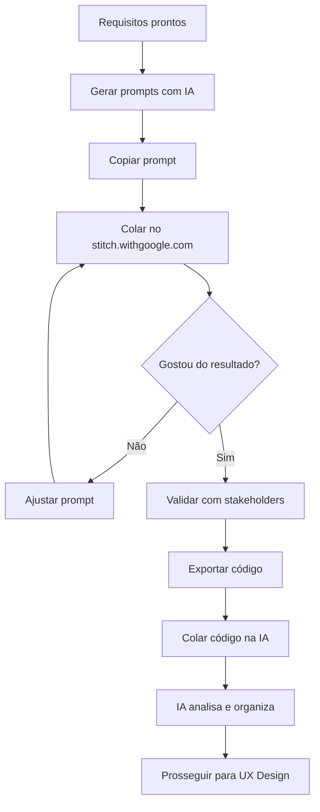

# Prompt: Gerar Prompts para Google Stitch

## Quando Usar
Após ter os requisitos definidos, use este prompt para gerar entradas otimizadas para o Google Stitch (stitch.withgoogle.com).

---

## Prompt Principal

```text
Atue como especialista em UI/UX e prototipagem com IA.

Contexto do projeto:
[COLE O CONTEÚDO DE docs/CONTEXTO.md]

Requisitos funcionais:
[COLE OS RFs DE docs/02-requisitos/requisitos.md]

Sua tarefa: Gerar prompts otimizados em INGLÊS para o Google Stitch 
(stitch.withgoogle.com) que criarão protótipos de UI de alta qualidade.

Para cada tela principal do sistema, forneça:

## Tela: [Nome em português]

### Prompt para o Stitch (copiar e colar)
```
[Prompt em inglês, 3-6 linhas, detalhado]
```

### Componentes Esperados
- [Lista de componentes que devem aparecer]

### Campos de Dados
- [Campos que precisam existir, mapeados aos requisitos]

### Sugestão Visual
- Tema: [dark/light]
- Cor principal: [hex ou nome]
- Estilo: [modern/minimal/corporate/playful]

---

Gere prompts para as seguintes telas principais:
1. [Tela de login/home]
2. [Dashboard/listagem principal]
3. [Formulário principal]
4. [Detalhes/visualização]
5. [Outras telas críticas baseadas nos requisitos]

Dicas para os prompts:
- Use inglês (Stitch funciona melhor)
- Seja específico sobre layout e componentes
- Mencione cores e tema
- Descreva hierarquia visual
- Inclua tipo (mobile app / web app / dashboard)
```

---

## Prompt de Análise (Após Testar no Stitch)

```text
Testei o protótipo no Google Stitch e exportei o código.

Contexto do projeto:
[COLE O CONTEÚDO DE docs/CONTEXTO.md]

Código HTML/CSS ou React gerado:
[COLE O CÓDIGO]

Analise o código gerado e:

## 1. Componentes Identificados
Liste cada componente visual encontrado no código.

## 2. Mapeamento para o Domínio
Relacione elementos de UI com entidades/campos dos requisitos.

## 3. Componentes Reutilizáveis
Identifique padrões que aparecem múltiplas vezes e podem virar componentes.

## 4. Estrutura de Pastas Sugerida
Proponha organização para os componentes no projeto.

## 5. Ajustes Necessários
O que precisa ser modificado para alinhar com a arquitetura planejada?

## 6. Próximos Passos
O que o UX Designer deve refinar a partir deste protótipo?
```

---

## Exemplos de Prompts de Alta Qualidade

### Dashboard SaaS
```
Create a modern SaaS analytics dashboard with:
- Top navbar: logo on left, search bar center, user avatar and notification bell right
- Left sidebar: collapsible menu with icons for Dashboard, Analytics, Reports, Settings
- Main area: 4 KPI cards in a row showing metrics with sparkline charts
- Below cards: large area chart showing trends over time
- Bottom section: data table with sortable columns and pagination
- Use Inter font, white background, blue (#3B82F6) accent color
- Add subtle shadows and rounded corners for modern feel
```

### Mobile E-commerce
```
Design a mobile product listing page for a fashion e-commerce app:
- Top: search bar with filter icon and cart badge
- Category pills: horizontally scrollable chips for Women, Men, Kids, Sale
- Product grid: 2 columns of product cards with image, name, price, heart icon
- Each card has rounded corners and subtle shadow on tap
- Floating filter button at bottom right corner
- Bottom navigation: Home, Categories, Wishlist, Cart, Profile
- Clean white theme with coral (#FF6B6B) accent for sale items
```

### Formulário Complexo
```
Create a multi-step form for user onboarding:
- Progress bar at top showing 4 steps with current step highlighted
- Step 1: Personal info - name, email, phone fields with labels above
- Avatar upload circle with camera icon
- Date picker for birthdate
- "Next" button at bottom, full width, primary color
- Validation states: red outline for errors, green checkmark for valid
- Light theme, plenty of whitespace, modern sans-serif font
- Subtle animations mentioned but not implemented
```

---

## Fluxo Completo


