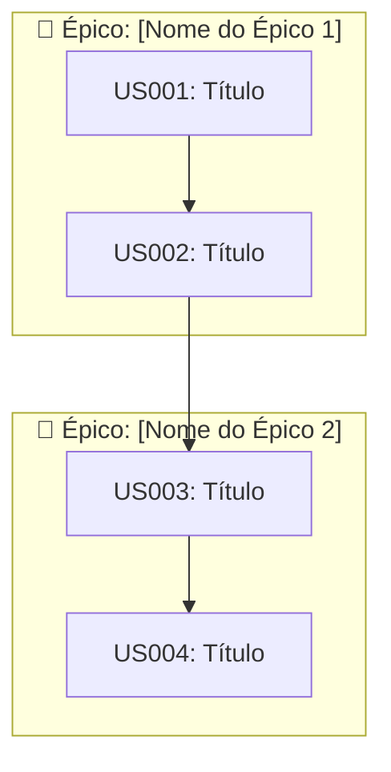

# Backlog: [Nome do Sistema]

**Versão:** 1.0  
**Data:** YYYY-MM-DD  
**Product Owner:** [Nome]  
**PRD Relacionado:** [Link]

---

## Épicos

| ID | Épico | Descrição | Prioridade | Sprint Alvo |
|---|---|---|---|---|
| E001 | [Nome do Épico] | [Descrição breve] | P0 | 1-2 |
| E002 | [Nome do Épico] | [Descrição breve] | P1 | 3-4 |
| E003 | [Nome do Épico] | [Descrição breve] | P2 | Backlog |

---

## Histórias de Usuário

### Épico: E001 - [Nome do Épico]

#### US001 - [Título da História]

**Como** [persona],  
**Quero** [ação/funcionalidade],  
**Para** [benefício/valor].

| Campo | Valor |
|---|---|
| **Épico** | E001 |
| **Prioridade** | P0 |
| **Pontos** | 3 |
| **Sprint** | 1 |
| **Requisitos** | RF001, RF002 |

**Critérios de Aceite:**
- [ ] CA1: [Critério verificável]
- [ ] CA2: [Critério verificável]
- [ ] CA3: [Critério verificável]

**Definição de Pronto:**
- [ ] Código implementado
- [ ] Testes unitários (cobertura > 80%)
- [ ] Code review aprovado
- [ ] Documentação atualizada
- [ ] Deploy em staging

**Notas técnicas:**
- [Consideração técnica relevante]

---

#### US002 - [Título da História]

**Como** [persona],  
**Quero** [ação],  
**Para** [benefício].

| Campo | Valor |
|---|---|
| **Épico** | E001 |
| **Prioridade** | P0 |
| **Pontos** | 5 |
| **Sprint** | 1 |
| **Requisitos** | RF003 |
| **Dependências** | US001 |

**Critérios de Aceite:**
- [ ] CA1:
- [ ] CA2:

---

### Épico: E002 - [Nome do Épico]

#### US003 - [Título]

[Repetir estrutura]

---

## Sprint Planning

### Sprint 1 (Semana X-Y)

**Objetivo:** [Objetivo da sprint em uma frase]

**Capacidade:** X pontos

| ID | História | Pontos | Responsável | Status |
|---|---|---|---|---|
| US001 | [Título] | 3 | [Nome] | ⏳ To Do |
| US002 | [Título] | 5 | [Nome] | ⏳ To Do |
| **Total** | | **8** | | |

### Sprint 2 (Semana X-Y)

**Objetivo:** [Objetivo]

| ID | História | Pontos | Responsável | Status |
|---|---|---|---|---|
| US003 | [Título] | 3 | | ⏳ |
| US004 | [Título] | 5 | | ⏳ |

---

## Bugs e Débito Técnico

| ID | Tipo | Título | Prioridade | Sprint |
|---|---|---|---|---|
| BUG001 | Bug | [Descrição] | Alta | 1 |
| TECH001 | Tech Debt | [Descrição] | Média | Backlog |

---

## Métricas de Velocidade

| Sprint | Planejado | Entregue | Velocidade |
|---|---|---|---|
| 1 | X pts | - | - |
| 2 | X pts | - | - |
| Média | | | - |

---

## Definição de Pronto (DoD) Global

Toda história deve atender:

- [ ] Código implementado e funcionando
- [ ] Testes unitários com cobertura > 80%
- [ ] Testes de integração para fluxos críticos
- [ ] Code review aprovado por 1+ devs
- [ ] Build passando no CI
- [ ] Sem vulnerabilidades de segurança críticas
- [ ] Documentação técnica atualizada
- [ ] Deploy bem-sucedido em staging
- [ ] Aceite do PO

---

## Diagrama de Dependências

### Visão Geral

### Tabela de Dependências

| História | Depende de | Bloqueia | Prioridade |
|----------|------------|----------|------------|
| US001 | - | US002 | Alta |
| US002 | US001 | US003 | Alta |
| US003 | US002 | US004 | Média |

### Legenda
- ⬜ Pendente
- 🔄 Em andamento
- ✅ Concluído
- ⏸️ Bloqueado

---

## Changelog

| Versão | Data | Autor | Mudanças |
|---|---|---|---|
| 1.0 | YYYY-MM-DD | [Nome] | Versão inicial |
