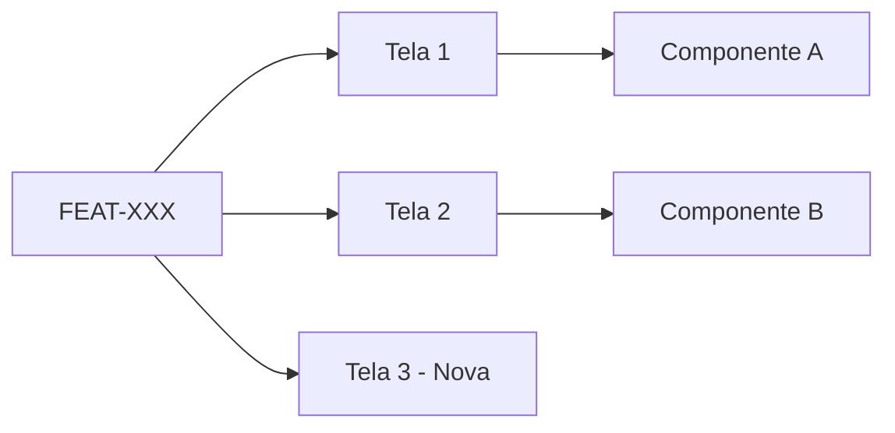

# Template: Feature

## [FEAT-XXX]: [Nome da Feature]

### Visão Geral
[Descrição breve da feature em 2-3 linhas]

### Requisitos Relacionados
- [RF-XXX](../../02-requisitos/requisitos.md#RF-XXX)

### Épico Pai
← [EPIC-XXX: Nome do Épico](../epicos/EPIC-XXX.md)

---

## Histórias Derivadas

### Fase 1: Contrato
| ID | Título | Status | Dependências |
|----|--------|--------|--------------|
| CONT-XXX | Contrato da API | ⬜ | - |

### Fase 2: Frontend
| ID | Título | Status | Dependências |
|----|--------|--------|--------------|
| US-XXX-FE | [Nome da história frontend] | ⬜ | CONT-XXX |

### Fase 3: Backend
| ID | Título | Status | Dependências |
|----|--------|--------|--------------|
| US-XXX-BE | [Nome da história backend] | ⬜ | CONT-XXX |

### Fase 4: Integração
| ID | Título | Status | Dependências |
|----|--------|--------|--------------|
| INT-XXX | Integrar Frontend + Backend | ⬜ | US-XXX-FE, US-XXX-BE |

---

## Ordem de Execução
```
1. CONT-XXX (Contrato)
       │
   ┌───┴───┐
   ▼       ▼
2. US-XXX-FE   3. US-XXX-BE  (paralelo)
   │               │
   └───────┬───────┘
           ▼
      4. INT-XXX (Integração)
```

---

## Legenda de Status
- ⬜ Pendente
- 🔄 Em andamento
- ✅ Concluído
- ⏸️ Bloqueado

---

## Telas Afetadas

### Mapa de Impacto



### Tabela de Impacto

| Tela | Ação | Detalhes | Componentes |
|------|------|----------|-------------|
| [Nome Tela 1] | Modifica | [O que muda] | [Componentes afetados] |
| [Nome Tela 2] | Nova | [Descrição] | [Novos componentes] |
| [Nome Tela 3] | Remove | [Justificativa] | - |

### Legenda de Ações
- **Nova**: Tela criada por esta feature
- **Modifica**: Tela existente que será alterada
- **Remove**: Tela que será descontinuada

