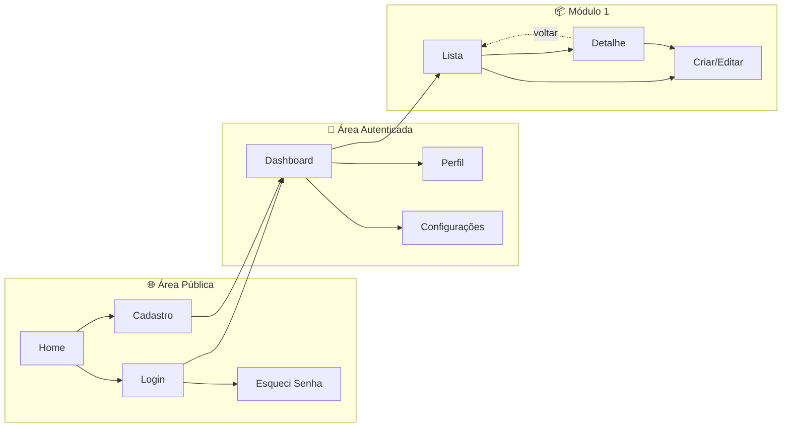

# Mapa de Navegação: [Nome do Sistema]

**Versão:** 1.0  
**Data:** YYYY-MM-DD  
**Designer:** [Nome]  
**Design Doc Relacionado:** [Link]

---

## 1. Diagrama de Navegação

---

## 2. Inventário de Telas

| ID | Tela | URL | Acesso | RFs Relacionados | Descrição |
|----|------|-----|--------|------------------|-----------|
| T01 | Home | `/` | Público | - | Landing page |
| T02 | Login | `/login` | Público | RF-001 | Autenticação |
| T03 | Cadastro | `/register` | Público | RF-002 | Novo usuário |
| T04 | Dashboard | `/dashboard` | Auth | RF-003 | Visão geral |
| T05 | [Módulo] Lista | `/modulo` | Auth | RF-00X | Lista de itens |
| T06 | [Módulo] Detalhe | `/modulo/:id` | Auth | RF-00X | Detalhes do item |
| T07 | [Módulo] Criar | `/modulo/new` | Auth | RF-00X | Criar novo item |

---

## 3. Padrões de Navegação

### 3.1 Navegação Global

| Padrão | Telas Aplicáveis | Comportamento |
|--------|------------------|---------------|
| Header | Todas autenticadas | Logo, menu principal, avatar |
| Sidebar | Dashboard, módulos | Menu colapsável |
| Breadcrumb | Detalhes, edição | Home > Módulo > Item |
| Back Button | Detalhes, formulários | Volta para lista |

### 3.2 Transições entre Telas

| Origem | Destino | Gatilho | Dados Passados |
|--------|---------|---------|----------------|
| Lista | Detalhe | Click no item | `id` do item |
| Detalhe | Editar | Botão "Editar" | `id` do item |
| Form | Lista | Submit sucesso | - (refresh lista) |
| Qualquer | Login | Sessão expirada | `returnUrl` |

---

## 4. Estados por Tela

| Tela | Loading | Empty | Error | Success |
|------|---------|-------|-------|---------|
| Lista | Skeleton table | "Nenhum item encontrado" + CTA | Toast + retry | - |
| Detalhe | Spinner central | 404 page | Toast + back | - |
| Form | Button loading | - | Inline errors | Toast + redirect |
| Dashboard | Skeleton cards | Cards com zeros | Toast | - |

---

## 5. Responsividade

| Breakpoint | Navegação | Layout |
|------------|-----------|--------|
| Mobile (< 768px) | Bottom nav ou hamburger | Stack vertical |
| Tablet (768-1024px) | Sidebar colapsada | 2 colunas |
| Desktop (> 1024px) | Sidebar fixa | 3+ colunas |

---

## 6. Acessibilidade na Navegação

- [ ] Skip links no topo de cada página
- [ ] Focus trap em modais
- [ ] Aria-current para item ativo do menu
- [ ] Landmarks (`nav`, `main`, `aside`)
- [ ] Anúncio de mudança de página para screen readers

---

## 7. Deep Links e Compartilhamento

| Tela | Pode Compartilhar | URL Pattern | Auth Required |
|------|-------------------|-------------|---------------|
| Detalhe | ✅ | `/modulo/:id` | Sim |
| Lista com filtros | ✅ | `/modulo?filter=x` | Sim |
| Dashboard | ❌ | - | Sim |
| Login | ❌ | - | Não |

---

## Changelog

| Versão | Data | Autor | Mudanças |
|--------|------|-------|----------|
| 1.0 | YYYY-MM-DD | [Nome] | Versão inicial |
