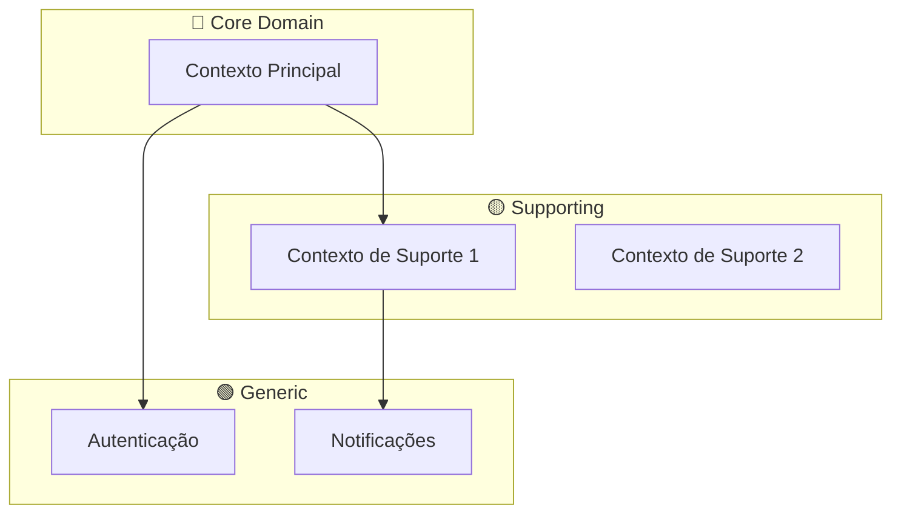
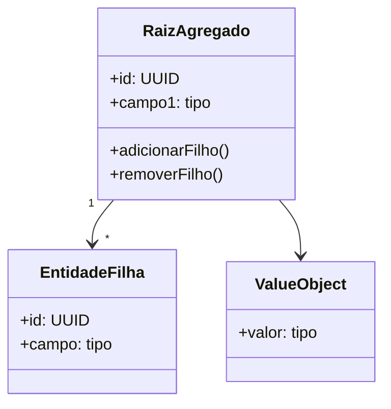
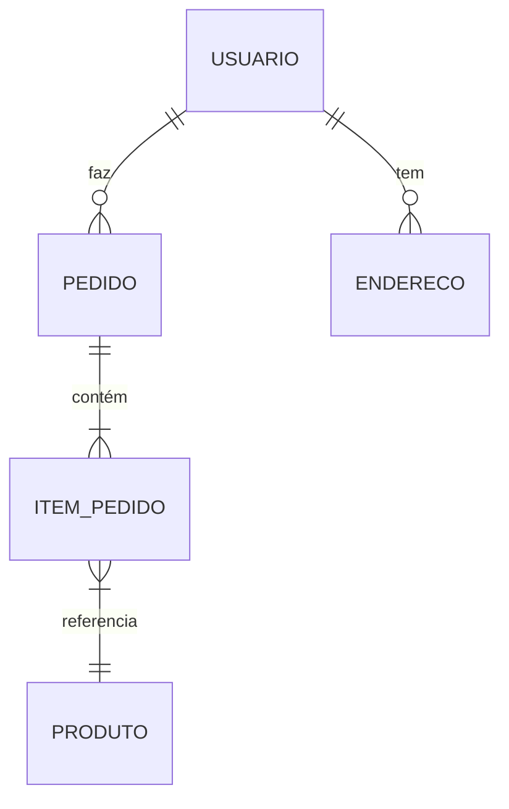

# Modelo de Domínio: [Nome do Sistema]

**Versão:** 1.0  
**Data:** YYYY-MM-DD  
**Requisitos Relacionados:** [Link]

---

## 1. Bounded Contexts



| Bounded Context | Responsabilidade | Tipo | Linguagem Ubíqua |
|---|---|---|---|
| [Nome] | [O que faz] | Core/Supporting/Generic | [Termos específicos] |

---

## 2. Entidades

### 2.1 [NomeEntidade]

**Descrição:** [O que esta entidade representa no domínio]

**Bounded Context:** [A qual contexto pertence]

| Campo | Tipo | Obrigatório | Descrição | Validações |
|---|---|---|---|---|
| id | UUID | ✅ | Identificador único | Auto-gerado |
| nome | string(100) | ✅ | Nome do... | Min 2 chars |
| email | string(255) | ✅ | Email do... | Formato email |
| status | enum | ✅ | Status atual | [ATIVO, INATIVO] |
| createdAt | datetime | ✅ | Data de criação | Auto |
| updatedAt | datetime | ✅ | Última atualização | Auto |

**Regras de Negócio:**
- RN1: [Nome deve ser único dentro de X]
- RN2: [Status só pode mudar de ATIVO para INATIVO se Y]

**Invariantes:**
- [Condição que SEMPRE deve ser verdadeira para esta entidade]
- Email não pode ser alterado após criação

**Métodos de Domínio:**
- `ativar()`: Muda status para ATIVO
- `desativar()`: Muda status para INATIVO se [condição]

---

### 2.2 [OutraEntidade]

**Descrição:** [Descrição]

| Campo | Tipo | Obrigatório | Descrição | Validações |
|---|---|---|---|---|
| id | UUID | ✅ | | |
| | | | | |

---

## 3. Value Objects

### 3.1 [NomeVO]

**Descrição:** [Objeto imutável que representa um conceito]

| Campo | Tipo | Validação |
|---|---|---|
| valor | string | [Regra] |

**Exemplo:** Email, CPF, Dinheiro, Endereço

```typescript
// Exemplo de uso
class Email {
  constructor(private readonly value: string) {
    if (!this.isValid(value)) throw new Error('Email inválido');
  }
}
```

---

## 4. Agregados

### 4.1 Agregado: [Nome]

**Raiz do Agregado:** [Entidade raiz]

**Descrição:** [O que este agregado encapsula]



**Regras do Agregado:**
- Acesso às entidades filhas somente através da raiz
- [Regra específica]

---

## 5. Relacionamentos

### Diagrama ER



### Tabela de Relacionamentos

| Origem | Destino | Cardinalidade | Descrição | Obrigatório |
|---|---|---|---|---|
| Usuario | Pedido | 1:N | Um usuário faz vários pedidos | Não |
| Pedido | ItemPedido | 1:N | Um pedido tem vários itens | Sim (min 1) |
| ItemPedido | Produto | N:1 | Item referencia um produto | Sim |

---

## 6. Eventos de Domínio

| Evento | Trigger | Payload | Consumidores |
|---|---|---|---|
| UsuarioCriado | Após criar usuário | `{id, email, nome}` | EmailService, Analytics |
| PedidoFinalizado | Após finalizar pedido | `{id, total, itens}` | Estoque, Financeiro |
| | | | |

### Exemplo de Evento

```typescript
interface PedidoFinalizadoEvent {
  eventType: 'PedidoFinalizado';
  occurredAt: Date;
  payload: {
    pedidoId: string;
    usuarioId: string;
    total: number;
    itens: Array<{produtoId: string; quantidade: number}>;
  };
}
```

---

## 7. Serviços de Domínio

| Serviço | Responsabilidade | Entidades Envolvidas |
|---|---|---|
| CalculadoraPreco | Calcula preço com descontos | Pedido, Cupom, Produto |
| ValidadorEstoque | Verifica disponibilidade | Produto, ItemPedido |

---

## 8. Repositórios

| Repositório | Entidade | Métodos Principais |
|---|---|---|
| UsuarioRepository | Usuario | `findById`, `findByEmail`, `save` |
| PedidoRepository | Pedido | `findById`, `findByUsuario`, `save` |

---

## 9. Dúvidas em Aberto

- [ ] [Pergunta sobre o domínio para stakeholder]
- [ ] [Outra dúvida]

---

## Glossário (Linguagem Ubíqua)

| Termo | Definição no Domínio |
|---|---|
| [Termo] | [O que significa neste contexto] |
| | |

---

## Changelog

| Versão | Data | Autor | Mudanças |
|---|---|---|---|
| 1.0 | YYYY-MM-DD | [Nome] | Versão inicial |
