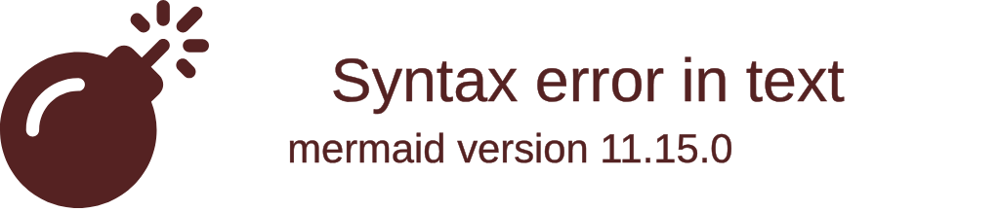

# 📊 Relatório de Acessibilidade WCAG 2.1 AA

## 📋 Metadados

**Projeto:** [Nome do Projeto]  
**URL do Projeto:** [https://exemplo.com]  
**Data da Auditoria:** [DD/MM/YYYY]  
**Período da Auditoria:** [DD/MM/YYYY] a [DD/MM/YYYY]  
**Auditor Responsável:** [Nome do Auditor]  
**Equipe Envolvida:** [Lista de membros]  
**Versão do Relatório:** 1.0  
**Próxima Revisão:** [DD/MM/YYYY]  

---

## 🎯 Executivo Summary

### Status Geral da Acessibilidade
- **Nível de Conformidade:** [WCAG 2.1 AA|A|AAA|Não Conforme]
- **Score Geral:** [XX]/100 pontos
- **Issues Críticas:** [X]
- **Issues Moderadas:** [X]
- **Issues Leves:** [X]
- **Recomendação:** [Aprovar|Reprovar|Aprovar com Reservas]

### Principais Descobertas
1. **[Descoberta 1]** - [Impacto e importância]
2. **[Descoberta 2]** - [Impacto e importância]
3. **[Descoberta 3]** - [Impacto e importância]

### Impacto nos Usuários
- **Usuários com Deficiência Visual:** [Descrição do impacto]
- **Usuários com Deficiência Motora:** [Descrição do impacto]
- **Usuários com Deficiência Auditiva:** [Descrição do impacto]
- **Usuários com Deficiência Cognitiva:** [Descrição do impacto]

---

## 📈 Métricas de Conformidade

### Score por Princípio WCAG

| Princípio | Score Máximo | Score Obtido | Percentual | Status |
|-----------|--------------|--------------|-----------|--------|
| **Perceptível** | 38 | [XX] | [XX]% | [✅|⚠️|❌] |
| **Operável** | 31 | [XX] | [XX]% | [✅|⚠️|❌] |
| **Compreensível** | 30 | [XX] | [XX]% | [✅|⚠️|❌] |
| **Robusto** | 12 | [XX] | [XX]% | [✅|⚠️|❌] |
| **TOTAL** | **111** | **[XX]** | **[XX]%** | **[Status Final]** |

### Distribuição de Issues por Severidade



### Evolução Histórica

| Data | Score | Issues Críticas | Issues Moderadas | Status |
|------|-------|----------------|------------------|--------|
| [Data 1] | [XX] | [X] | [X] | [Status] |
| [Data 2] | [XX] | [X] | [X] | [Status] |
| [Data 3] | [XX] | [X] | [X] | [Status] |

---

## 🔍 Análise Detalhada

### 1. Issues Críticas (Prioridade Alta)

#### Issue #[XX]: [Título da Issue]
- **WCAG:** [1.1.1|1.4.3|2.1.1|2.4.1|3.3.1|4.1.1]
- **Severidade:** Crítica
- **Local:** [Página/Componente Específico]
- **Descrição:** [Descrição detalhada do problema]
- **Impacto no Usuário:** [Como afeta usuários com deficiências]
- **Exemplo:** [Exemplo concreto do problema]
- **Reprodução:** [Passos para reproduzir o issue]

**Recomendação:**
```html
<!-- ✅ Solução Recomendada -->
[Exemplo de código corrigido]
```

**Prioridade:** Alta - Corrigir em [X] dias

---

#### Issue #[XX]: [Título da Issue]
- **WCAG:** [Critério WCAG]
- **Severidade:** Crítica
- **Local:** [Página/Componente Específico]
- **Descrição:** [Descrição detalhada do problema]
- **Impacto no Usuário:** [Como afeta usuários com deficiências]
- **Exemplo:** [Exemplo concreto do problema]
- **Reprodução:** [Passos para reproduzir o issue]

**Recomendação:**
```html
<!-- ✅ Solução Recomendada -->
[Exemplo de código corrigido]
```

**Prioridade:** Alta - Corrigir em [X] dias

---

### 2. Issues Moderadas (Prioridade Média)

#### Issue #[XX]: [Título da Issue]
- **WCAG:** [Critério WCAG]
- **Severidade:** Moderada
- **Local:** [Página/Componente Específico]
- **Descrição:** [Descrição detalhada do problema]
- **Impacto no Usuário:** [Como afeta usuários com deficiências]
- **Exemplo:** [Exemplo concreto do problema]

**Recomendação:**
```html
<!-- ✅ Solução Recomendada -->
[Exemplo de código corrigido]
```

**Prioridade:** Média - Corrigir em [X] semanas

---

### 3. Issues Leves (Prioridade Baixa)

#### Issue #[XX]: [Título da Issue]
- **WCAG:** [Critério WCAG]
- **Severidade:** Leve
- **Local:** [Página/Componente Específico]
- **Descrição:** [Descrição detalhada do problema]
- **Impacto no Usuário:** [Como afeta usuários com deficiências]

**Recomendação:**
```html
<!-- ✅ Solução Recomendada -->
[Exemplo de código corrigido]
```

**Prioridade:** Baixa - Corrigir em [X] meses

---

## 🧪 Testes Realizados

### Testes Automatizados

#### axe-core Results
- **Total de Violations:** [X]
- **Total de Incomplete:** [X]
- **Total de Needs Review:** [X]
- **Score de Acessibilidade:** [XX]/100

**Principais Violations:**
1. **[Violation Type]** - [X] ocorrências
2. **[Violation Type]** - [X] ocorrências
3. **[Violation Type]** - [X] ocorrências

#### WAVE Results
- **Errors:** [X]
- **Alerts:** [X]
- **Features:** [X]
- **Structural Elements:** [X]
- **ARIA:** [X]

#### Lighthouse Accessibility
- **Score:** [XX]/100
- **Performance:** [XX]/100
- **Best Practices:** [XX]/100
- **SEO:** [XX]/100

### Testes Manuais

#### Navegação por Teclado
- **Status:** [✅ Passou|⚠️ Parcial|❌ Falhou]
- **Observações:** [Detalhes dos testes]
- **Issues Encontrados:** [Lista de issues]

**Testes Realizados:**
- [ ] Tab navigation em todas as páginas
- [ ] Shift+Tab navigation reversa
- [ ] Enter/Space em elementos interativos
- [ ] Escape para fechar modais/dialogs
- [ ] Arrow keys em menus e listas
- [ ] Foco visível em todos os elementos

#### Leitores de Tela

##### NVDA (Windows)
- **Status:** [✅ Passou|⚠️ Parcial|❌ Falhou]
- **Versão Testada:** [Versão do NVDA]
- **Navegador:** [Chrome/Firefox/Edge]
- **Observações:** [Detalhes dos testes]

**Elementos Testados:**
- [ ] Títulos e cabeçalhos
- [ ] Links e botões
- [ ] Formulários e campos
- [ ] Tabelas e listas
- [ ] Imagens e gráficos
- [ ] Modais e dialogs

##### VoiceOver (macOS)
- **Status:** [✅ Passou|⚠️ Parcial|❌ Falhou]
- **Versão Testada:** [Versão do VoiceOver]
- **Navegador:** [Safari]
- **Observações:** [Detalhes dos testes]

**Elementos Testados:**
- [ ] Navegação por VO keys
- [ ] Rotor para headings
- [ ] Rotor para links
- [ ] Rotor para form controls
- [ ] Web rotor

##### JAWS (Windows)
- **Status:** [✅ Passou|⚠️ Parcial|❌ Falhou]
- **Versão Testada:** [Versão do JAWS]
- **Navegador:** [Chrome/Firefox/Edge]
- **Observações:** [Detalhes dos testes]

#### Zoom do Navegador
- **Status:** [✅ Passou|⚠️ Parcial|❌ Falhou]
- **Níveis Testados:** 150%, 200%, 300%
- **Observações:** [Detalhes dos testes]

**Elementos Verificados:**
- [ ] Layout não quebra
- [ ] Texto permanece legível
- [ ] Funcionalidade preservada
- [ ] Navegação funcional

#### Modo Alto Contraste
- **Status:** [✅ Passou|⚠️ Parcial|❌ Falhou]
- **Sistema Testado:** [Windows/macOS]
- **Observações:** [Detalhes dos testes]

---

## 🎯 Análise por Componente

### Header e Navegação
- **Score:** [XX]/100
- **Issues:** [X] críticas, [X] moderadas, [X] leves
- **Status:** [✅ Conforme|⚠️ Parcialmente Conforme|❌ Não Conforme]

**Principais Issues:**
1. **[Issue]** - [Descrição]
2. **[Issue]** - [Descrição]

### Conteúdo Principal
- **Score:** [XX]/100
- **Issues:** [X] críticas, [X] moderadas, [X] leves
- **Status:** [✅ Conforme|⚠️ Parcialmente Conforme|❌ Não Conforme]

**Principais Issues:**
1. **[Issue]** - [Descrição]
2. **[Issue]** - [Descrição]

### Formulários
- **Score:** [XX]/100
- **Issues:** [X] críticas, [X] moderadas, [X] leves
- **Status:** [✅ Conforme|⚠️ Parcialmente Conforme|❌ Não Conforme]

**Principais Issues:**
1. **[Issue]** - [Descrição]
2. **[Issue]** - [Descrição]

### Rodapé (Footer)
- **Score:** [XX]/100
- **Issues:** [X] críticas, [X] moderadas, [X] leves
- **Status:** [✅ Conforme|⚠️ Parcialmente Conforme|❌ Não Conforme]

**Principais Issues:**
1. **[Issue]** - [Descrição]
2. **[Issue]** - [Descrição]

---

## 📋 Recomendações Estratégicas

### Ações Imediatas (1-2 semanas)
1. **[Ação 1]** - [Descrição detalhada]
   - **Impacto:** [Alto|Médio|Baixo]
   - **Esforço:** [Alto|Médio|Baixo]
   - **Responsável:** [Nome/Cargo]

2. **[Ação 2]** - [Descrição detalhada]
   - **Impacto:** [Alto|Médio|Baixo]
   - **Esforço:** [Alto|Médio|Baixo]
   - **Responsável:** [Nome/Cargo]

### Melhorias de Médio Prazo (1-2 meses)
1. **[Melhoria 1]** - [Descrição detalhada]
   - **Impacto:** [Alto|Médio|Baixo]
   - **Esforço:** [Alto|Médio|Baixo]
   - **Responsável:** [Nome/Cargo]

2. **[Melhoria 2]** - [Descrição detalhada]
   - **Impacto:** [Alto|Médio|Baixo]
   - **Esforço:** [Alto|Médio|Baixo]
   - **Responsável:** [Nome/Cargo]

### Iniciativas de Longo Prazo (3-6 meses)
1. **[Iniciativa 1]** - [Descrição detalhada]
   - **Impacto:** [Alto|Médio|Baixo]
   - **Esforço:** [Alto|Médio|Baixo]
   - **Responsável:** [Nome/Cargo]

---

## 🛠️ Plano de Implementação

### Roadmap de Correções

#### Fase 1: Crítico (Semanas 1-2)
- **Objetivo:** Resolver todas as issues críticas
- **Entregáveis:**
  - [ ] [Entregável 1]
  - [ ] [Entregável 2]
  - [ ] [Entregável 3]

**Timeline:**
- **Semana 1:** Planejamento e setup
- **Semana 2:** Implementação e testes

#### Fase 2: Moderado (Semanas 3-4)
- **Objetivo:** Resolver issues moderadas
- **Entregáveis:**
  - [ ] [Entregável 1]
  - [ ] [Entregável 2]

**Timeline:**
- **Semana 3:** Desenvolvimento
- **Semana 4:** Testes e validação

#### Fase 3: Leve (Semanas 5-6)
- **Objetivo:** Resolver issues leves e otimizações
- **Entregáveis:**
  - [ ] [Entregável 1]
  - [ ] [Entregável 2]

**Timeline:**
- **Semana 5:** Implementação
- **Semana 6:** Testes finais e documentação

### Recursos Necessários

#### Equipe
- **Desenvolvedor Frontend:** [X] FTE
- **Designer UX:** [X] FTE
- **QA Tester:** [X] FTE
- **Especialista em Acessibilidade:** [X] FTE

#### Ferramentas
- **axe-core:** Já integrado
- **WAVE:** Gratuito
- **NVDA:** Gratuito
- **VoiceOver:** Incluído no macOS
- **JAWS:** Licença necessária

#### Treinamento
- **WCAG 2.1 Training:** [X] horas
- **Screen Reader Testing:** [X] horas
- **ARIA Best Practices:** [X] horas

---

## 📊 Monitoramento Contínuo

### Métricas de Sucesso

#### KPIs de Acessibilidade
- **WCAG Compliance Score:** Meta [XX]%
- **Critical Issues:** Meta 0
- **User Satisfaction:** Meta [XX]/5
- **Time to Fix:** Meta [X] dias

#### Ferramentas de Monitoramento
- **Automated Testing:** axe-core em CI/CD
- **User Testing:** Sessões mensais com usuários
- **Analytics:** Uso de tecnologias assistivas
- **Feedback:** Canal para report de issues

### Processo de Validação Contínua

#### Checklist de Deploy
- [ ] Testes automatizados passam
- [ ] Revisão manual de novas features
- [ ] Validação com leitores de tela
- [ ] Teste de navegação por teclado
- [ ] Verificação de contraste

#### Relatórios Mensais
- **Score de Acessibilidade:** [XX]/100
- **Issues Resolvidas:** [X]
- **Novos Issues:** [X]
- **Tendências:** [Análise de tendências]

---

## 📚 Recursos e Referências

### Documentação WCAG
- **WCAG 2.1 Guidelines:** https://www.w3.org/WAI/WCAG21/quickref/
- **Understanding WCAG 2.1:** https://www.w3.org/WAI/WCAG21/understanding/
- **WCAG 2.1 Techniques:** https://www.w3.org/WAI/WCAG21/Techniques/

### ARIA e HTML Semântico
- **ARIA Authoring Practices:** https://www.w3.org/TR/wai-aria-practices-1.1/
- **HTML5 Accessibility:** https://www.w3.org/TR/html-accessibility/
- **Semantic HTML:** https://html5doctor.com/

### Ferramentas de Teste
- **axe-core:** https://www.deque.com/axe/
- **WAVE:** https://wave.webaim.org/
- **Lighthouse:** https://developers.google.com/web/tools/lighthouse/
- **Color Contrast Checker:** https://webaim.org/resources/contrastchecker/

### Comunidade e Suporte
- **WebAIM:** https://webaim.org/
- **A11y Project:** https://www.a11yproject.com/
- **IAAP:** https://www.accessibilityassociation.org/

---

## 📞 Contato e Suporte

### Equipe do Projeto
- **Product Manager:** [Nome] - [email@exemplo.com]
- **Tech Lead:** [Nome] - [email@exemplo.com]
- **Accessibility Specialist:** [Nome] - [email@exemplo.com]
- **QA Lead:** [Nome] - [email@exemplo.com]

### Canais de Comunicação
- **Slack:** #acessibilidade
- **Email:** accessibility@exemplo.com
- **Issues:** GitHub Issues [link]

### Escalation
- **Level 1:** [Nome/Cargo] - [contato]
- **Level 2:** [Nome/Cargo] - [contato]
- **Level 3:** [Nome/Cargo] - [contato]

---

## 📝 Anexos

### Anexo A: Screenshots dos Issues
- [Screenshot 1]: [Descrição]
- [Screenshot 2]: [Descrição]
- [Screenshot 3]: [Descrição]

### Anexo B: Logs de Testes
- [Log 1]: [Descrição]
- [Log 2]: [Descrição]

### Anexo C: Código de Exemplo
- [Exemplo 1]: [Descrição]
- [Exemplo 2]: [Descrição]

---

## 🔄 Histórico de Revisões

| Versão | Data | Autor | Mudanças |
|--------|------|-------|----------|
| 1.0 | [DD/MM/YYYY] | [Nome] | Versão inicial |
| 1.1 | [DD/MM/YYYY] | [Nome] | [Descrição] |
| 1.2 | [DD/MM/YYYY] | [Nome] | [Descrição] |

---

**Status Final do Relatório:** [ ] ✅ **APROVADO** | [ ] 🔄 **APROVADO COM RESERVAS** | [ ] ❌ **REPROVADO**

**Recomendação Final:** [Descrição da recomendação final]

**Próxima Auditoria:** [DD/MM/YYYY]

---

*Este relatório deve ser revisado e atualizado regularmente para manter a conformidade WCAG contínua e garantir a acessibilidade para todos os usuários.*