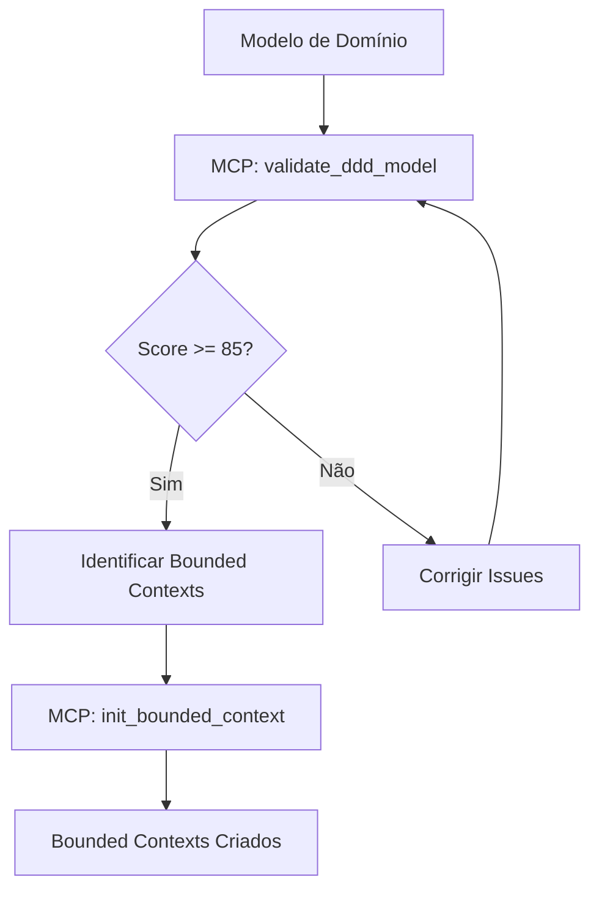
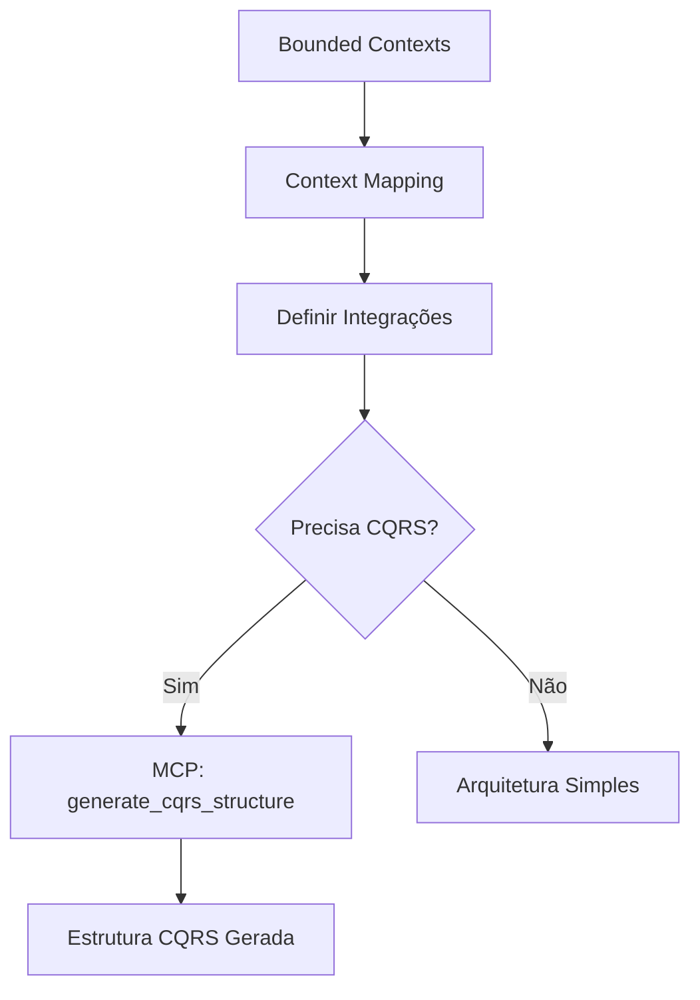
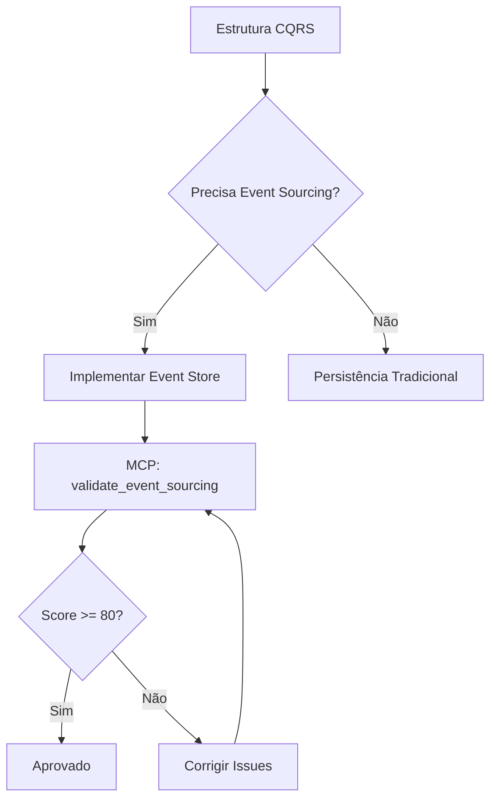

# MCP Integration - Arquitetura Avançada

**Especialista:** Arquitetura Avançada  
**Versão MCP:** 2.0  
**Última Atualização:** 01/02/2026

---

## 🎯 Visão Geral da Integração MCP

Este documento descreve como o **MCP (Model Context Protocol)** integra com o especialista de Arquitetura Avançada para automatizar validações, geração de estruturas e garantia de qualidade em arquiteturas enterprise.

### Princípios de Integração

1. **Skills Descritivas:** Este especialista fornece apenas informações e processos
2. **MCP Executa:** Toda lógica de automação é implementada no MCP
3. **Zero Scripts Locais:** Nenhum código executável nesta skill
4. **Validação Automatizada:** Quality gates executados pelo MCP

---

## 🔧 Funções MCP Disponíveis

### 1. `init_bounded_context`

Inicializa a estrutura de um bounded context seguindo padrões DDD.

**Quando usar:**
- Ao identificar um novo bounded context
- Ao iniciar implementação de um contexto
- Ao migrar funcionalidade para novo contexto

**Input esperado:**
```json
{
  "context_name": "Order",
  "responsibility": "Gerenciar pedidos e checkout",
  "ubiquitous_language": {
    "Order": "Pedido do cliente",
    "OrderItem": "Item do pedido",
    "Checkout": "Processo de finalização"
  },
  "aggregates": ["Order", "Cart"],
  "domain_events": ["OrderCreated", "OrderPaid", "OrderShipped"]
}
```

**Output gerado:**
```
docs/bounded-contexts/order/
├── bounded-context.md      # Documentação do contexto
├── ubiquitous-language.md  # Glossário de termos
├── aggregates/
│   ├── order.md
│   └── cart.md
└── domain-events/
    ├── order-created.md
    ├── order-paid.md
    └── order-shipped.md
```

**Validações automáticas:**
- ✅ Nome do contexto segue convenção (PascalCase)
- ✅ Responsabilidade é clara e única
- ✅ Linguagem ubíqua está definida
- ✅ Aggregates têm root entity
- ✅ Domain events seguem padrão (PastTense)

---

### 2. `validate_ddd_model`

Valida se o modelo de domínio segue princípios DDD corretamente.

**Quando usar:**
- Após criar/atualizar modelo de domínio
- Antes de avançar para implementação
- Durante code review de domínio

**Input esperado:**
```json
{
  "model_path": "docs/04-modelo/modelo-dominio.md",
  "bounded_contexts": ["Order", "Payment", "Shipping"],
  "validation_level": "strict"
}
```

**Validações executadas:**

#### Strategic Design (40 pontos)
- [ ] Bounded contexts identificados (10 pts)
- [ ] Context mapping definido (10 pts)
- [ ] Linguagem ubíqua por contexto (10 pts)
- [ ] Anticorruption layers onde necessário (10 pts)

#### Tactical Design (40 pontos)
- [ ] Aggregates com root entity (10 pts)
- [ ] Entities vs Value Objects corretos (10 pts)
- [ ] Domain events modelados (10 pts)
- [ ] Repositories por aggregate (10 pts)

#### Quality Attributes (20 pontos)
- [ ] Coesão interna > 80% (10 pts)
- [ ] Acoplamento < 20% (10 pts)

**Output:**
```json
{
  "score": 85,
  "status": "approved",
  "issues": [],
  "warnings": [
    "Context 'Payment' tem acoplamento de 25% com 'Order'"
  ],
  "recommendations": [
    "Considere adicionar anticorruption layer entre Payment e Order"
  ]
}
```

---

### 3. `generate_cqrs_structure`

Gera estrutura completa para implementação CQRS.

**Quando usar:**
- Ao decidir aplicar CQRS em um contexto
- Ao separar read/write models
- Ao implementar eventual consistency

**Input esperado:**
```json
{
  "bounded_context": "Order",
  "aggregate": "Order",
  "commands": [
    {
      "name": "CreateOrder",
      "properties": ["customerId", "items", "totalAmount"]
    },
    {
      "name": "CancelOrder",
      "properties": ["orderId", "reason"]
    }
  ],
  "queries": [
    {
      "name": "GetOrderById",
      "parameters": ["orderId"],
      "returns": "OrderDto"
    },
    {
      "name": "GetOrdersByCustomer",
      "parameters": ["customerId"],
      "returns": "OrderDto[]"
    }
  ],
  "events": [
    "OrderCreated",
    "OrderCancelled"
  ]
}
```

**Output gerado:**
```
src/order/
├── commands/
│   ├── create-order.command.ts
│   ├── create-order.handler.ts
│   ├── cancel-order.command.ts
│   └── cancel-order.handler.ts
├── queries/
│   ├── get-order-by-id.query.ts
│   ├── get-order-by-id.handler.ts
│   ├── get-orders-by-customer.query.ts
│   └── get-orders-by-customer.handler.ts
├── events/
│   ├── order-created.event.ts
│   ├── order-created.handler.ts
│   ├── order-cancelled.event.ts
│   └── order-cancelled.handler.ts
├── domain/
│   └── order.aggregate.ts
└── read-models/
    └── order.dto.ts
```

**Padrões aplicados:**
- Command handlers retornam void ou ID
- Query handlers retornam DTOs
- Events são imutáveis
- Separação clara read/write

---

### 4. `validate_event_sourcing`

Valida implementação de Event Sourcing.

**Quando usar:**
- Após implementar event store
- Antes de deploy em produção
- Durante auditoria de arquitetura

**Input esperado:**
```json
{
  "event_store_path": "src/infrastructure/event-store",
  "aggregates": ["Order", "Payment"],
  "snapshot_strategy": "every_100_events"
}
```

**Validações executadas:**

#### Event Store (30 pontos)
- [ ] Event store implementado (10 pts)
- [ ] Eventos são append-only (10 pts)
- [ ] Eventos têm timestamp e version (10 pts)

#### Snapshots (20 pontos)
- [ ] Snapshot strategy definida (10 pts)
- [ ] Snapshots são criados corretamente (10 pts)

#### Event Replay (20 pontos)
- [ ] Event replay funciona (10 pts)
- [ ] Estado é reconstruído corretamente (10 pts)

#### Versioning (30 pontos)
- [ ] Eventos têm schema versionado (15 pts)
- [ ] Upcasting implementado (15 pts)

**Output:**
```json
{
  "score": 90,
  "status": "approved",
  "event_count": 15420,
  "snapshot_count": 154,
  "oldest_event": "2024-01-15T10:30:00Z",
  "issues": [],
  "performance": {
    "replay_time_ms": 450,
    "events_per_second": 34267
  }
}
```

---

## 🔄 Fluxo de Trabalho com MCP

### Fase 1: Análise de Domínio



### Fase 2: Design Estratégico



### Fase 3: Implementação Tática



---

## 📊 Quality Gates Automatizados

### Gate 1: DDD Model Validation

**Executado por:** `validate_ddd_model`  
**Threshold:** 85 pontos  
**Bloqueante:** Sim

**Critérios:**
- Strategic Design: 40 pontos
- Tactical Design: 40 pontos
- Quality Attributes: 20 pontos

### Gate 2: CQRS Structure Validation

**Executado por:** `generate_cqrs_structure` (validação automática)  
**Threshold:** 90 pontos  
**Bloqueante:** Sim

**Critérios:**
- Separação Command/Query: 30 pontos
- Event Handlers: 30 pontos
- DTOs e Models: 20 pontos
- Padrões aplicados: 20 pontos

### Gate 3: Event Sourcing Validation

**Executado por:** `validate_event_sourcing`  
**Threshold:** 80 pontos  
**Bloqueante:** Sim

**Critérios:**
- Event Store: 30 pontos
- Snapshots: 20 pontos
- Event Replay: 20 pontos
- Versioning: 30 pontos

---

## 🎯 Exemplos de Uso

### Exemplo 1: Iniciar Bounded Context

```bash
# Via MCP
mcp call init_bounded_context \
  --context-name "Order" \
  --responsibility "Gerenciar pedidos e checkout" \
  --aggregates "Order,Cart" \
  --events "OrderCreated,OrderPaid"
```

### Exemplo 2: Validar Modelo DDD

```bash
# Via MCP
mcp call validate_ddd_model \
  --model-path "docs/04-modelo/modelo-dominio.md" \
  --contexts "Order,Payment,Shipping" \
  --level "strict"
```

### Exemplo 3: Gerar Estrutura CQRS

```bash
# Via MCP
mcp call generate_cqrs_structure \
  --context "Order" \
  --aggregate "Order" \
  --commands "CreateOrder,CancelOrder" \
  --queries "GetOrderById,GetOrdersByCustomer"
```

---

## 🔗 Integração com Outros Especialistas

### Upstream (Dependências)

- **Modelagem de Domínio:** Fornece modelo base para DDD
- **Arquitetura de Software:** Define stack e padrões base
- **Engenharia de Requisitos:** Fornece requisitos complexos

### Downstream (Consumidores)

- **Performance e Escalabilidade:** Usa bounded contexts para otimização
- **Observabilidade:** Monitora eventos e agregados
- **DevOps:** Deploya microservices independentemente

---

## 📚 Referências MCP

### Documentação Técnica
- **MCP Server:** `@maestro/mcp-server`
- **Functions:** `src/mcp/functions/architecture/`
- **Validators:** `src/mcp/validators/ddd/`

### Schemas
- **Bounded Context:** `schemas/bounded-context.schema.json`
- **CQRS:** `schemas/cqrs.schema.json`
- **Event Sourcing:** `schemas/event-sourcing.schema.json`

---

## ⚙️ Configuração

### Habilitar Validação Automática

```json
{
  "mcp": {
    "architecture": {
      "auto_validate": true,
      "validation_level": "strict",
      "quality_gates": {
        "ddd_model": 85,
        "cqrs_structure": 90,
        "event_sourcing": 80
      }
    }
  }
}
```

### Customizar Thresholds

```json
{
  "mcp": {
    "architecture": {
      "thresholds": {
        "bounded_context_cohesion": 80,
        "service_coupling": 20,
        "event_consistency_ms": 100
      }
    }
  }
}
```

---

**Nota:** Todas as funções MCP são **descritivas** e implementadas externamente no MCP Server. Este especialista não contém código executável.
