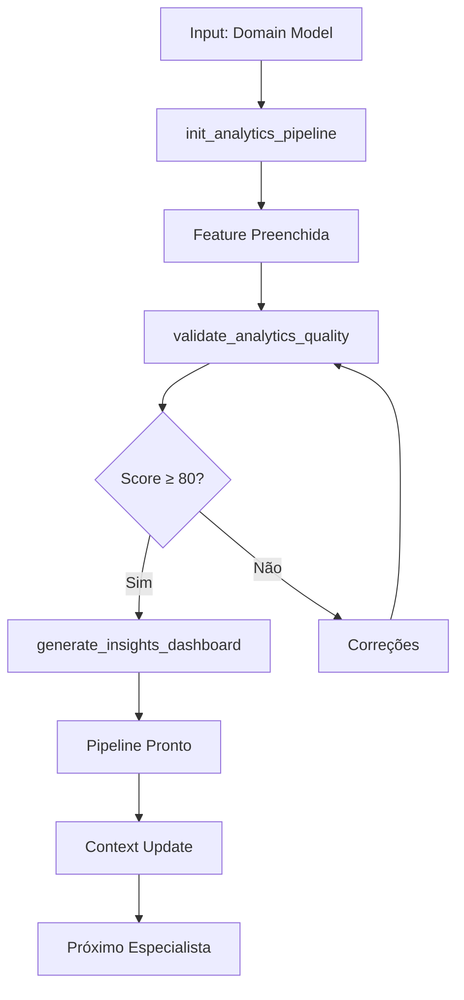

# 🔗 MCP Integration Guide - Dados e Analytics

## Visão Geral

Este documento descreve como integrar o especialista em Dados e Analytics com o MCP Maestro para automação completa de pipelines, modelagem dimensional e dashboards.

## 🎯 Objetivo da Integração

Transformar o especialista em uma skill puramente descritiva que delega toda execução ao MCP, garantindo:
- **Zero execução local** de scripts
- **Automação centralizada** no MCP
- **Validação automática** de qualidade
- **Context flow** contínuo entre especialistas

## 🏗️ Arquitetura de Integração

### Separação de Responsabilidades

```
┌─────────────────┐    ┌─────────────────┐    ┌─────────────────┐
│   Skill Analytics│───▶│      MCP        │───▶│  Data Pipeline  │
│  (Descritiva)   │    │   (Execução)    │    │   (Real)        │
└─────────────────┘    └─────────────────┘    └─────────────────┘
```

#### Skill (Nossa Responsabilidade)
- **Informações descritivas**: Processos e conhecimentos
- **Templates estruturados**: Formatos padronizados
- **Quality gates**: Critérios de validação
- **Context flow**: Mapeamento de dependências

#### MCP (Responsabilidade do MCP)
- **Execução de scripts**: Geração de pipelines
- **Validação automática**: Quality gates
- **Integração externa**: APIs e serviços
- **Gerenciamento de estado**: Persistência

## 🛠️ Funções MCP Obrigatórias

### 1. init_analytics_pipeline

**Propósito**: Criar estrutura base do pipeline de analytics

**Assinatura**:
```python
async def init_analytics_pipeline(params: dict) -> dict:
    """
    Inicializa estrutura base do pipeline de analytics
    
    Args:
        params: {
            "project_name": str,
            "business_requirements": dict,
            "data_sources": list[dict],
            "kpi_definitions": list[dict],
            "target_warehouse": str
        }
    
    Returns:
        dict: {
            "success": bool,
            "pipeline_structure": dict,
            "template_path": str,
            "created_files": list[str],
            "next_steps": list[str],
            "validation_score": int
        }
    """
```

### 2. validate_analytics_quality

**Propósito**: Validar qualidade do pipeline de analytics

**Assinatura**:
```python
async def validate_analytics_quality(params: dict) -> dict:
    """
    Valida qualidade do pipeline de analytics
    
    Args:
        params: {
            "pipeline_path": str,
            "feature_content": dict,
            "validation_level": str,
            "data_quality_checks": bool,
            "pipeline_tests": bool
        }
    
    Returns:
        dict: {
            "success": bool,
            "score": int,
            "issues": list[dict],
            "recommendations": list[str],
            "can_proceed": bool,
            "quality_metrics": dict
        }
    """
```

### 3. generate_insights_dashboard

**Propósito**: Gerar dashboard completo de insights

**Assinatura**:
```python
async def generate_insights_dashboard(params: dict) -> dict:
    """
    Gera dashboard completo de insights
    
    Args:
        params: {
            "dashboard_tool": str,
            "kpi_definitions": list[dict],
            "data_model": dict,
            "visualization_config": dict,
            "access_control": dict
        }
    
    Returns:
        dict: {
            "success": bool,
            "dashboard_url": str,
            "dashboard_config": dict,
            "queries": list[str],
            "visualizations": list[dict],
            "setup_instructions": list[str]
        }
    """
```

## 🔄 Context Flow Implementation

### Mapeamento de Entrada

```python
def map_input_context():
    """Mapeia contexto de especialistas anteriores"""
    return {
        "from_domain_model": {
            "model_path": "docs/04-modelo/modelo-dominio.md",
            "required_fields": ["entities", "relationships", "attributes"],
            "mapping": {
                "entities": "analytics.dimensions",
                "relationships": "analytics.fact_relationships",
                "attributes": "analytics.metrics"
            }
        },
        "from_development": {
            "data_path": "src/",
            "database_schema": "database/migrations/",
            "mapping": {
                "database_tables": "analytics.data_sources",
                "api_endpoints": "analytics.real_time_sources"
            }
        }
    }
```

### Mapeamento de Saída

```python
def map_output_context():
    """Mapeia contexto para próximos especialistas"""
    return {
        "to_documentation": {
            "pipeline_docs": "docs/analytics/pipelines/",
            "data_dictionary": "docs/analytics/dictionary/",
            "runbooks": "docs/analytics/runbooks/"
        },
        "to_troubleshooting": {
            "monitoring_data": "monitoring/analytics/",
            "error_logs": "logs/analytics/",
            "performance_metrics": "metrics/analytics/"
        }
    }
```

## 🚀 Pipeline de Automação

### Fluxo Completo



## 📋 Templates Integration

### Template Principal: feature.md

**Uso no MCP**:
```python
def load_template():
    """Carrega template principal"""
    with open("resources/templates/feature.md", "r") as f:
        return f.read()

def fill_template(template, params):
    """Preenche template com parâmetros"""
    # Substituição de placeholders
    template = template.replace("[Nome da Feature]", params["feature_name"])
    template = template.replace("[Descrição clara]", params["business_objective"])
    return template
```

### Templates de Apoio

**slo-sli.md**:
```python
def generate_slo_sli(kpi_definitions):
    """Gera SLO/SLI baseado nos KPIs"""
    slo_content = "# Service Level Objectives\n\n"
    for kpi in kpi_definitions:
        slo_content += f"## {kpi['name']}\n"
        slo_content += f"- **Objective**: {kpi['target']}\n"
        slo_content += f"- **Indicator**: {kpi['metric']}\n"
        slo_content += f"- **Threshold**: {kpi['threshold']}\n\n"
    return slo_content
```

## ✅ Quality Gates Implementation

### Validação Automática

```python
def validate_analytics_quality(feature_content):
    """Validação automática de qualidade"""
    score = 0
    issues = []
    
    # Fontes documentadas (20 pontos)
    if feature_content.get("data_sources"):
        score += 20
    else:
        issues.append("Fontes de dados não documentadas")
    
    # Schema definido (20 pontos)
    if feature_content.get("data_model"):
        score += 20
    else:
        issues.append("Schema de dados não definido")
    
    # Pipeline implementado (20 pontos)
    if feature_content.get("pipeline_config"):
        score += 20
    else:
        issues.append("Pipeline não configurado")
    
    # Dashboard funcional (20 pontos)
    if feature_content.get("dashboard_config"):
        score += 20
    else:
        issues.append("Dashboard não configurado")
    
    # KPIs calculados (20 pontos)
    if feature_content.get("kpi_definitions"):
        score += 20
    else:
        issues.append("KPIs não definidos")
    
    return {
        "score": score,
        "issues": issues,
        "can_proceed": score >= 80
    }
```

## 🔄 Guardrails e Segurança

### Regras de Segurança

1. **Nunca expor dados sensíveis** sem anonimização
2. **Sempre validar permissões** antes de acessar dados
3. **Implementar criptografia** em dados em repouso
4. **Auditar acesso** aos dados

### Tratamento de Erros

```python
def handle_analytics_errors(error):
    """Tratamento robusto de erros"""
    if error.type == "data_quality_error":
        return {
            "success": False,
            "error": "Qualidade de dados insuficiente",
            "details": error.details,
            "suggestions": ["Verifique fontes de dados", "Execute limpeza"]
        }
    elif error.type == "pipeline_error":
        return {
            "success": False,
            "error": "Erro no pipeline",
            "details": error.message,
            "suggestions": ["Verifique configuração", "Teste conectividade"]
        }
```

## 📊 Monitoramento e Métricas

### Métricas de Pipeline

```python
def track_analytics_metrics():
    """Monitoramento de métricas do especialista"""
    return {
        "pipeline_execution_time": measure_pipeline_time(),
        "data_quality_score": calculate_data_quality(),
        "dashboard_load_time": measure_dashboard_performance(),
        "kpi_calculation_accuracy": validate_kpi_accuracy(),
        "user_satisfaction": collect_feedback()
    }
```

### KPIs do Processo
- **Tempo de setup**: < 45 minutos
- **Score de qualidade**: > 80 pontos
- **Taxa de sucesso**: > 95%
- **Satisfação**: > 90%

## 🎯 Implementação no MCP

### Função de Inicialização
```python
async def init_analytics_pipeline(params):
    """Função MCP para inicialização"""
    
    # 1. Carregar template
    template = load_template("feature.md")
    
    # 2. Preencher com parâmetros
    filled_template = fill_template(template, params)
    
    # 3. Criar estrutura de diretórios
    created_dirs = create_analytics_structure(params["project_name"])
    
    # 4. Gerar arquivos base
    created_files = generate_base_files(filled_template, params)
    
    # 5. Configurar data warehouse
    warehouse_setup = setup_data_warehouse(params["target_warehouse"])
    
    return {
        "success": True,
        "pipeline_structure": {
            "template": filled_template,
            "directories": created_dirs,
            "files": created_files,
            "warehouse": warehouse_setup
        },
        "template_path": "resources/templates/feature.md",
        "created_files": created_files,
        "next_steps": generate_next_steps(params),
        "validation_score": 50  # Score inicial
    }
```

## 🎯 Benefícios da Integração

### Para o Usuário
- **Experiência limpa**: Sem detalhes técnicos
- **Automação completa**: Zero configuração manual
- **Validação automática**: Qualidade garantida
- **Progresso contínuo**: Fluxo entre especialistas

### Para o Sistema
- **Execução centralizada**: Tudo no MCP
- **Zero dependências locais**: Scripts externos
- **Escalabilidade**: Suporte ilimitado
- **Manutenibilidade**: Código centralizado

### Para o Time
- **Separação clara**: Skills descritivas vs execução
- **Evolução independente**: Skills e MCP separados
- **Testabilidade**: Validação automatizada
- **Documentação**: Completa e atualizada

---

## 🔄 Próximos Passos

1. **Implementar funções MCP** descritas neste guia
2. **Testar integração** com projetos reais
3. **Coletar feedback** e otimizar performance
4. **Documentar casos de uso** específicos
5. **Monitorar métricas** continuamente

Para suporte técnico, consulte os recursos em `resources/` ou os exemplos em `examples/`.
