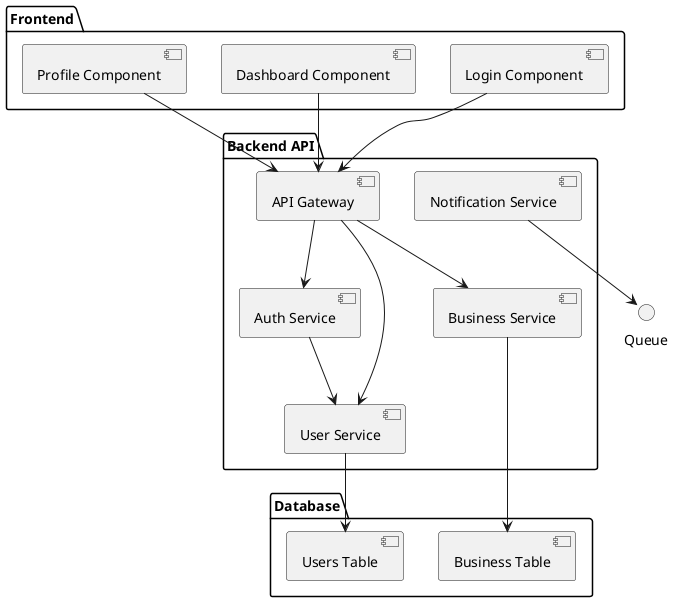

# [Nome do Projeto] - Arquitetura C4

## Sumário Executivo
[ ] **Projeto:** [Nome do projeto]
[ ] **Versão:** [Versão atual]
[ ] **Data:** [Data de criação]
[ ] **Status:** [Em elaboração/Revisão/Aprovado]
[ ] **Autor:** [Solution Architect]
[ ] **Stack Tecnológica:** [Tecnologias principais]

---

## 1. Visão Geral da Arquitetura

### 1.1 Contexto do Sistema
- **Tipo de sistema:** [Web/Mobile/Desktop/Híbrido]
- **Escopo:** [O que o sistema faz]
- **Usuários:** [Perfil e quantidade]
- **Integrações:** [Sistemas externos]
- **Restrições:** [Técnicas e de negócio]

### 1.2 Princípios Arquiteturais
- [ ] **Simplicidade:** [Descrição do princípio]
- [ ] **Escalabilidade:** [Descrição do princípio]
- [ ] **Segurança:** [Descrição do princípio]
- [ ] **Manutenibilidade:** [Descrição do princípio]
- [ ] **Performance:** [Descrição do princípio]

### 1.3 Stack Tecnológica
| Camada | Tecnologia | Versão | Propósito |
|--------|------------|--------|-----------|
| Frontend | [Tecnologia] | [Versão] | [Descrição] |
| Backend | [Tecnologia] | [Versão] | [Descrição] |
| Banco | [Tecnologia] | [Versão] | [Descrição] |
| Cache | [Tecnologia] | [Versão] | [Descrição] |
| Mensageria | [Tecnologia] | [Versão] | [Descrição] |

---

## 2. Nível 1: Contexto do Sistema (C4 Level 1)

### 2.1 Diagrama de Contexto

```plantuml
@startuml
!define RECTANGLE class

' Sistema principal
rectangle "[Nome do Sistema]" as Sistema {
  (Sistema)
}

' Usuários
actor "[Tipo de Usuário 1]" as User1
actor "[Tipo de Usuário 2]" as User2

' Sistemas externos
rectangle "[Sistema Externo 1]" as Ext1 {
  (Ext1)
}

rectangle "[Sistema Externo 2]" as Ext2 {
  (Ext2)
}

' Relacionamentos
User1 --> Sistema : "usa"
User2 --> Sistema : "gerencia"
Sistema --> Ext1 : "integra via API"
Sistema --> Ext2 : "consome dados"
Ext1 --> Sistema : "envia notificações"

@enduml
```

### 2.2 Descrição dos Componentes

#### [Nome do Sistema]
- **Tipo:** [Aplicação/Serviço]
- **Descrição:** [O que faz]
- **Propósito:** [Por que existe]
- **Dono:** [Time responsável]

#### Usuários
- **[Tipo de Usuário 1]:** [Descrição e perfil]
- **[Tipo de Usuário 2]:** [Descrição e perfil]

#### Sistemas Externos
- **[Sistema Externo 1]:** [Descrição e integração]
- **[Sistema Externo 2]:** [Descrição e integração]

### 2.3 Interações
| Origem | Destino | Tipo | Descrição | Protocolo |
|--------|---------|------|-----------|----------|
| [User1] | [Sistema] | [Uso] | [Descrição] | [HTTP/UI] |
| [Sistema] | [Ext1] | [API] | [Descrição] | [REST] |
| [Ext1] | [Sistema] | [Webhook] | [Descrição] | [HTTP] |

---

## 3. Nível 2: Containers (C4 Level 2)

### 3.1 Diagrama de Containers

```plantuml
@startuml
!define RECTANGLE class

' Containers
rectangle "Frontend" as Frontend {
  (Frontend)
}

rectangle "Backend API" as Backend {
  (Backend)
}

rectangle "Banco de Dados" as Database {
  (Database)
}

rectangle "Cache" as Cache {
  (Cache)
}

rectangle "Fila de Mensagens" as Queue {
  (Queue)
}

' Usuários
actor "Usuário" as User

' Relacionamentos
User --> Frontend : "usa"
Frontend --> Backend : "chama API"
Backend --> Database : "ler/escrever"
Backend --> Cache : "cache"
Backend --> Queue : "envia mensagem"
Queue --> Backend : "processa mensagem"

@enduml
```

### 3.2 Descrição dos Containers

#### Frontend
- **Tecnologia:** [React/Vue/Angular/etc]
- **Responsabilidades:**
  - [ ] Interface do usuário
  - [ ] Validação de formulários
  - [ ] Navegação
- **Tecnologias:** [Lista de tecnologias]
- **Endpoints:** [URLs principais]

#### Backend API
- **Tecnologia:** [Node.js/Java/Python/etc]
- **Responsabilidades:**
  - [ ] Lógica de negócio
  - [ ] APIs REST
  - [ ] Autenticação
- **Tecnologias:** [Lista de tecnologias]
- **Portas:** [Portas de acesso]

#### Banco de Dados
- **Tecnologia:** [PostgreSQL/MySQL/MongoDB/etc]
- **Responsabilidades:**
  - [ ] Persistência de dados
  - [ ] Consultas complexas
  - [ ] Transações
- **Tecnologias:** [Lista de tecnologias]
- **Schema:** [Nome do schema]

#### Cache
- **Tecnologia:** [Redis/Memcached/etc]
- **Responsabilidades:**
  - [ ] Cache de sessão
  - [ ] Cache de consultas
  - [ ] Cache de API
- **Tecnologias:** [Lista de tecnologias]
- **TTL:** [Configurações]

#### Fila de Mensagens
- **Tecnologia:** [RabbitMQ/Kafka/etc]
- **Responsabilidades:**
  - [ ] Processamento assíncrono
  - [ ] Notificações
  - [ ] Integrações
- **Tecnologias:** [Lista de tecnologias]
- **Filas:** [Lista de filas]

### 3.3 Comunicação entre Containers
| Origem | Destino | Protocolo | Formato | Autenticação |
|--------|---------|-----------|--------|---------------|
| [Frontend] | [Backend] | HTTP/HTTPS | JSON | JWT/OAuth |
| [Backend] | [Database] | TCP/SQL | SQL | Connection String |
| [Backend] | [Cache] | TCP | Binary | Password |
| [Backend] | [Queue] | TCP | JSON | Credentials |

---

## 4. Nível 3: Componentes (C4 Level 3)

### 4.1 Diagrama de Componentes



### 4.2 Componentes do Backend

#### API Gateway
- **Responsabilidades:**
  - [ ] Roteamento de requisições
  - [ ] Autenticação
  - [ ] Rate limiting
- **Tecnologias:** [Express/Kong/etc]
- **Configurações:** [Portas, rotas]

#### Auth Service
- **Responsabilidades:**
  - [ ] Login/Logout
  - [ ] Geração de tokens
  - [ ] Validação de permissões
- **Dependências:** [User Service, Cache]
- **Endpoints:** [Lista de endpoints]

#### User Service
- **Responsabilidades:**
  - [ ] CRUD de usuários
  - [ ] Perfil do usuário
  - [ ] Preferências
- **Dependências:** [Database, Cache]
- **Endpoints:** [Lista de endpoints]

#### Business Service
- **Responsabilidades:**
  - [ ] Lógica principal de negócio
  - [ ] Validações de domínio
  - [ ] Processamento de regras
- **Dependências:** [Database, Queue]
- **Endpoints:** [Lista de endpoints]

#### Notification Service
- **Responsabilidades:**
  - [ ] Envio de emails
  - [ ] Push notifications
  - [ ] SMS
- **Dependências:** [Queue, External APIs]
- **Endpoints:** [Lista de endpoints]

### 4.3 Componentes do Frontend

#### Login Component
- **Responsabilidades:**
  - [ ] Formulário de login
  - [ ] Validação local
  - [ ] Redirecionamento
- **Dependências:** [API Gateway]
- **Tecnologias:** [React components, forms]

#### Dashboard Component
- **Responsabilidades:**
  - [ ] Visualização de dados
  - [ ] Gráficos e métricas
  - [ ] Atualização em tempo real
- **Dependências:** [API Gateway, WebSocket]
- **Tecnologias:** [Charts, real-time]

#### Profile Component
- **Responsabilidades:**
  - [ ] Edição de perfil
  - [ ] Upload de avatar
  - [ ] Configurações
- **Dependências:** [API Gateway]
- **Tecnologias:** [Forms, file upload]

---

## 5. Decisões Arquiteturais (ADRs)

### 5.1 ADR-001: Escolha da Stack Tecnológica
- **Status:** [Aceito/Proposto/Superado]
- **Data:** [Data da decisão]
- **Contexto:** [Problema a resolver]
- **Decisão:** [O que foi decidido]
- **Consequências:** [Impactos positivos e negativos]
- **Alternativas:** [Outras opções consideradas]

### 5.2 ADR-002: Arquitetura de Microserviços
- **Status:** [Aceito/Proposto/Superado]
- **Data:** [Data da decisão]
- **Contexto:** [Problema a resolver]
- **Decisão:** [O que foi decidido]
- **Consequências:** [Impactos positivos e negativos]
- **Alternativas:** [Outras opções consideradas]

### 5.3 ADR-003: Estratégia de Persistência
- **Status:** [Aceito/Proposto/Superado]
- **Data:** [Data da decisão]
- **Contexto:** [Problema a resolver]
- **Decisão:** [O que foi decidido]
- **Consequências:** [Impactos positivos e negativos]
- **Alternativas:** [Outras opções consideradas]

---

## 6. Qualidade Não Funcional (NFRs)

### 6.1 Performance
| Métrica | Meta | Como medir | Alerta |
|---------|------|------------|--------|
| Tempo de resposta | < 200ms | APM | > 500ms |
| Throughput | > 1000 req/s | Load testing | < 500 req/s |
| Uso de CPU | < 70% | Monitoring | > 85% |
| Uso de memória | < 80% | Monitoring | > 90% |

### 6.2 Disponibilidade
| Métrica | Meta | Como medir | Alerta |
|---------|------|------------|--------|
| Uptime | 99.9% | Health checks | < 99.5% |
| MTTR | < 30 min | Incident tracking | > 1 hora |
| MTBF | > 720 horas | Monitoring | < 24 horas |

### 6.3 Segurança
| Requisito | Implementação | Como validar |
|-----------|----------------|---------------|
| Autenticação | JWT + OAuth | Testes de segurança |
| Autorização | RBAC | Testes de penetração |
| Criptografia | TLS 1.3 | SSL Labs |
| Logging | Audit trail | Análise de logs |

### 6.4 Escalabilidade
| Tipo | Estratégia | Implementação |
|------|------------|---------------|
| Horizontal | Load balancer | Kubernetes |
| Vertical | Resize instances | Cloud provider |
| Auto-scaling | Baseado em métricas | HPA/VPA |

---

## 7. Infraestrutura e Deploy

### 7.1 Ambiente de Produção
- **Cloud provider:** [AWS/Azure/GCP]
- **Região:** [Região principal]
- **Zonas de disponibilidade:** [Lista]
- **VPC:** [Configuração de rede]
- **Subnets:** [Públicas/Privadas]

### 7.2 Estratégia de Deploy
- **Tipo:** [Blue-Green/Canary/Rolling]
- **Ferramenta:** [Jenkins/GitHub Actions/ArgoCD]
- **Frequência:** [Diária/Semanal/Mensal]
- **Rollback:** [Estratégia de rollback]

### 7.3 Monitoramento e Observabilidade
- **Logs:** [ELK Stack/Fluentd]
- **Métricas:** [Prometheus/Grafana]
- **Tracing:** [Jaeger/Zipkin]
- **Alertas:** [PagerDuty/Slack]

---

## 8. Integrações

### 8.1 APIs Externas
| Sistema | Tipo | Endpoint | Autenticação | Rate Limit |
|---------|------|----------|---------------|------------|
| [Sistema 1] | REST | [URL] | API Key | 1000/h |
| [Sistema 2] | SOAP | [URL] | OAuth | 500/h |
| [Sistema 3] | GraphQL | [URL] | JWT | 2000/h |

### 8.2 Webhooks
| Evento | Destino | Payload | Segurança |
|--------|---------|---------|-----------|
| [Evento 1] | [URL] | [Formato] | HMAC |
| [Evento 2] | [URL] | [Formato] | Signature |

### 8.3 Bancos de Dados Externos
| Sistema | Tipo | Acesso | Uso |
|---------|------|--------|-----|
| [DB 1] | Read-only | Connection | Consultas |
| [DB 2] | Bidirectional | API | Sincronização |

---

## 9. Riscos e Mitigações

### 9.1 Riscos Técnicos
| Risco | Probabilidade | Impacto | Mitigação |
|-------|---------------|---------|-----------|
| [Risco 1] | [Alta/Média/Baixa] | [Alto/Médio/Baixo] | [Mitigação] |
| [Risco 2] | [Alta/Média/Baixa] | [Alto/Médio/Baixo] | [Mitigação] |

### 9.2 Riscos de Negócio
| Risco | Probabilidade | Impacto | Mitigação |
|-------|---------------|---------|-----------|
| [Risco 1] | [Alta/Média/Baixa] | [Alto/Médio/Baixo] | [Mitigação] |
| [Risco 2] | [Alta/Média/Baixa] | [Alto/Médio/Baixo] | [Mitigação] |

---

## 10. Roadmap Evolutivo

### 10.1 Curto Prazo (3-6 meses)
- [ ] **[Feature 1]:** [Descrição]
- [ ] **[Feature 2]:** [Descrição]
- [ ] **[Melhoria 1]:** [Descrição]

### 10.2 Médio Prazo (6-12 meses)
- [ ] **[Feature 3]:** [Descrição]
- [ ] **[Feature 4]:** [Descrição]
- [ ] **[Refatoração 1]:** [Descrição]

### 10.3 Longo Prazo (1-2 anos)
- [ ] **[Feature 5]:** [Descrição]
- [ ] **[Migração 1]:** [Descrição]
- [ ] **[Arquitetura 2]:** [Descrição]

---

## 11. Apêndice

### 11.1 Legendas
- **Container:** Aplicação autônoma
- **Componente:** Módulo dentro de um container
- **Entidade:** Objeto de domínio

### 11.2 Convenções
- **Nomenclatura:** [Padrão de nomes]
- **Versionamento:** [Estratégia]
- **Documentação:** [Ferramentas]

### 11.3 Referências
- **C4 Model:** [https://c4model.com/](https://c4model.com/)
- **ADR:** [https://adr.github.io/](https://adr.github.io/)
- **12-Factor App:** [https://12factor.net/](https://12factor.net/)

---

**Status:** [Em elaboração/Revisão/Aprovado]  
**Revisado por:** [Nome]  
**Data da revisão:** [Data]  
**Próxima revisão:** [Data]
