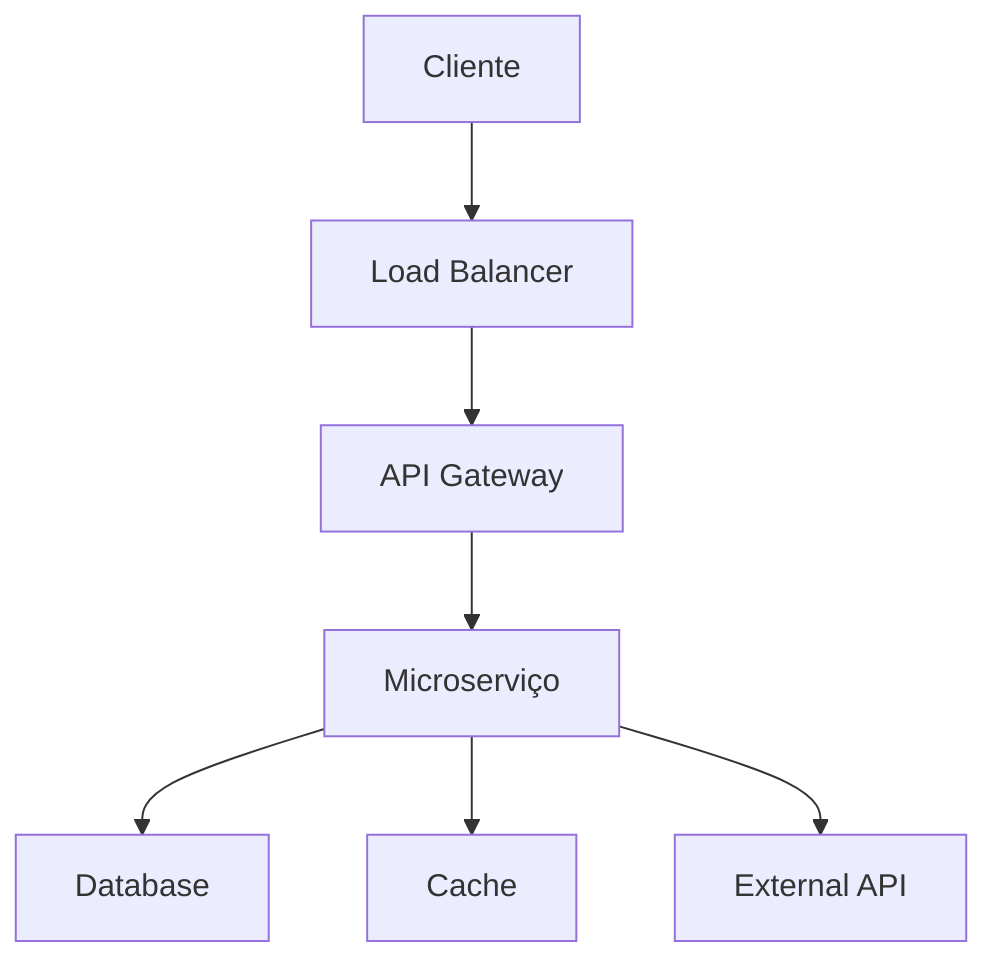

# 📚 Guia Completo de Segurança da Informação

## 🎯 Visão Geral

Guia abrangente para implementação de segurança em sistemas modernos, cobrindo OWASP Top 10, compliance regulatório, threat modeling e melhores práticas da indústria.

## 🏗️ Fundamentos de Segurança

### Princípios Core

#### 1. Principle of Least Privilege
```text
Cada usuário/sistema deve ter apenas o acesso mínimo necessário para executar suas funções.
```

**Implementação:**
- RBAC (Role-Based Access Control)
- ABAC (Attribute-Based Access Control)
- Segregação de duties
- Revisão periódica de permissões

#### 2. Defense in Depth
```text
Múltiplas camadas de segurança para proteção em profundidade.
```

**Camadas:**
- **Network:** Firewalls, WAF, DDoS protection
- **Application:** Input validation, authentication, authorization
- **Data:** Encryption, masking, access controls
- **Physical:** Data center security, access controls

#### 3. Secure by Default
```text
Sistemas devem ser seguros por padrão, sem configuração manual.
```

**Práticas:**
- Configurações seguras out-of-the-box
- Headers de segurança automáticos
- Criptografia habilitada por padrão
- Logging de segurança ativo

## 🔒 OWASP Top 10 2025 - Guia Detalhado

### 1. Broken Access Control

#### Identificação
```python
# Exemplo de vulnerabilidade
@app.get("/admin/users/{user_id}")
def get_user(user_id: int, current_user: User):
    # VULNERABILIDADE: Qualquer usuário pode acessar qualquer usuário
    return get_user_by_id(user_id)
```

#### Mitigação
```python
# Exemplo seguro
@app.get("/admin/users/{user_id}")
def get_user(user_id: int, current_user: User):
    # MITIGAÇÃO: Verificar permissão
    if not has_permission(current_user, "read_user", user_id):
        raise HTTPException(403, "Forbidden")
    return get_user_by_id(user_id)

def has_permission(user: User, action: str, resource_id: int) -> bool:
    return any(
        perm.action == action and 
        (perm.resource_id is None or perm.resource_id == resource_id)
        for perm in user.permissions
    )
```

#### Best Practices
- Implementar RBAC em todas as camadas
- Validar autorização em cada request
- Usar deny-by-default
- Implementar rate limiting

### 2. Cryptographic Failures

#### Identificação
```python
# Exemplo vulnerável
def encrypt_password(password: str) -> str:
    # VULNERABILIDADE: MD5 é quebrado
    import hashlib
    return hashlib.md5(password.encode()).hexdigest()
```

#### Mitigação
```python
# Exemplo seguro
def hash_password(password: str) -> str:
    # MITIGAÇÃO: Argon2id com salt
    import argon2
    hasher = argon2.PasswordHasher()
    return hasher.hash(password)

def verify_password(hash: str, password: str) -> bool:
    try:
        import argon2
        hasher = argon2.PasswordHasher()
        return hasher.verify(hash, password)
    except:
        return False
```

#### Best Practices
- Usar algoritmos modernos (Argon2id, bcrypt, scrypt)
- Implementar TLS 1.3+ em trânsito
- Usar AES-256-GCM para dados em repouso
- Gerenciamento seguro de chaves

### 3. Injection

#### Identificação
```python
# Exemplo vulnerável
def get_user_by_email(email: str):
    # VULNERABILIDADE: SQL injection
    query = f"SELECT * FROM users WHERE email = '{email}'"
    return db.execute(query)
```

#### Mitigação
```python
# Exemplo seguro
def get_user_by_email(email: str):
    # MITIGAÇÃO: Parameterized query
    query = "SELECT * FROM users WHERE email = %s"
    return db.execute(query, (email,))

# Ou usando ORM
def get_user_by_email(email: str):
    # MITIGAÇÃO: ORM com proteção built-in
    return User.objects.filter(email=email).first()
```

#### Best Practices
- Usar ORMs com parameterized queries
- Validar todos os inputs
- Implementar input sanitization
- Usar stored procedures quando possível

### 4. Insecure Design

#### Identificação
```python
# Exemplo vulnerável
class BankTransfer:
    def transfer(self, from_account, to_account, amount):
        # VULNERABILIDADE: Não valida limite diário
        if from_account.balance >= amount:
            from_account.balance -= amount
            to_account.balance += amount
            return True
        return False
```

#### Mitigação
```python
# Exemplo seguro
class BankTransfer:
    def __init__(self):
        self.daily_limits = {}
    
    def transfer(self, from_account, to_account, amount):
        # MITIGAÇÃO: Validar limite diário
        daily_total = self.daily_limits.get(from_account.id, 0)
        if daily_total + amount > from_account.daily_limit:
            raise ValueError("Daily limit exceeded")
        
        if from_account.balance >= amount:
            from_account.balance -= amount
            to_account.balance += amount
            self.daily_limits[from_account.id] = daily_total + amount
            return True
        return False
```

#### Best Practices
- Implementar threat modeling
- Usar secure-by-default patterns
- Validar business logic
- Implementar rate limiting

### 5. Security Misconfiguration

#### Identificação
```yaml
# Exemplo vulnerável (docker-compose.yml)
version: '3.8'
services:
  app:
    image: myapp:latest
    ports:
      - "80:80"  # VULNERABILIDADE: Porta admin exposta
    environment:
      - DEBUG=true  # VULNERABILIDADE: Debug em produção
      - SECRET_KEY=secret123  # VULNERABILIDADE: Hardcoded secret
```

#### Mitigação
```yaml
# Exemplo seguro
version: '3.8'
services:
  app:
    image: myapp:${VERSION}
    ports:
      - "127.0.0.1:8080:80"  # MITIGAÇÃO: Apenas localhost
    environment:
      - DEBUG=false  # MITIGAÇÃO: Debug desabilitado
      - SECRET_KEY_FILE=/run/secrets/app_secret  # MITIGAÇÃO: Secret do Docker
    secrets:
      - app_secret
secrets:
  app_secret:
    external: true
```

#### Best Practices
- Remover defaults e features desnecessárias
- Implementar hardening de servidores
- Usar secrets management
- Configurar headers de segurança

### 6. Vulnerable Components

#### Identificação
```json
// package.json vulnerável
{
  "dependencies": {
    "express": "4.16.0",  // VULNERABILIDADE: Versão antiga
    "lodash": "4.17.10",  // VULNERABILIDADE: Versão com CVE
    "request": "2.88.0"   // VULNERABILIDADE: Biblioteca depreciada
  }
}
```

#### Mitigação
```json
// package.json seguro
{
  "dependencies": {
    "express": "^4.18.2",  // MITIGAÇÃO: Versão atual
    "lodash": "^4.17.21",  // MITIGAÇÃO: Versão sem CVEs
    "axios": "^1.6.0"      // MITIGAÇÃO: Biblioteca mantida
  },
  "scripts": {
    "audit": "npm audit && npm audit fix",
    "audit-ci": "npm audit --audit-level moderate"
  }
}
```

#### Best Practices
- Scannear dependências regularmente
- Usar lock files
- Implementar SBOM
- Manter dependências atualizadas

### 7. Identification and Authentication Failures

#### Identificação
```python
# Exemplo vulnerável
@app.post("/login")
def login(username: str, password: str):
    user = get_user(username)
    # VULNERABILIDADE: Senha em plaintext
    if user and user.password == password:
        return {"token": generate_token(user.id)}
    return {"error": "Invalid credentials"}
```

#### Mitigação
```python
# Exemplo seguro
@app.post("/login")
def login(username: str, password: str, totp_code: str = None):
    user = get_user(username)
    
    # MITIGAÇÃO: Rate limiting
    if is_rate_limited(username):
        raise HTTPException(429, "Too many attempts")
    
    # MITIGAÇÃO: Password hashing
    if not user or not verify_password(user.password_hash, password):
        increment_failed_attempts(username)
        raise HTTPException(401, "Invalid credentials")
    
    # MITIGAÇÃO: MFA
    if user.mfa_enabled and not verify_totp(user.totp_secret, totp_code):
        raise HTTPException(401, "Invalid MFA code")
    
    reset_failed_attempts(username)
    return {"token": generate_token(user.id)}
```

#### Best Practices
- Implementar MFA
- Usar password hashing forte
- Implementar rate limiting
- Monitorar tentativas de login

### 8. Software and Data Integrity Failures

#### Identificação
```bash
# Exemplo vulnerável
curl -X POST https://api.example.com/webhook \
  -H "Content-Type: application/json" \
  -d '{"event": "payment", "data": {...}}'
# VULNERABILIDADE: Sem verificação de assinatura
```

#### Mitigação
```python
# Exemplo seguro
@app.post("/webhook")
def webhook(request: Request):
    # MITIGAÇÃO: Verificar assinatura
    signature = request.headers.get("X-Signature")
    if not verify_webhook_signature(request.body, signature):
        raise HTTPException(401, "Invalid signature")
    
    # MITIGAÇÃO: Validar timestamp
    timestamp = request.headers.get("X-Timestamp")
    if not is_recent_timestamp(timestamp):
        raise HTTPException(401, "Expired request")
    
    return process_webhook(request.json())

def verify_webhook_signature(payload: bytes, signature: str) -> bool:
    secret = get_webhook_secret()
    expected = hmac.new(secret, payload, hashlib.sha256).hexdigest()
    return hmac.compare_digest(expected, signature)
```

#### Best Practices
- Implementar code signing
- Verificar integridade de pacotes
- Usar checksums
- Implementar CI/CD seguro

### 9. Security Logging and Monitoring Failures

#### Identificação
```python
# Exemplo vulnerável
@app.post("/transfer")
def transfer(from_account: int, to_account: int, amount: float):
    # VULNERABILIDADE: Sem logging de segurança
    if from_account.balance >= amount:
        from_account.balance -= amount
        to_account.balance += amount
        return {"success": True}
    return {"error": "Insufficient funds"}
```

#### Mitigação
```python
# Exemplo seguro
import structlog

logger = structlog.get_logger()

@app.post("/transfer")
def transfer(from_account: int, to_account: int, amount: float, current_user: User):
    # MITIGAÇÃO: Logging estruturado
    logger.info(
        "transfer_initiated",
        user_id=current_user.id,
        from_account=from_account,
        to_account=to_account,
        amount=amount,
        ip_address=request.client.host
    )
    
    if from_account.balance >= amount:
        from_account.balance -= amount
        to_account.balance += amount
        
        # MITIGAÇÃO: Log de sucesso
        logger.info(
            "transfer_completed",
            user_id=current_user.id,
            transaction_id=generate_transaction_id(),
            amount=amount
        )
        
        return {"success": True}
    
    # MITIGAÇÃO: Log de falha
    logger.warning(
        "transfer_failed",
        user_id=current_user.id,
        reason="insufficient_funds",
        amount=amount,
        balance=from_account.balance
    )
    
    return {"error": "Insufficient funds"}
```

#### Best Practices
- Logar eventos de segurança
- Usar logging estruturado
- Implementar alerting
- Centralizar logs

### 10. Server-Side Request Forgery (SSRF)

#### Identificação
```python
# Exemplo vulnerável
@app.get("/fetch-url")
def fetch_url(url: str):
    # VULNERABILIDADE: Permite qualquer URL
    response = requests.get(url)
    return response.json()
```

#### Mitigação
```python
# Exemplo seguro
import ipaddress
from urllib.parse import urlparse

ALLOWED_DOMAINS = ["api.example.com", "cdn.example.com"]

@app.get("/fetch-url")
def fetch_url(url: str):
    # MITIGAÇÃO: Validar URL
    parsed = urlparse(url)
    
    # Validar protocolo
    if parsed.scheme not in ["http", "https"]:
        raise HTTPException(400, "Invalid protocol")
    
    # Validar domínio
    if parsed.netloc not in ALLOWED_DOMAINS:
        raise HTTPException(400, "Domain not allowed")
    
    # Validar IP (prevenir DNS rebinding)
    try:
        ip = ipaddress.ip_address(parsed.hostname)
        if ip.is_private or ip.is_loopback:
            raise HTTPException(400, "Private IP not allowed")
    except ValueError:
        pass  # Hostname, validado acima
    
    # MITIGAÇÃO: Timeout e validação
    response = requests.get(url, timeout=10)
    return response.json()
```

#### Best Practices
- Implementar allowlist de domínios
- Validar endereços IP
- Usar timeouts
- Implementar network segmentation

## 🛡️ Supply Chain Security

### Dependency Management

#### Scanning Automatizado
```yaml
# .github/workflows/security.yml
name: Security Scan
on: [push, pull_request]

jobs:
  security:
    runs-on: ubuntu-latest
    steps:
      - uses: actions/checkout@v4
      
      - name: Node.js audit
        run: |
          npm audit --audit-level moderate
          npm audit fix
          
      - name: Python security scan
        run: |
          pip-audit
          safety check
          
      - name: Generate SBOM
        run: |
          syft dir:. -o spdx-json > sbom.json
          
      - name: Container scan
        run: |
          docker build -t myapp .
          trivy image --severity HIGH,CRITICAL myapp
```

#### Private Registry
```bash
# Configurar npm private registry
npm config set @company:registry https://npm.company.com
npm config set //npm.company.com/:_authToken ${NPM_TOKEN}

# Configurar Python private registry
pip config set global.index-url https://pypi.company.com/simple
pip config set global.extra-index-url https://pypi.org/simple
```

### Code Signing

#### GPG Signing
```bash
# Assinar commits
git config user.signingkey YOUR_GPG_KEY_ID
git config commit.gpgsign true

# Assinar tags
git tag -s v1.0.0 -m "Release v1.0.0"
```

#### Container Signing
```bash
# Assinar imagem Docker
COSIGN_EXPERIMENTAL=1 cosign sign \
  --key cosign.key \
  myapp:latest

# Verificar assinatura
cosign verify \
  --key cosign.pub \
  myapp:latest
```

## 📊 Compliance Regulatório

### LGPD (Lei Geral de Proteção de Dados)

#### Requisitos Principais
- **Base legal:** Identificar base legal para tratamento
- **Consentimento:** Obter consentimento explícito
- **Direitos dos titulares:** Implementar direitos LGPD
- **Data Protection Officer:** Designar DPO
- **Incident response:** Plano para vazamento de dados

#### Implementação
```python
# Sistema de consentimento LGPD
class ConsentManager:
    def __init__(self):
        self.consents = {}
    
    def record_consent(self, user_id: int, purpose: str, consent: bool):
        self.consents[user_id] = self.consents.get(user_id, {})
        self.consents[user_id][purpose] = {
            "consent": consent,
            "timestamp": datetime.now(),
            "ip_address": request.client.host,
            "user_agent": request.headers.get("User-Agent")
        }
    
    def has_consent(self, user_id: int, purpose: str) -> bool:
        return self.consents.get(user_id, {}).get(purpose, {}).get("consent", False)
    
    def delete_user_data(self, user_id: int):
        # Direito ao esquecimento
        User.objects.filter(id=user_id).delete()
        self.consents.pop(user_id, None)
```

### PCI-DSS

#### Requisitos Principais
- **Network security:** Firewall configurado
- **Data protection:** Criptografia de dados de cartão
- **Vulnerability management:** Scanning regular
- **Access control:** Controle de acesso restrito
- **Monitoring:** Logging e monitoramento

#### Implementação
```python
# Tokenização de dados de cartão
class PaymentTokenizer:
    def __init__(self):
        self.vault = PaymentVault()
    
    def tokenize_card(self, card_number: str, expiry: str, cvv: str) -> str:
        # Armazenar dados seguros no vault
        token = self.vault.store_card({
            "number": card_number,
            "expiry": expiry,
            "cvv": cvv
        })
        return token
    
    def detokenize_card(self, token: str) -> dict:
        return self.vault.retrieve_card(token)

# Processamento de pagamento seguro
@app.post("/payment")
def process_payment(token: str, amount: float, current_user: User):
    # Usar token em vez de dados brutos
    card_data = tokenizer.detokenize_card(token)
    
    # Processar pagamento via gateway seguro
    result = payment_gateway.charge(card_data, amount)
    
    # Log sem dados sensíveis
    logger.info(
        "payment_processed",
        user_id=current_user.id,
        amount=amount,
        token=token[:8] + "...",  # Token mascarado
        result=result["status"]
    )
    
    return result
```

## 🔍 Threat Modeling

### STRIDE Model

#### Spoofing
- **Identificação:** Alguém se passando por outro usuário/sistema
- **Mitigação:** Autenticação forte, MFA, certificados digitais

#### Tampering
- **Identificação:** Modificação não autorizada de dados
- **Mitigação:** Integridade de dados, assinaturas digitais, checksums

#### Repudiation
- **Identificação:** Negação de ações realizadas
- **Mitigação:** Audit trails completos, não-repúdio, logging

#### Information Disclosure
- **Identificação:** Exposição não autorizada de informações
- **Mitigação:** Criptografia, controle de acesso, data masking

#### Denial of Service
- **Identificação:** Indisponibilidade do serviço
- **Mitigação:** Rate limiting, DDoS protection, redundância

#### Elevation of Privilege
- **Identificação:** Escalonamento de privilégios não autorizado
- **Mitigação:** Principle of least privilege, validação de permissões

### Processo de Threat Modeling

#### 1. Identificar Assets
```text
Assets críticos:
- Dados de clientes (PII)
- Informações financeiras
- Propriedade intelectual
- Credenciais de acesso
```

#### 2. Mapear Fluxos de Dados


#### 3. Identificar Threats
```text
Para cada componente:
- Quais são as possíveis ameaças?
- Qual o impacto de cada ameaça?
- Qual a probabilidade de ocorrência?
```

#### 4. Definir Mitigações
```text
Para cada ameaça:
- Controles preventivos
- Controles detectivos
- Controles corretivos
```

## 📈 Security Metrics

### KPIs de Segurança

#### Technical Metrics
- **MTTD (Mean Time to Detect):** Tempo médio para detectar incidentes
- **MTTR (Mean Time to Respond):** Tempo médio para responder
- **Vulnerability Coverage:** Percentual de vulnerabilidades mitigadas
- **Patch Time:** Tempo para aplicar patches críticos

#### Business Metrics
- **Security Incidents:** Número de incidentes por mês
- **Data Breach Cost:** Custo médio de vazamento de dados
- **Compliance Score:** Percentual de conformidade
- **Security ROI:** Retorno sobre investimento em segurança

### Dashboard Example
```json
{
  "security_dashboard": {
    "overview": {
      "security_score": 92,
      "active_incidents": 2,
      "open_vulnerabilities": 15,
      "compliance_status": "98%"
    },
    "metrics": {
      "mttp": "4.2 hours",
      "mttr": "1.8 hours",
      "patch_coverage": "96%",
      "false_positive_rate": "2.1%"
    },
    "trends": {
      "incidents_trend": "down",
      "vulnerabilities_trend": "stable",
      "compliance_trend": "up"
    }
  }
}
```

## 🚀 Best Practices Summary

### Development
- ✅ Secure coding practices
- ✅ Code reviews com foco em segurança
- ✅ Automated security testing
- ✅ Dependency scanning

### Operations
- ✅ Infrastructure as code seguro
- ✅ Immutable infrastructure
- ✅ Zero trust architecture
- ✅ Continuous monitoring

### Compliance
- ✅ Privacy by design
- ✅ Data minimization
- ✅ Regular audits
- ✅ Documentation completa

---

**Versão:** 2.0  
**Framework:** Security Best Practices 2025  
**Status:** ✅ Produção Ready  
**Última atualização:** 2026-01-29