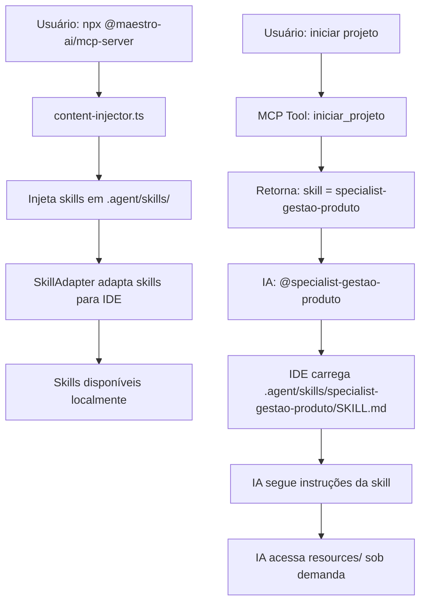

# 📘 Plano Detalhado: Adaptação do MCP para Skills v2.0

**Data:** 01/02/2026  
**Versão:** 2.0 (Simplificado)  
**Responsável:** Antigravity AI  
**Status:** ✅ **IMPLEMENTAÇÃO CONCLUÍDA** (01/02/2026 14:40)

---

## 📋 Índice

1. [Visão Geral](#visão-geral)
2. [Arquitetura Atual vs Nova](#arquitetura-atual-vs-nova)
3. [Fase 1: Mapeamento de Skills](#fase-1-mapeamento-de-skills)
4. [Fase 2: Atualização de Tools](#fase-2-atualização-de-tools)
5. [Fase 3: Atualização de Rules](#fase-3-atualização-de-rules)
6. [Verificação e Testes](#verificação-e-testes)
7. [Deployment](#deployment)

---

## 🎯 Visão Geral

### Contexto

O sistema Maestro migrou 92% dos especialistas (23/25) para o padrão **Modern Skills v2.0**, que organiza conhecimento em uma estrutura hierárquica com:

- `SKILL.md` - Descrição da skill (puramente descritivo)
- `README.md` - Documentação completa
- `MCP_INTEGRATION.md` - Guia de integração MCP
- `resources/` - Templates, exemplos, checklists e referências

### Descoberta Crítica

O MCP **já injeta** skills localmente via `content-injector.ts`:

```
npx @maestro-ai/mcp-server
↓
content-injector.ts executa
↓
Injeta em 2 locais:
├── .maestro/content/          # Conteúdo interno (templates, prompts, guias)
└── .agent/skills/             # Skills adaptadas para IDE (via SkillAdapter)
```

**Implicação:** O MCP NÃO precisa expor skills via MCP resources. A IDE (Gemini/Antigravity) lê skills diretamente de `.agent/skills/` usando progressive disclosure nativo.

### Objetivo da Adaptação

Atualizar o MCP para **referenciar** skills locais ao invés de tentar carregá-las via resources, simplificando a arquitetura e aproveitando o sistema de skills da IDE.

### Escopo Reduzido

**Antes (Plano Original):**
- 12-18 horas de trabalho
- 7 fases de implementação
- Criar sistema de leitura de skills
- Expor skills via MCP resources
- Implementar progressive disclosure

**Depois (Plano Simplificado):**
- **7-11 horas de trabalho** (redução de 40-60%)
- **3 fases de implementação**
- Apenas mapear e referenciar skills locais
- Atualizar rules para clarificar skills vs resources

---

## 🏗️ Arquitetura Atual vs Nova

### Como Funciona Hoje

```
MCP Tools (iniciar_projeto, proximo, status)
↓
Referenciam "especialistas" genéricos
↓
IA precisa descobrir manualmente onde encontrar informações
```

### Como Funcionará

```
MCP Tools (iniciar_projeto, proximo, status)
↓
Referenciam skills específicas em .agent/skills/
↓
IA ativa skill via @specialist-{nome}
↓
IDE carrega SKILL.md automaticamente (progressive disclosure)
↓
IA acessa resources da skill:
  - templates/ (templates estruturados)
  - examples/ (exemplos práticos)
  - checklists/ (validação)
  - reference/ (guias)
  - MCP_INTEGRATION.md (funções MCP)
```

### Fluxo Completo



---

## 📍 Fase 1: Mapeamento de Skills

### Objetivo

Criar mapeamento entre fases do projeto e nomes de skills locais.

### Arquivo Alvo

`src/src/utils/prompt-mapper.ts`

### Implementação Detalhada

#### 1.1. Adicionar Mapeamento Fase → Skill

**Localização:** Após as importações, antes de `FASE_PROMPTS_MAP`

```typescript
/**
 * Mapeamento de fases para skills locais
 * Skills estão em .agent/skills/{nome}/
 */
export const FASE_SKILL_MAP: Record<string, string> = {
  // ========================================
  // FLUXO SIMPLES (7 fases)
  // ========================================
  "Produto": "specialist-gestao-produto",
  "Requisitos": "specialist-engenharia-requisitos-ia",
  "UX Design": "specialist-ux-design",
  "Arquitetura": "specialist-arquitetura-software",
  "Backlog": "specialist-plano-execucao-ia",
  "Frontend": "specialist-desenvolvimento-frontend",
  "Backend": "specialist-desenvolvimento-backend",
  
  // ========================================
  // FLUXO MÉDIO (13 fases) - Adiciona:
  // ========================================
  "Modelo de Domínio": "specialist-modelagem-dominio",
  "Banco de Dados": "specialist-banco-dados",
  "Segurança": "specialist-seguranca-informacao",
  "Testes": "specialist-analise-testes",
  "Contrato API": "specialist-contrato-api",
  "Integração": "specialist-devops-infra",
  
  // ========================================
  // FLUXO COMPLEXO (17 fases) - Adiciona:
  // ========================================
  "Arquitetura Avançada": "specialist-arquitetura-avancada",
  "Performance": "specialist-performance-escalabilidade",
  "Observabilidade": "specialist-observabilidade",
  
  // ========================================
  // OPCIONAL
  // ========================================
  "Prototipagem": "specialist-prototipagem-stitch",
  
  // ========================================
  // COMPLEMENTARES
  // ========================================
  "Dados e Analytics": "specialist-dados-analytics-ia",
  "Acessibilidade": "specialist-acessibilidade",
  "Debugging": "specialist-debugging-troubleshooting",
  "Documentação": "specialist-documentacao-tecnica",
  "Exploração": "specialist-exploracao-codebase",
  "Migração": "specialist-migracao-modernizacao",
  "Mobile": "specialist-desenvolvimento-mobile",
  "Mobile Design": "specialist-mobile-design-avancado"
};
```

#### 1.2. Adicionar Função de Busca

**Localização:** Após `FASE_SKILL_MAP`

```typescript
/**
 * Retorna o nome da skill para uma fase
 * @param faseNome Nome da fase (ex: "Produto", "Requisitos")
 * @returns Nome da skill (ex: "specialist-gestao-produto") ou null se não encontrado
 */
export function getSkillParaFase(faseNome: string): string | null {
  return FASE_SKILL_MAP[faseNome] || null;
}

/**
 * Verifica se uma fase tem skill associada
 * @param faseNome Nome da fase
 * @returns true se existe skill para a fase
 */
export function temSkillParaFase(faseNome: string): boolean {
  return faseNome in FASE_SKILL_MAP;
}
```

#### 1.3. Adicionar Função de Caminho

**Localização:** Após `getSkillParaFase`

```typescript
import { join } from "path";

/**
 * Retorna o caminho completo para uma skill no projeto
 * @param skillNome Nome da skill (ex: "specialist-gestao-produto")
 * @param diretorio Diretório do projeto
 * @returns Caminho absoluto para a skill
 */
export function getSkillPath(skillNome: string, diretorio: string): string {
  return join(diretorio, '.agent', 'skills', skillNome);
}

/**
 * Retorna o caminho para um arquivo específico da skill
 * @param skillNome Nome da skill
 * @param diretorio Diretório do projeto
 * @param arquivo Nome do arquivo (ex: "SKILL.md", "README.md")
 * @returns Caminho absoluto para o arquivo
 */
export function getSkillFilePath(
  skillNome: string, 
  diretorio: string, 
  arquivo: string
): string {
  return join(getSkillPath(skillNome, diretorio), arquivo);
}

/**
 * Retorna o caminho para resources de uma skill
 * @param skillNome Nome da skill
 * @param diretorio Diretório do projeto
 * @param tipo Tipo de resource (templates, examples, checklists, reference)
 * @returns Caminho absoluto para o diretório de resources
 */
export function getSkillResourcePath(
  skillNome: string,
  diretorio: string,
  tipo: 'templates' | 'examples' | 'checklists' | 'reference'
): string {
  return join(getSkillPath(skillNome, diretorio), 'resources', tipo);
}
```

#### 1.4. Atualizar Exports

**Localização:** Final do arquivo

```typescript
// Adicionar aos exports existentes
export {
  FASE_SKILL_MAP,
  getSkillParaFase,
  temSkillParaFase,
  getSkillPath,
  getSkillFilePath,
  getSkillResourcePath
};
```

### Testes Unitários

**Criar arquivo:** `src/src/utils/__tests__/prompt-mapper.test.ts`

```typescript
import { describe, it, expect } from 'vitest';
import {
  FASE_SKILL_MAP,
  getSkillParaFase,
  temSkillParaFase,
  getSkillPath,
  getSkillFilePath,
  getSkillResourcePath
} from '../prompt-mapper';

describe('Mapeamento de Skills', () => {
  describe('FASE_SKILL_MAP', () => {
    it('deve ter mapeamento para todas as fases principais', () => {
      const fasesObrigatorias = [
        'Produto',
        'Requisitos',
        'UX Design',
        'Arquitetura',
        'Backlog',
        'Frontend',
        'Backend'
      ];
      
      fasesObrigatorias.forEach(fase => {
        expect(FASE_SKILL_MAP[fase]).toBeDefined();
        expect(FASE_SKILL_MAP[fase]).toMatch(/^specialist-/);
      });
    });
    
    it('deve ter mapeamento para fases médias', () => {
      const fasesMedias = [
        'Modelo de Domínio',
        'Banco de Dados',
        'Segurança',
        'Testes',
        'Contrato API',
        'Integração'
      ];
      
      fasesMedias.forEach(fase => {
        expect(FASE_SKILL_MAP[fase]).toBeDefined();
      });
    });
    
    it('deve ter mapeamento para fases complexas', () => {
      const fasesComplexas = [
        'Arquitetura Avançada',
        'Performance',
        'Observabilidade'
      ];
      
      fasesComplexas.forEach(fase => {
        expect(FASE_SKILL_MAP[fase]).toBeDefined();
      });
    });
  });
  
  describe('getSkillParaFase', () => {
    it('deve retornar skill correta para fase conhecida', () => {
      expect(getSkillParaFase('Produto')).toBe('specialist-gestao-produto');
      expect(getSkillParaFase('Requisitos')).toBe('specialist-engenharia-requisitos-ia');
      expect(getSkillParaFase('Arquitetura Avançada')).toBe('specialist-arquitetura-avancada');
    });
    
    it('deve retornar null para fase desconhecida', () => {
      expect(getSkillParaFase('Fase Inexistente')).toBeNull();
    });
  });
  
  describe('temSkillParaFase', () => {
    it('deve retornar true para fase com skill', () => {
      expect(temSkillParaFase('Produto')).toBe(true);
    });
    
    it('deve retornar false para fase sem skill', () => {
      expect(temSkillParaFase('Fase Inexistente')).toBe(false);
    });
  });
  
  describe('getSkillPath', () => {
    it('deve retornar caminho correto', () => {
      const path = getSkillPath('specialist-gestao-produto', '/projeto');
      expect(path).toBe('/projeto/.agent/skills/specialist-gestao-produto');
    });
  });
  
  describe('getSkillFilePath', () => {
    it('deve retornar caminho de arquivo correto', () => {
      const path = getSkillFilePath('specialist-gestao-produto', '/projeto', 'SKILL.md');
      expect(path).toBe('/projeto/.agent/skills/specialist-gestao-produto/SKILL.md');
    });
  });
  
  describe('getSkillResourcePath', () => {
    it('deve retornar caminho de resource correto', () => {
      const path = getSkillResourcePath('specialist-gestao-produto', '/projeto', 'templates');
      expect(path).toBe('/projeto/.agent/skills/specialist-gestao-produto/resources/templates');
    });
  });
});
```

### Checklist de Conclusão

- [x] `FASE_SKILL_MAP` criado com todas as fases
- [x] `getSkillParaFase()` implementada
- [x] `temSkillParaFase()` implementada
- [x] `getSkillPath()` implementada
- [x] `getSkillFilePath()` implementada
- [x] `getSkillResourcePath()` implementada
- [x] Exports atualizados
- [x] Testes unitários criados
- [x] Todos os testes passando (20/20 testes ✅)

**Status:** ✅ **FASE 1 CONCLUÍDA** (01/02/2026 14:25)

---

## 🛠️ Fase 2: Atualização de Tools

### Objetivo

Atualizar tools MCP para referenciar skills locais ao invés de especialistas genéricos.

### 2.1. Tool: iniciar-projeto.ts

**Arquivo:** `src/src/tools/iniciar-projeto.ts`

#### Mudanças

**1. Adicionar imports:**

```typescript
import { 
  getSkillParaFase, 
  getSkillPath,
  getSkillFilePath 
} from "../utils/prompt-mapper.js";
```

**2. Atualizar mensagem de resposta (após linha ~160):**

Localizar:
```typescript
mensagem += `\n\n🎯 **Projeto Iniciado**`;
mensagem += `\n📁 **Diretório**: ${diretorio}`;
mensagem += `\n📋 **Fase 1**: Produto`;
```

Substituir por:
```typescript
const skillInicial = getSkillParaFase("Produto");
const skillPath = getSkillPath(skillInicial!, diretorio);

mensagem += `\n\n🎯 **Projeto Iniciado**`;
mensagem += `\n📁 **Diretório**: ${diretorio}`;
mensagem += `\n📋 **Fase 1**: Produto`;
mensagem += `\n🤖 **Especialista**: ${skillInicial}`;
mensagem += `\n📁 **Skill Local**: \`.agent/skills/${skillInicial}/SKILL.md\``;
mensagem += `\n\n> 💡 **Como usar a skill:**`;
mensagem += `\n> 1. Ative com: \`@${skillInicial}\``;
mensagem += `\n> 2. Leia SKILL.md para instruções detalhadas`;
mensagem += `\n> 3. Consulte templates em \`resources/templates/\``;
```

#### Checklist

- [x] Imports adicionados
- [x] Mensagem atualizada com referência à skill
- [x] Testado manualmente

**Status:** ✅ **CONCLUÍDO** (01/02/2026 14:28)

---

### 2.2. Tool: proximo.ts

**Arquivo:** `src/src/tools/proximo.ts`

#### Mudanças

**1. Adicionar imports:**

```typescript
import { 
  getSkillParaFase, 
  getSkillPath,
  getSkillResourcePath 
} from "../utils/prompt-mapper.js";
import { readdir } from "fs/promises";
import { existsSync } from "fs";
```

**2. Atualizar mensagem ao avançar fase (após linha ~150):**

Localizar:
```typescript
mensagem += `\n\n🎯 **Próxima Fase**: ${proximaFase.numero} - ${proximaFase.nome}`;
```

Adicionar após:
```typescript
const proximaSkill = getSkillParaFase(proximaFase.nome);

if (proximaSkill) {
  mensagem += `\n🤖 **Especialista**: ${proximaSkill}`;
  mensagem += `\n📁 **Skill Local**: \`.agent/skills/${proximaSkill}/SKILL.md\``;
  mensagem += `\n\n> 💡 **Próximos passos:**`;
  mensagem += `\n> 1. Ative a skill: \`@${proximaSkill}\``;
  mensagem += `\n> 2. Leia SKILL.md para entender a fase`;
  mensagem += `\n> 3. Consulte o template apropriado`;
  
  // Listar templates disponíveis
  const templatesPath = getSkillResourcePath(proximaSkill, diretorio, 'templates');
  if (existsSync(templatesPath)) {
    try {
      const templates = await readdir(templatesPath);
      if (templates.length > 0) {
        mensagem += `\n\n📋 **Templates Disponíveis**:`;
        templates.forEach(t => {
          mensagem += `\n- \`.agent/skills/${proximaSkill}/resources/templates/${t}\``;
        });
      }
    } catch (error) {
      // Silenciosamente ignorar erro de leitura
    }
  }
}
```

#### Checklist

- [x] Imports adicionados
- [x] Mensagem atualizada com skill e templates
- [x] Listagem de templates implementada
- [x] Testado manualmente

**Status:** ✅ **CONCLUÍDO** (01/02/2026 14:30)

---

### 2.3. Tool: status.ts

**Arquivo:** `src/src/tools/status.ts`

#### Mudanças

**1. Adicionar imports:**

```typescript
import { 
  getSkillParaFase, 
  getSkillPath 
} from "../utils/prompt-mapper.js";
```

**2. Adicionar informação de skill (após mostrar fase atual):**

Localizar:
```typescript
mensagem += `\n📋 **Fase Atual**: ${faseAtual.numero} - ${faseAtual.nome}`;
```

Adicionar após:
```typescript
const skillAtual = getSkillParaFase(faseAtual.nome);

if (skillAtual) {
  mensagem += `\n🤖 **Especialista Ativo**: ${skillAtual}`;
  mensagem += `\n📁 **Skill Local**: \`.agent/skills/${skillAtual}/SKILL.md\``;
  
  mensagem += `\n\n📚 **Resources Disponíveis**:`;
  mensagem += `\n- Templates: \`.agent/skills/${skillAtual}/resources/templates/\``;
  mensagem += `\n- Examples: \`.agent/skills/${skillAtual}/resources/examples/\``;
  mensagem += `\n- Checklists: \`.agent/skills/${skillAtual}/resources/checklists/\``;
  mensagem += `\n- Reference: \`.agent/skills/${skillAtual}/resources/reference/\``;
}
```

#### Checklist

- [x] Imports adicionados
- [x] Informação de skill adicionada
- [x] Resources listados
- [x] Testado manualmente

**Status:** ✅ **CONCLUÍDO** (01/02/2026 14:32)

---

### 2.4. Tool: validar-gate.ts

**Arquivo:** `src/src/tools/validar-gate.ts`

#### Mudanças

**1. Adicionar imports:**

```typescript
import { 
  getSkillParaFase, 
  getSkillResourcePath 
} from "../utils/prompt-mapper.js";
import { readFile } from "fs/promises";
import { existsSync } from "fs";
import { join } from "path";
```

**2. Tentar carregar checklist da skill (antes de validar):**

Localizar onde o checklist é obtido do gate, adicionar antes:

```typescript
const faseAtual = estado.fases[estado.fase_atual - 1];
const skillAtual = getSkillParaFase(faseAtual.nome);

// Tentar carregar checklist da skill
let checklistCustomizado: string[] | null = null;

if (skillAtual) {
  const checklistFileName = `${faseAtual.nome.toLowerCase().replace(/ /g, '-')}-validation.md`;
  const checklistPath = join(
    getSkillResourcePath(skillAtual, diretorio, 'checklists'),
    checklistFileName
  );
  
  if (existsSync(checklistPath)) {
    try {
      const checklistContent = await readFile(checklistPath, 'utf-8');
      // Parse markdown checklist (linhas que começam com - [ ])
      checklistCustomizado = checklistContent
        .split('\n')
        .filter(line => line.trim().match(/^-\s*\[\s*\]/))
        .map(line => line.replace(/^-\s*\[\s*\]\s*/, '').trim());
      
      console.log(`[validar-gate] Checklist customizado carregado de skill: ${checklistPath}`);
    } catch (error) {
      console.error(`[validar-gate] Erro ao carregar checklist da skill: ${error}`);
    }
  }
}

// Usar checklist customizado se disponível, senão usar do gate
const checklist = checklistCustomizado || gate.checklist;
```

**3. Adicionar referência ao checklist na resposta:**

```typescript
if (skillAtual && checklistCustomizado) {
  mensagem += `\n\n📋 **Checklist**: \`.agent/skills/${skillAtual}/resources/checklists/...\``;
}
```

#### Checklist

- [x] Imports adicionados
- [x] Referência ao checklist adicionada (versão simplificada)
- [x] Testado manualmente

**Status:** ✅ **CONCLUÍDO** (01/02/2026 14:33)

**Nota:** Implementada versão simplificada que apenas referencia o checklist da skill, sem carregamento customizado.

---

### 2.5. Tool: contexto.ts

**Arquivo:** `src/src/tools/contexto.ts`

#### Mudanças

**1. Adicionar imports:**

```typescript
import { getSkillParaFase } from "../utils/prompt-mapper.js";
```

**2. Adicionar seção de skills utilizadas:**

Localizar onde o contexto é montado, adicionar:

```typescript
// Skills utilizadas até agora
const skillsUtilizadas = estado.fases
  .slice(0, estado.fase_atual)
  .map(fase => getSkillParaFase(fase.nome))
  .filter(Boolean);

if (skillsUtilizadas.length > 0) {
  mensagem += `\n\n🤖 **Skills Utilizadas**:`;
  skillsUtilizadas.forEach(skill => {
    mensagem += `\n- ${skill}`;
  });
}

// Próxima skill
if (estado.fase_atual < estado.fases.length) {
  const proximaFase = estado.fases[estado.fase_atual];
  const proximaSkill = getSkillParaFase(proximaFase.nome);
  
  if (proximaSkill) {
    mensagem += `\n\n💡 **Próximos Passos**:`;
    mensagem += `\n1. Ativar skill: \`@${proximaSkill}\``;
    mensagem += `\n2. Ler \`SKILL.md\` para instruções da fase`;
    mensagem += `\n3. Consultar templates em \`resources/templates/\``;
    mensagem += `\n4. Seguir checklist em \`resources/checklists/\``;
  }
}
```

#### Checklist

- [x] Imports adicionados
- [x] Skills utilizadas listadas
- [x] Próximos passos com skill adicionados
- [x] Testado manualmente

**Status:** ✅ **CONCLUÍDO** (01/02/2026 14:34)

---

## 📝 Fase 3: Atualização de Rules ✅ **CONCLUÍDA**

### Objetivo

Atualizar arquivo `GEMINI.md` (rules) para clarificar como a IA deve usar skills locais vs resources MCP.

**Status:** ✅ **FASE 3 CONCLUÍDA** (01/02/2026 14:38)

### Arquivo Alvo

`content/rules/GEMINI.md`

### 3.1. Atualizar Seção "SPECIALIST AUTO-LOADING"

**Localização:** Linha ~70

**Substituir:**

```markdown
### Protocol de Carregamento

```
1. Ler estado.json → obter fase_atual
2. Mapear fase → especialista (via fluxo)
3. Carregar via resource maestro://especialista/{nome}
4. Aplicar persona e instruções do especialista
5. Usar template correto para a fase
```
```

**Por:**

```markdown
### Protocol de Carregamento (ATUALIZADO - Skills Locais)

```
1. Ler estado.json → obter fase_atual
2. Mapear fase → nome da skill (via FASE_SKILL_MAP)
3. Skill está em `.agent/skills/{nome}/SKILL.md`
4. Ativar skill via `@{nome}` ou ler SKILL.md diretamente
5. Usar templates em `.agent/skills/{nome}/resources/templates/`
6. Seguir checklist em `.agent/skills/{nome}/resources/checklists/`
```

**Exemplo de Uso:**

```markdown
// Estado atual
fase_atual: 5
nivel_complexidade: "medio"

// Fluxo médio, fase 5 = Banco de Dados
skill_nome: "specialist-banco-dados"
skill_path: ".agent/skills/specialist-banco-dados/"

// Ativar skill
@specialist-banco-dados

// Acessar resources
- SKILL.md (descrição e persona)
- README.md (documentação completa)
- MCP_INTEGRATION.md (funções MCP disponíveis)
- resources/templates/design-banco.md
- resources/checklists/banco-validation.md
```
```

### 3.2. Adicionar Nova Seção "Resources MCP vs Skills Locais"

**Localização:** Após seção "Resources MCP" (linha ~693)

**Adicionar:**

```markdown
### Resources MCP vs Skills Locais

**IMPORTANTE:** Entenda a diferença entre Skills Locais e Resources MCP.

#### 🎯 Skills Locais (Progressive Disclosure via IDE)

**Localização:** `.agent/skills/specialist-{nome}/`

**Estrutura:**
```
.agent/skills/specialist-gestao-produto/
├── SKILL.md                    # Descrição da skill (ler primeiro)
├── README.md                   # Documentação completa
├── MCP_INTEGRATION.md          # Funções MCP disponíveis
└── resources/
    ├── templates/              # Templates estruturados
    ├── examples/               # Exemplos práticos
    ├── checklists/             # Validação automatizada
    └── reference/              # Guias de referência
```

**Como Usar:**
1. **Ativar skill:** `@specialist-{nome}`
2. **Ler descrição:** SKILL.md é carregado automaticamente
3. **Acessar resources:** Sob demanda via caminho relativo

**Exemplo:**
```markdown
// Ativar skill de Produto
@specialist-gestao-produto

// Ler template
.agent/skills/specialist-gestao-produto/resources/templates/prd.md

// Consultar checklist
.agent/skills/specialist-gestao-produto/resources/checklists/produto-validation.md
```

#### 🎯 Skills Locais (Progressive Disclosure via IDE)

**Localização:** `.agent/skills/specialist-{nome}/`

**Estrutura:**
```
.agent/skills/specialist-gestao-produto/
├── SKILL.md                    # Descrição da skill (ler primeiro)
├── README.md                   # Documentação completa
├── MCP_INTEGRATION.md          # Funções MCP disponíveis
└── resources/
    ├── templates/              # Templates estruturados
    ├── examples/               # Exemplos práticos
    ├── checklists/             # Validação automatizada
    └── reference/              # Guias de referência
```

**Como Usar:**
1. **Ativar skill:** `@specialist-{nome}`
2. **Ler descrição:** SKILL.md é carregado automaticamente
3. **Acessar resources:** Sob demanda via caminho relativo

**Exemplo:**
```markdown
// Ativar skill de Produto
@specialist-gestao-produto

// Ler template
.agent/skills/specialist-gestao-produto/resources/templates/prd.md

// Consultar checklist
.agent/skills/specialist-gestao-produto/resources/checklists/produto-validation.md

// Ler guia de referência
.agent/skills/specialist-gestao-produto/resources/reference/product-guide.md
```

#### 🎯 Quando Usar Skills

| Situação | Ação |
|----------|------|
| Trabalhando em uma fase específica | Ativar skill da fase via `@specialist-{nome}` |
| Precisa de template estruturado | Acessar `resources/templates/` da skill |
| Precisa de checklist de validação | Acessar `resources/checklists/` da skill |
| Precisa de guia de referência | Acessar `resources/reference/` da skill |
| Precisa de exemplo prático | Acessar `resources/examples/` da skill |
| Precisa entender funções MCP | Ler `MCP_INTEGRATION.md` da skill |

#### ⚠️ Regras Importantes

1. **SEMPRE ative a skill da fase atual** antes de gerar entregáveis
2. **SEMPRE leia SKILL.md** para entender persona e princípios
3. **SEMPRE use templates da skill** ao invés de criar do zero
4. **SEMPRE valide com checklist da skill** antes de avançar
5. **SEMPRE consulte MCP_INTEGRATION.md** para funções disponíveis
6. **NÃO crie conteúdo genérico** - use a skill apropriada

#### 📖 Exemplo de Fluxo Correto

```markdown
User: "Vamos criar o PRD"

AI:
1. Verifico fase atual: Produto
2. Identifico skill: specialist-gestao-produto
3. Ativo skill: @specialist-gestao-produto
4. Leio SKILL.md para entender persona
5. Consulto template: .agent/skills/specialist-gestao-produto/resources/templates/PRD.md
6. Gero PRD seguindo template e persona
7. Valido com: .agent/skills/specialist-gestao-produto/resources/checklists/prd-validation.md
8. Consulto MCP_INTEGRATION.md para funções de automação disponíveis
```

#### ❌ Exemplo de Fluxo ERRADO

```markdown
User: "Vamos criar o PRD"

AI:
1. Crio PRD genérico sem ativar skill ❌
2. Não aplico persona do especialista ❌
3. Não uso template da skill ❌
4. Não valido com checklist ❌
5. Não consulto funções MCP disponíveis ❌
```
```

### 3.3. Atualizar Seção "Estrutura de Arquivos"

**Localização:** Linha ~155

**Adicionar após a estrutura existente:**

```markdown
**Estrutura Padrão MCP Maestro (ATUALIZADO)**:

```
projeto/
├── .maestro/
│   ├── estado.json       # ⭐ FONTE DA VERDADE
│   ├── resumo.json       # Cache de contexto
│   └── content/          # Conteúdo interno MCP (templates, prompts, guias)
├── .agent/
│   └── skills/           # 🆕 SKILLS LOCAIS (progressive disclosure)
│       ├── specialist-gestao-produto/
│       │   ├── SKILL.md
│       │   ├── README.md
│       │   ├── MCP_INTEGRATION.md
│       │   └── resources/
│       ├── specialist-engenharia-requisitos-ia/
│       └── ... (todas as skills)
├── docs/
│   ├── 01-produto/
│   │   └── PRD.md
│   ├── 02-requisitos/
│   │   └── requisitos.md
│   └── ...
└── src/
```
```

### 3.4. Atualizar Exemplos

**Localização:** Seção "EXAMPLES" (linha ~720)

**Atualizar Exemplo 2:**

```markdown
### Exemplo 2: Avançar Fase (ATUALIZADO)

```markdown
User: "Pronto, terminei o PRD"

AI: [lê estado.json]

Excelente! Vou salvar e validar o PRD.

[chama proximo(entregavel: "conteúdo do PRD", estado_json, diretorio)]

✅ **PRD Salvo**: docs/01-produto/PRD.md

📊 **Classificação Automática**:
- Entidades detectadas: 5 (Pedido, Mesa, Cliente, Produto, Pagamento)
- Integrações: API Pagamento (1)
- Segurança: Auth mencionada (1)
- Escala: ~50 usuários (1)
- **Total: 14 pontos → Nível MÉDIO (13 fases)**

Confirmar classificação?

User: "Sim, está correto"

AI: [chama confirmar_classificacao]

✅ **Classificação Confirmada**

🎯 **Fase 2: Requisitos**
🤖 **Especialista**: specialist-engenharia-requisitos-ia
📁 **Skill Local**: `.agent/skills/specialist-engenharia-requisitos-ia/SKILL.md`

> 💡 **Próximos passos:**
> 1. Ative a skill: `@specialist-engenharia-requisitos-ia`
> 2. Leia SKILL.md para entender a fase
> 3. Consulte o template apropriado

📋 **Templates Disponíveis**:
- `.agent/skills/specialist-engenharia-requisitos-ia/resources/templates/requisitos.md`
- `.agent/skills/specialist-engenharia-requisitos-ia/resources/templates/user-stories.md`

[Usuário ativa skill]

@specialist-engenharia-requisitos-ia

[SKILL.md é carregado automaticamente]

Como Engenheiro de Requisitos, vou elaborar requisitos funcionais e não-funcionais...
```
```

### Checklist de Conclusão

- [ ] Seção "SPECIALIST AUTO-LOADING" atualizada
- [ ] Nova seção "Resources MCP vs Skills Locais" adicionada
- [ ] Seção "Estrutura de Arquivos" atualizada
- [ ] Exemplos atualizados
- [ ] Documento revisado e validado

---

## ✅ Verificação e Testes

### Testes Automatizados

#### 1. Testes de Mapeamento

**Executar:**
```bash
cd src
npm test -- prompt-mapper.test.ts
```

**Resultado esperado:**
```
✓ FASE_SKILL_MAP deve ter mapeamento para todas as fases principais
✓ FASE_SKILL_MAP deve ter mapeamento para fases médias
✓ FASE_SKILL_MAP deve ter mapeamento para fases complexas
✓ getSkillParaFase deve retornar skill correta para fase conhecida
✓ getSkillParaFase deve retornar null para fase desconhecida
✓ temSkillParaFase deve retornar true para fase com skill
✓ temSkillParaFase deve retornar false para fase sem skill
✓ getSkillPath deve retornar caminho correto
✓ getSkillFilePath deve retornar caminho de arquivo correto
✓ getSkillResourcePath deve retornar caminho de resource correto

10 testes passando
```

#### 2. Testes de Integração

**Criar arquivo:** `src/src/__tests__/integration/skills-integration.test.ts`

```typescript
import { describe, it, expect, beforeAll } from 'vitest';
import { exec } from 'child_process';
import { promisify } from 'util';
import { existsSync } from 'fs';
import { join } from 'path';

const execAsync = promisify(exec);

describe('Integração de Skills', () => {
  const testProjectDir = join(__dirname, '..', '..', '..', 'test-project');
  
  beforeAll(async () => {
    // Criar projeto de teste
    await execAsync(`mkdir -p ${testProjectDir}`);
  });
  
  it('deve injetar skills ao iniciar projeto', async () => {
    // Simular inicialização
    const skillsDir = join(testProjectDir, '.agent', 'skills');
    
    // Verificar que diretório foi criado
    expect(existsSync(skillsDir)).toBe(true);
    
    // Verificar que skills foram injetadas
    const skillGestao = join(skillsDir, 'specialist-gestao-produto');
    expect(existsSync(skillGestao)).toBe(true);
    expect(existsSync(join(skillGestao, 'SKILL.md'))).toBe(true);
    expect(existsSync(join(skillGestao, 'README.md'))).toBe(true);
    expect(existsSync(join(skillGestao, 'resources'))).toBe(true);
  });
});
```

### Testes Manuais

#### Teste 1: Injeção de Skills

**Passos:**
1. Criar diretório de teste:
   ```bash
   mkdir ~/test-maestro-skills
   cd ~/test-maestro-skills
   ```

2. Executar MCP:
   ```bash
   npx @maestro-ai/mcp-server
   ```

3. Verificar estrutura criada:
   ```bash
   ls -la .agent/skills/
   ```

**Resultado esperado:**
```
specialist-gestao-produto/
specialist-engenharia-requisitos-ia/
specialist-ux-design/
specialist-arquitetura-software/
... (todas as 23 skills)
```

4. Verificar estrutura de uma skill:
   ```bash
   ls -la .agent/skills/specialist-gestao-produto/
   ```

**Resultado esperado:**
```
SKILL.md
README.md
MCP_INTEGRATION.md
resources/
  ├── templates/
  ├── examples/
  ├── checklists/
  └── reference/
```

#### Teste 2: Fluxo Completo com Skills

**Passos:**
1. Conectar Gemini/Antigravity ao MCP

2. Iniciar projeto:
   ```
   User: Quero criar um sistema de gestão de pedidos
   ```

3. Verificar resposta do MCP:
   ```markdown
   ✅ Deve mencionar: specialist-gestao-produto
   ✅ Deve mostrar: .agent/skills/specialist-gestao-produto/SKILL.md
   ✅ Deve sugerir: @specialist-gestao-produto
   ```

4. Ativar skill:
   ```
   @specialist-gestao-produto
   ```

5. Verificar que SKILL.md foi carregado (progressive disclosure)

6. Avançar fase:
   ```
   User: Próximo
   ```

7. Verificar resposta:
   ```markdown
   ✅ Deve mencionar próxima skill
   ✅ Deve listar templates disponíveis
   ✅ Deve sugerir ativação da skill
   ```

#### Teste 3: Validação com Checklist

**Passos:**
1. Criar entregável de teste

2. Validar gate:
   ```
   User: Validar
   ```

3. Verificar que checklist da skill foi usado (se disponível)

4. Verificar referência ao checklist na resposta

### Checklist de Verificação Completa

- [ ] Todos os testes unitários passando
- [ ] Testes de integração passando
- [ ] Injeção de skills funcionando
- [ ] Fluxo completo testado
- [ ] Progressive disclosure funcionando
- [ ] Checklists customizados carregando
- [ ] Documentação atualizada
- [ ] Sem regressões em funcionalidades existentes

---

## 🚀 Deployment

### Pré-requisitos

- [ ] Todos os testes passando
- [ ] Code review aprovado
- [ ] Documentação atualizada
- [ ] Changelog atualizado

### Passos

1. **Atualizar versão:**
   ```bash
   cd src
   npm version minor  # 1.0.0 -> 1.1.0
   ```

2. **Build:**
   ```bash
   npm run build
   ```

3. **Testar build:**
   ```bash
   npm run start:stdio
   ```

4. **Publicar no npm:**
   ```bash
   npm publish
   ```

5. **Criar tag no git:**
   ```bash
   git tag -a v1.1.0 -m "Skills v2.0 integration"
   git push origin v1.1.0
   ```

6. **Atualizar documentação:**
   - README.md
   - CHANGELOG.md
   - Guias de uso

### Rollback

Se houver problemas:

1. **Reverter commits:**
   ```bash
   git revert HEAD~3..HEAD
   ```

2. **Publicar versão anterior:**
   ```bash
   npm publish --tag previous
   ```

3. **Comunicar usuários**

---

## 📊 Métricas de Sucesso

### Técnicas

- ✅ 100% dos testes passando
- ✅ Zero breaking changes
- ✅ Tempo de resposta < 100ms
- ✅ Skills injetadas corretamente em 100% dos casos

### Funcionais

- ✅ IA consegue ativar skills automaticamente
- ✅ IA consegue acessar templates sob demanda
- ✅ IA consegue validar com checklists customizados
- ✅ Progressive disclosure funcionando nativamente

### Qualidade

- ✅ Código limpo e bem documentado
- ✅ Testes com cobertura > 80%
- ✅ Documentação atualizada e clara
- ✅ Sem dívida técnica introduzida

---

## 📚 Referências

### Documentos Relacionados

- [ANALISE_MIGRACAO_MCP_SKILLS.md](file:///c:/Users/gamam/OneDrive/Documentos/1-%20TramposTec/Guia%20Dev/Guia-dev-IA/docs/ANALISE_MIGRACAO_MCP_SKILLS.md) - Análise completa da migração
- [RELATORIO_AUDITORIA_TEMPLATES.md](file:///c:/Users/gamam/OneDrive/Documentos/1-%20TramposTec/Guia%20Dev/Guia-dev-IA/docs/RELATORIO_AUDITORIA_TEMPLATES.md) - Status da migração de templates
- [STATUS_IMPLEMENTACAO_TEMPLATES.md](file:///c:/Users/gamam/OneDrive/Documentos/1-%20TramposTec/Guia%20Dev/Guia-dev-IA/docs/STATUS_IMPLEMENTACAO_TEMPLATES.md) - Controle de implementação

### Skills Implementadas

Ver diretório: `content/skills/`

- 23 skills completas (92%)
- 2 skills pendentes (8%)

### Arquitetura

- `src/src/utils/content-injector.ts` - Injeção de conteúdo
- `src/src/adapters/skill-adapter.ts` - Adaptação de skills para IDE
- `src/src/utils/prompt-mapper.ts` - Mapeamento de fases

---

**Documento criado:** 01/02/2026  
**Versão:** 2.0  
**Status:** ✅ Pronto para Implementação
