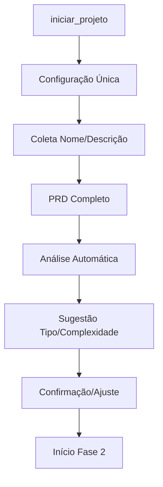

# 🎯 Plano de Otimização do Sistema Maestro
## Redução de Prompts e Melhoria da Experiência do Usuário

**Data:** 03/02/2026  
**Objetivo:** Criar sistema de alto nível para orquestração na engenharia, arquitetura e desenvolvimento de software, economizando créditos de prompts sem perder qualidade.

---

## 📋 RESUMO EXECUTIVO

O sistema Maestro atual já possui uma base sólida com:
- ✅ Sistema de Discovery agrupado
- ✅ 3 modos de operação (Economy/Balanced/Quality)
- ✅ Skills automáticas por fase
- ✅ Gates adaptativos por tier
- ✅ Classificação automática pós-PRD

**Oportunidades identificadas:**
1. **Reorganização do fluxo de perguntas** - PRD primeiro, depois complexidade
2. **Configuração inicial única** - Modo, IDE e Google Stitch definidos uma vez
3. **Sistema de inferência inteligente** - Reduzir prompts baseado em contexto
4. **Otimização de utilização de skills** - Garantir uso correto dos templates
5. **Sistema de cache de decisões** - Reutilizar escolhas similares

---

## 🎯 PLANO 1: REORGANIZAÇÃO DO SISTEMA DE PERGUNTAS
### Problema Atual
- Perguntas sobre tipo/complexidade antes do PRD
- Classificação pode mudar após entender o produto
- Necessidade de confirmar classificação manualmente

### Solução Proposta: Fluxo PRD-First

#### 1.1 Nova Sequência de Inicialização


#### 1.2 Implementação Detalhada

**Modificações em `iniciar_projeto`:**
1. Remover perguntas sobre tipo/complexidade iniciais
2. Ir direto para configuração (IDE/Modo) + PRD
3. Após PRD, fazer análise automática inteligente

**Nova lógica:**
```typescript
export async function iniciarProjeto(args: IniciarProjetoArgs) {
    // 1. Configuração única (IDE + Modo)
    if (!args.ide || !args.modo) {
        return gerarQuestionarioConfiguracao(args);
    }
    
    // 2. Criar projeto em modo "discovery"
    const estado = criarEstadoInicial(args);
    estado.status = 'aguardando_prd';
    
    // 3. Ir direto para Fase 1 com PRD
    return iniciarFaseProduto(estado);
}
```

**Novo fluxo pós-PRD:**
```typescript
export async function proximo(args: ProximoArgs) {
    const estado = parsearEstado(args.estado_json);
    
    if (estado.fase_atual === 1 && estado.status === 'aguardando_prd') {
        // Análise automática do PRD
        const analise = analisarPRD(args.entregavel);
        const sugestao = sugerirClassificacao(analise);
        
        return {
            analise_automatica: analise,
            sugestao_classificacao: sugestao,
            aguardando_confirmacao: true
        };
    }
    
    // Continuar fluxo normal...
}
```

#### 1.3 Sistema de Análise de PRD Inteligente

**Critérios Expandidos:**
- **Entidades de Domínio**: Análise semântica de substantivos
- **Complexidade de Regras**: Detecção de workflows/cálculos
- **Integrações**: APIs, serviços externos, webhooks
- **Segurança**: LGPD, autenticação, criptografia
- **Escala**: Números de usuários, volume de dados
- **Tecnologia**: Stacks mencionadas, arquitetura

**Algoritmo de Pontuação:**
```typescript
interface AnaliseComplexidade {
    entidades: { nome: string, confianca: number }[];
    integracoes: string[];
    seguranca: string[];
    escala: { usuarios?: number, volume?: string };
    regras_negocio: number;
    pontuacao_total: number;
    justificativa: string;
}

function analisarPRD(prd: string): AnaliseComplexidade {
    // Análise com NLP/regex avançado
    // Retorna análise detalhada
}
```

#### 1.4 Cronograma de Implementação
- **Semana 1**: Modificar `iniciar_projeto` e `proximo`
- **Semana 2**: Implementar análise de PRD inteligente
- **Semana 3**: Testes e refinamento do algoritmo
- **Semana 4**: Deploy e monitoramento

---

## 🛠️ PLANO 2: CONFIGURAÇÃO INICIAL ÚNICA
### Problema Atual
- Perguntas sobre modo/IDE/Stitch espalhadas no fluxo
- Usuário pode ser perguntado várias vezes sobre preferências

### Solução: Sistema de Configuração Centralizada

#### 2.1 Nova Tool: setup_inicial
```typescript
interface SetupInicial {
    ide: 'windsurf' | 'cursor' | 'antigravity';
    modo: 'economy' | 'balanced' | 'quality';
    usar_stitch: boolean;
    preferencias_stack?: {
        frontend?: 'react' | 'vue' | 'angular' | 'nextjs';
        backend?: 'node' | 'java' | 'php' | 'python';
        database?: 'postgres' | 'mysql' | 'mongodb';
    };
    team_size?: 'solo' | 'pequeno' | 'medio' | 'grande';
}

export async function setupInicial(config: SetupInicial) {
    // Salva configuração global do usuário
    await salvarConfiguracaoGlobal(config);
    
    // Injeta skills/rules apropriadas
    await injectContentForIDE(config.ide);
    
    // Prepara template de discovery baseado no modo
    const discoveryTemplate = gerarDiscoveryTemplate(config);
    
    return {
        configuracao_salva: true,
        discovery_template: discoveryTemplate,
        skills_injetadas: true
    };
}
```

#### 2.2 Integração com Fluxo Existente

**Modificação em `iniciar_projeto`:**
```typescript
export async function iniciarProjeto(args: IniciarProjetoArgs) {
    // 1. Verificar se tem configuração global
    const configGlobal = await carregarConfiguracaoGlobal();
    
    if (!configGlobal) {
        return gerarQuestionarioSetupCompleto(args);
    }
    
    // 2. Usar configuração existente + prosseguir
    const projetoConfig = { ...args, ...configGlobal };
    return criarProjetoComConfig(projetoConfig);
}
```

#### 2.3 Sistema de Preferências Persistentes

**Arquivo de configuração global:**
```json
// ~/.maestro/config.json
{
    "version": "2.1.0",
    "user_preferences": {
        "ide": "windsurf",
        "default_mode": "balanced",
        "sempre_usar_stitch": false,
        "stack_preferences": {
            "frontend": "react",
            "backend": "node",
            "database": "postgres"
        },
        "team_context": {
            "size": "pequeno",
            "experience": "pleno"
        }
    },
    "project_defaults": {
        "auto_discovery": true,
        "early_classification": true,
        "frontend_first": true
    }
}
```

#### 2.4 Cronograma de Implementação
- **Semana 1**: Criar tool `setup_inicial` e sistema de configuração
- **Semana 2**: Integrar com `iniciar_projeto`
- **Semana 3**: Sistema de preferências persistentes
- **Semana 4**: Migração de projetos existentes

---

## 🧠 PLANO 3: SISTEMA DE INFERÊNCIA INTELIGENTE
### Problema Atual
- IA ainda faz muitas perguntas que poderiam ser inferidas
- Contexto disponível não é totalmente aproveitado

### Solução: Engine de Inferência Contextual

#### 3.1 Sistema de Contexto Inteligente

**Context Engine:**
```typescript
interface ContextoInteligente {
    projeto: {
        nome: string;
        dominio: string; // e-commerce, fintech, saude, etc
        stack_detectada: string[];
        complexidade_inferida: NivelComplexidade;
    };
    time: {
        tamanho: string;
        experiencia: string;
        stack_conhecida: string[];
    };
    tecnico: {
        arquitetura_sugerida: string;
        patterns_recomendados: string[];
        integracoes_previstas: string[];
    };
    negocio: {
        tipo_usuario: string[];
        modelo_monetizacao?: string;
        compliance_necessario: string[];
    };
}

class InferenceEngine {
    async inferirContexto(
        nome: string, 
        descricao: string, 
        prd?: string,
        historico_usuario?: UserHistory
    ): Promise<ContextoInteligente> {
        // Combina múltiplas fontes de inferência
    }
    
    async sugerirProximasPerguntas(
        contexto: ContextoInteligente,
        fase_atual: number
    ): Promise<PerguntasPriorizadas> {
        // Só pergunta o que realmente precisa
    }
}
```

#### 3.2 Algoritmos de Inferência

**Detecção de Domínio:**
```typescript
const DOMINIO_PATTERNS = {
    'e-commerce': ['loja', 'produto', 'carrinho', 'pagamento', 'estoque'],
    'fintech': ['pagamento', 'cartão', 'banco', 'transação', 'pix'],
    'saude': ['paciente', 'consulta', 'prontuário', 'medico'],
    'educacao': ['aluno', 'curso', 'aula', 'professor'],
    'gestao': ['usuario', 'dashboard', 'relatório', 'admin']
};

function detectarDominio(texto: string): { dominio: string, confianca: number } {
    // Análise por pontuação de palavras-chave + contexto
}
```

**Inferência de Stack:**
```typescript
const STACK_INFERENCE_RULES = {
    'react_ecosystem': {
        frontend: 'react',
        backend: 'node',
        database: 'postgres',
        condicoes: ['spa', 'dashboard', 'tempo_real']
    },
    'php_ecosystem': {
        frontend: 'blade',
        backend: 'laravel',
        database: 'mysql',
        condicoes: ['crud', 'backoffice', 'tradicional']
    }
};
```

#### 3.3 Sistema de Perguntas Inteligentes

**Priorização de Perguntas:**
```typescript
interface PerguntaPriorizada {
    pergunta: string;
    prioridade: 'critica' | 'importante' | 'opcional';
    pode_inferir: boolean;
    valor_inferido?: string;
    confianca_inferencia?: number;
}

class SmartQuestionEngine {
    priorizarPerguntas(
        contexto: ContextoInteligente,
        especialista: string
    ): PerguntaPriorizada[] {
        // Só pergunta o que não pode ser inferido com alta confiança
        return perguntas.filter(p => 
            p.prioridade === 'critica' || 
            (p.pode_inferir && p.confianca_inferencia < 0.8)
        );
    }
}
```

#### 3.4 Cronograma de Implementação
- **Semana 1**: Context Engine básico
- **Semana 2**: Algoritmos de inferência de domínio/stack
- **Semana 3**: Sistema de perguntas inteligentes
- **Semana 4**: Integração com especialistas existentes

---

## ⚙️ PLANO 4: GARANTIA DE USO CORRETO DE SKILLS
### Problema Atual
- IA pode não usar skills consistentemente
- Templates podem ser ignorados

### Solução: Sistema de Enforcement Obrigatório

#### 4.1 Skill Validation Engine

**Validação Obrigatória:**
```typescript
class SkillEnforcement {
    async validarUsoSkill(
        fase: string,
        entregavel: string,
        estado: EstadoProjeto
    ): Promise<ValidationResult> {
        const skillNecessaria = getSkillParaFase(fase);
        
        if (!skillNecessaria) {
            throw new Error(`Skill obrigatória não encontrada para fase: ${fase}`);
        }
        
        const skillCarregada = await verificarSkillCarregada(skillNecessaria);
        const templateUsado = await verificarTemplateUsado(entregavel, fase);
        
        return {
            skill_carregada: skillCarregada,
            template_usado: templateUsado,
            checklist_aplicado: await verificarChecklistAplicado(entregavel, fase),
            score_qualidade: calcularScoreQualidade(entregavel, skillNecessaria)
        };
    }
}
```

#### 4.2 Template Enforcement

**Sistema Obrigatório de Templates:**
```typescript
// Modificação em proximo()
export async function proximo(args: ProximoArgs) {
    const estado = parsearEstado(args.estado_json);
    const fase = estado.fluxo[estado.fase_atual - 1];
    
    // 1. OBRIGATÓRIO: Validar uso de skill
    const validacao = await skillEnforcement.validarUsoSkill(
        fase.nome,
        args.entregavel,
        estado
    );
    
    if (!validacao.skill_carregada) {
        throw new Error(`ERRO: Skill ${fase.especialista} não foi carregada antes da geração`);
    }
    
    if (!validacao.template_usado) {
        throw new Error(`ERRO: Template obrigatório não foi usado para ${fase.nome}`);
    }
    
    // Continuar só se validações passarem...
}
```

#### 4.3 Sistema de Hints Automático

**Auto-Hints para IA:**
```typescript
class SkillHintSystem {
    gerarHintsParaFase(fase: string): string {
        const skill = getSkillParaFase(fase);
        
        return `
🤖 **INSTRUÇÕES OBRIGATÓRIAS PARA IA:**

1. **ANTES** de gerar qualquer conteúdo:
   - Carregar skill: \`${skill}\`
   - Ler template: \`resources/templates/${fase.toLowerCase()}.md\`
   - Revisar checklist: \`resources/checklists/${fase.toLowerCase()}.md\`

2. **DURANTE** geração:
   - Aplicar persona do especialista
   - Seguir estrutura do template
   - Incluir todos os campos obrigatórios

3. **ANTES** de finalizar:
   - Validar contra checklist
   - Verificar completude do entregável
   - Garantir qualidade mínima

🚫 **PROIBIDO**: Gerar conteúdo sem seguir estas etapas
        `;
    }
}
```

#### 4.4 Cronograma de Implementação
- **Semana 1**: Skill Validation Engine
- **Semana 2**: Template Enforcement
- **Semana 3**: Sistema de Hints Automático
- **Semana 4**: Integração com todas as tools

---

## 📊 PLANO 5: SISTEMA DE CACHE E OTIMIZAÇÃO
### Problema Atual
- Decisões similares são refeitas
- Contexto é recarregado desnecessariamente

### Solução: Sistema de Cache Inteligente

#### 5.1 Decision Cache

**Cache de Decisões:**
```typescript
interface DecisionCache {
    tipo_projeto: string;
    dominio: string;
    stack_sugerida: string;
    arquitetura_recomendada: string;
    patterns_aplicados: string[];
    decisoes_tecnicas: Record<string, any>;
    usado_em_projetos: string[];
    taxa_sucesso: number;
}

class DecisionCacheEngine {
    async buscarDecisoesSimilares(
        contexto: ContextoInteligente
    ): Promise<DecisionCache[]> {
        // Busca decisões de projetos similares
        return await db.query(`
            SELECT * FROM decision_cache 
            WHERE dominio = ? AND tipo_projeto = ?
            ORDER BY taxa_sucesso DESC
        `, [contexto.projeto.dominio, contexto.projeto.tipo]);
    }
    
    async aplicarDecisaoCacheada(
        decisao: DecisionCache,
        projeto_atual: string
    ): Promise<void> {
        // Aplica decisões pré-validadas automaticamente
    }
}
```

#### 5.2 Context Caching

**Cache de Contexto:**
```typescript
interface ContextCache {
    hash_projeto: string;
    contexto_compilado: ContextoInteligente;
    ultima_atualizacao: Date;
    dependencias: string[]; // arquivos que afetam o contexto
    valido_ate: Date;
}

class ContextCacheEngine {
    async obterContexto(estado: EstadoProjeto): Promise<ContextoInteligente> {
        const hash = this.calcularHashProjeto(estado);
        const cached = await this.buscarCache(hash);
        
        if (cached && this.isCacheValido(cached)) {
            return cached.contexto_compilado;
        }
        
        // Regenerar contexto e cache
        const contexto = await this.gerarContextoCompleto(estado);
        await this.salvarCache(hash, contexto);
        
        return contexto;
    }
}
```

#### 5.3 Cronograma de Implementação
- **Semana 1**: Decision Cache básico
- **Semana 2**: Context Caching
- **Semana 3**: Integração com sistema existente
- **Semana 4**: Otimização e monitoramento

---

## 📈 MÉTRICAS DE SUCESSO

### Métricas Quantitativas
- **Redução de Prompts**: Meta de 40% menos prompts por projeto
- **Tempo de Setup**: De 10-15 mins para 3-5 mins
- **Reuso de Decisões**: 70% das decisões técnicas reutilizadas
- **Conformidade de Skills**: 98% de uso correto de templates

### Métricas Qualitativas
- **Experiência do Usuário**: Questionário de satisfação
- **Qualidade dos Entregáveis**: Score médio dos gates
- **Consistência**: Variação entre projetos similares
- **Adoção**: % de usuários que completam projetos

---

## 🚀 CRONOGRAMA GERAL DE IMPLEMENTAÇÃO

### Fase 1: Fundação (Semanas 1-4)
- Plano 2: Configuração Inicial Única
- Plano 4: Garantia de Uso de Skills (básico)

### Fase 2: Inteligência (Semanas 5-8)  
- Plano 1: Reorganização de Perguntas
- Plano 3: Sistema de Inferência (básico)

### Fase 3: Otimização (Semanas 9-12)
- Plano 3: Sistema de Inferência (avançado)
- Plano 5: Sistema de Cache

### Fase 4: Refinamento (Semanas 13-16)
- Testes A/B
- Otimizações baseadas em métricas
- Documentação final

---

## 🎯 PRÓXIMOS PASSOS IMEDIATOS

1. **Revisar e aprovar planos** com stakeholders
2. **Priorizar implementação** baseada no impacto/esforço
3. **Criar protótipos** para validação conceitual
4. **Definir métricas de baseline** antes das mudanças
5. **Iniciar desenvolvimento** da Fase 1

Este plano mantém a qualidade do sistema atual enquanto reduz significativamente a necessidade de prompts do usuário, criando uma experiência mais fluida e econômica.
