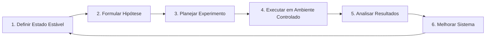

# Guia de Chaos Engineering

> **Prioridade**: 🟢 BAIXA  
> **Aplicável a**: Projetos Nível 3 (Complexo) com alta disponibilidade obrigatória  
> **Pré-requisito**: SLOs definidos para medir impacto

---

## O que é Chaos Engineering?

> "Chaos Engineering é a disciplina de experimentar em um sistema para construir confiança na capacidade do sistema de suportar condições turbulentas em produção."
> — [Principles of Chaos Engineering](https://principlesofchaos.org/)

**NÃO é**: Quebrar coisas aleatoriamente
**É**: Experimentos controlados para descobrir fraquezas

---

## Quando Usar?

| Contexto | Chaos Engineering? |
|----------|-------------------|
| MVP / Startup inicial | ❌ Não prioritário |
| SaaS com SLA 99.9% | ✅ Sim |
| Fintech / Healthcare | ✅ Obrigatório |
| Microserviços distribuídos | ✅ Altamente recomendado |
| Monolito simples | ⚠️ Pode ser overkill |

---

## Processo



### 1. Definir Estado Estável

Use SLOs como baseline:
- Disponibilidade: 99.9%
- Latência p95: < 200ms
- Taxa de erros: < 0.1%

### 2. Formular Hipótese

```
"Quando [FALHA INJETADA], o sistema deve [COMPORTAMENTO ESPERADO]
 e os SLOs devem [IMPACTO ACEITÁVEL]."
```

Exemplo:
> "Quando o banco de dados primário falhar, o sistema deve fazer failover para réplica em < 30 segundos, com queda temporária de disponibilidade < 0.01%."

### 3. Planejar Experimento

| Aspecto | Definição |
|---------|-----------|
| **Escopo** | Quais componentes? |
| **Blast Radius** | % de tráfego afetado |
| **Duração** | Quanto tempo? |
| **Métricas** | O que observar? |
| **Kill Switch** | Como parar imediatamente? |
| **Rollback** | Como reverter? |

### 4. Executar

- Começar em staging
- Depois em produção com % pequeno
- Ter equipe pronta para intervir
- Monitorar métricas em tempo real

### 5. Analisar

- Hipótese confirmada ou refutada?
- Descobertas inesperadas?
- SLOs impactados quanto?

### 6. Melhorar

- Criar tickets para corrigir fraquezas
- Adicionar alarmes faltantes
- Melhorar runbooks
- Repetir experimento após fix

---

## Tipos de Experimentos

### Infraestrutura

| Experimento | Descrição | Ferramenta |
|-------------|-----------|------------|
| **Kill Instance** | Terminar VM/container | Chaos Monkey |
| **CPU Stress** | 100% CPU | stress-ng |
| **Memory Pressure** | Esgotar memória | stress-ng |
| **Disk Fill** | Encher disco | dd |
| **Network Latency** | Adicionar latência | tc netem |
| **Network Partition** | Isolar serviços | iptables |
| **DNS Failure** | DNS não resolve | Gremlin |

### Aplicação

| Experimento | Descrição |
|-------------|-----------|
| **Dependency Failure** | Mock falha de serviço externo |
| **Database Slowdown** | Queries lentas artificialmente |
| **Circuit Breaker Test** | Abrir circuit breaker |
| **Cache Invalidation** | Limpar todo o cache |
| **Message Queue Backup** | Enfileirar muitas mensagens |

### Processo

| Experimento | Objetivo |
|-------------|----------|
| **On-Call Response** | Tempo de resposta do time |
| **Runbook Validity** | Runbooks funcionam? |
| **Rollback Speed** | Tempo para reverter deploy |

---

## Ferramentas

| Ferramenta | Tipo | Melhor Para |
|------------|------|-------------|
| **Chaos Monkey** | Open Source | Kill instances (EC2) |
| **Gremlin** | SaaS | Experimentos variados |
| **Litmus** | Open Source | Kubernetes |
| **Chaos Mesh** | Open Source | Kubernetes |
| **AWS FIS** | AWS | Experimentos na AWS |
| **Toxiproxy** | Open Source | Network failures |

---

## Exemplo: Experimento Simples

### Plano

```yaml
Experiment:
  Name: Database Failover Test
  Hypothesis: >
    Quando o RDS primário ficar indisponível por 5 minutos,
    o sistema deve fazer failover para a réplica em < 30 segundos
    com < 3 requests falhando.
    
  Scope:
    Environment: staging
    BlastRadius: 100% (staging é isolado)
    Duration: 5 minutes
    
  Execution:
    Tool: AWS FIS
    Action: aws:rds:failover-db-cluster
    Target: staging-db-cluster
    
  Metrics:
    - SLI: Availability (requests bem-sucedidos)
    - SLI: Error count durante failover
    - Custom: Tempo para recuperação
    
  KillSwitch:
    - Manual: Cancelar experimento no FIS console
    - Auto: Se error rate > 5% por 1 min
    
  Team:
    - Lead: @engineer-1
    - Observer: @engineer-2
    - Communicator: @manager (se escalar)
```

### Execução

```bash
# AWS FIS
aws fis start-experiment \
  --experiment-template-id EXT123456 \
  --tags Environment=staging

# Monitorar
watch -n 5 'curl -s https://staging.app.com/health | jq .'
```

### Resultado

```markdown
## Resultado: Database Failover Test

**Data**: 2024-01-15 14:00 UTC
**Hipótese**: CONFIRMADA ✅

### Métricas Observadas
- Tempo de failover: 22 segundos
- Requests falhados durante failover: 2
- Availability durante experimento: 99.97%

### Descobertas
- Circuit breaker levou 10s para abrir (configurar para 5s)
- Alertas dispararam corretamente
- Runbook estava desatualizado (atualizar)

### Ações
- [ ] Ajustar circuit breaker timeout
- [ ] Atualizar runbook de failover
- [ ] Adicionar métrica de tempo de failover
```

---

## Começando

### Semana 1: Preparação
- [ ] Definir SLOs de baseline
- [ ] Mapear dependências críticas
- [ ] Configurar observabilidade

### Semana 2: Primeiro Experimento
- [ ] Escolher experimento simples (ex: kill instance)
- [ ] Executar em staging
- [ ] Documentar resultados

### Semana 3+: Evolução
- [ ] Experimentos mais complexos
- [ ] Game days (simulação de incidente)
- [ ] Eventualmente em produção

---

## Checklist de Prontidão

Antes de chaos engineering em produção:

- [ ] SLOs definidos e monitorados
- [ ] Alertas funcionando
- [ ] Runbooks para cenários comuns
- [ ] Rollback testado e rápido
- [ ] Time treinado em resposta a incidentes
- [ ] Comunicação definida (quem avisar, quando)
- [ ] Janela de experimentos acordada
- [ ] Kill switch configurado e testado

---

## Anti-Patterns

| ❌ Não Faça | ✅ Faça |
|-------------|--------|
| Chaos sem hipótese | Sempre defina hipótese clara |
| Começar em produção | Staging primeiro |
| Grande blast radius inicial | Comece com 1% do tráfego |
| Sem monitoramento | Dashboards abertos durante |
| Sem kill switch | Sempre tenha forma de parar |
| Culpar pessoas | Foque em melhorar sistemas |

---

## Referências

- [Principles of Chaos Engineering](https://principlesofchaos.org/)
- [Chaos Engineering (O'Reilly Book)](https://www.oreilly.com/library/view/chaos-engineering/9781491988459/)
- [Netflix Chaos Monkey](https://github.com/Netflix/chaosmonkey)
- [AWS Fault Injection Simulator](https://aws.amazon.com/fis/)
