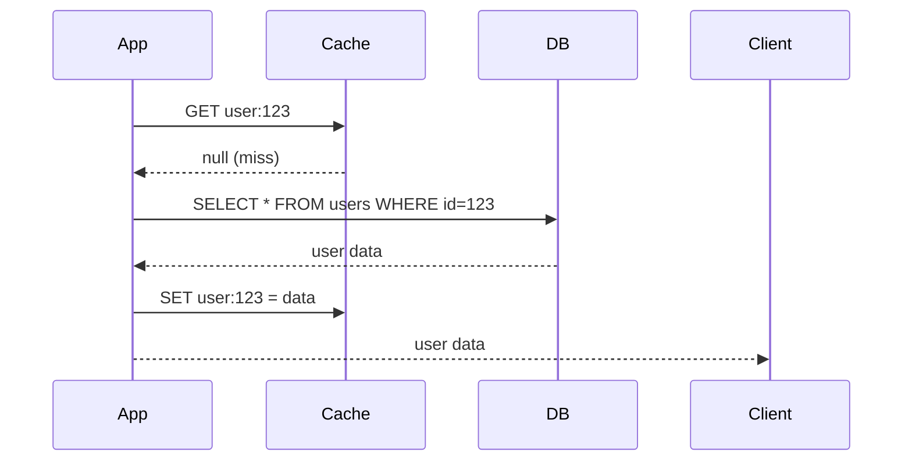

# Guia de Estratégias de Cache

> **Prioridade**: 🟡 MÉDIA  
> **Aplicável a**: Projetos Nível 2 (Médio) e Nível 3 (Complexo)

---

## Por que Cache?

- **Latência**: Acesso a memória ~100ns vs disco ~10ms vs rede ~100ms
- **Throughput**: Reduz carga no banco de dados
- **Custo**: Menos recursos computacionais
- **Disponibilidade**: Continua servindo se origem falhar (stale data)

---

## Padrões de Cache

### 1. Cache-Aside (Lazy Loading)

O mais comum. Aplicação gerencia o cache.



```typescript
async function getUser(id: string): Promise<User> {
  const cacheKey = `user:${id}`;
  
  // 1. Tentar cache
  const cached = await redis.get(cacheKey);
  if (cached) {
    return JSON.parse(cached);
  }
  
  // 2. Buscar no banco
  const user = await db.users.findById(id);
  
  // 3. Popular cache
  if (user) {
    await redis.setex(cacheKey, 3600, JSON.stringify(user));
  }
  
  return user;
}
```

**Prós**: Simples, só cacheia o que é acessado  
**Contras**: Cache miss inicial, dados podem ficar stale

---

### 2. Write-Through

Escreve no cache E no banco simultaneamente.

```typescript
async function updateUser(id: string, data: Partial<User>): Promise<User> {
  // 1. Atualizar banco
  const user = await db.users.update(id, data);
  
  // 2. Atualizar cache imediatamente
  await redis.setex(`user:${id}`, 3600, JSON.stringify(user));
  
  return user;
}
```

**Prós**: Cache sempre atualizado  
**Contras**: Latência de escrita dobra, escreve dados que talvez não sejam lidos

---

### 3. Write-Behind (Write-Back)

Escreve no cache, async para banco.

```typescript
async function updateUser(id: string, data: Partial<User>): Promise<User> {
  // 1. Atualizar só no cache
  const user = { ...await getCachedUser(id), ...data };
  await redis.setex(`user:${id}`, 3600, JSON.stringify(user));
  
  // 2. Enfileirar escrita no banco
  await queue.add('sync-user-to-db', { id, data });
  
  return user;
}
```

**Prós**: Escrita super rápida, batch possível  
**Contras**: Risco de perda de dados, complexidade

---

### 4. Read-Through

Cache é um proxy transparente.

```typescript
// O cache gerencia a busca automaticamente
const user = await cache.get('user:123', {
  fallback: () => db.users.findById('123'),
  ttl: 3600
});
```

**Prós**: Código limpo, abstração total  
**Contras**: Menos controle, dependência do cache library

---

## Estratégias de Invalidação

> "There are only two hard things in Computer Science: cache invalidation and naming things."

### 1. TTL (Time-To-Live)

```typescript
// Cache expira automaticamente
await redis.setex('user:123', 3600, data); // 1 hora
```

**Usar quando**: Dados mudam pouco, stale data aceitável

### 2. Invalidação Explícita

```typescript
async function updateUser(id: string, data: any) {
  await db.users.update(id, data);
  await redis.del(`user:${id}`);
}
```

**Usar quando**: Consistência importante

### 3. Event-Driven Invalidation

```typescript
// Producer
eventBus.emit('user.updated', { userId: '123' });

// Consumer
eventBus.on('user.updated', async ({ userId }) => {
  await redis.del(`user:${userId}`);
  await redis.del(`user-profile:${userId}`);
});
```

**Usar quando**: Múltiplos caches afetados, microserviços

### 4. Cache Tags

```typescript
// Cachear com tags
await cache.set('product:123', data, { 
  tags: ['products', 'category:electronics'] 
});

// Invalidar por tag
await cache.invalidateTag('category:electronics');
```

**Usar quando**: Muitos itens relacionados precisam invalidar juntos

---

## Padrões Avançados

### Stale-While-Revalidate

Retorna stale imediatamente, atualiza em background.

```typescript
async function getWithSWR(key: string, fetcher: () => Promise<any>) {
  const cached = await redis.get(key);
  
  if (cached) {
    const data = JSON.parse(cached);
    
    // Se próximo de expirar, revalidar em background
    if (data._expiresAt < Date.now() + 60000) {
      refreshInBackground(key, fetcher);
    }
    
    return data.value;
  }
  
  return fetchAndCache(key, fetcher);
}
```

### Cache Stampede Prevention

Evita que muitas requisições simultâneas busquem a mesma coisa.

```typescript
const locks = new Map<string, Promise<any>>();

async function getWithLock(key: string, fetcher: () => Promise<any>) {
  const cached = await redis.get(key);
  if (cached) return JSON.parse(cached);
  
  // Se já tem requisição em andamento, esperar ela
  if (locks.has(key)) {
    return locks.get(key);
  }
  
  // Criar lock
  const promise = fetcher().then(async (data) => {
    await redis.setex(key, 3600, JSON.stringify(data));
    locks.delete(key);
    return data;
  });
  
  locks.set(key, promise);
  return promise;
}
```

### Multi-Layer Cache

```
Browser Cache → CDN → Application Cache → Database
```

```typescript
async function getProduct(id: string) {
  // L1: In-memory (LRU)
  if (memoryCache.has(id)) {
    return memoryCache.get(id);
  }
  
  // L2: Redis
  const cached = await redis.get(`product:${id}`);
  if (cached) {
    const data = JSON.parse(cached);
    memoryCache.set(id, data);
    return data;
  }
  
  // L3: Database
  const product = await db.products.findById(id);
  
  // Populate caches
  await redis.setex(`product:${id}`, 3600, JSON.stringify(product));
  memoryCache.set(id, product);
  
  return product;
}
```

---

## Cache para diferentes tipos de dados

| Tipo de Dado | TTL Sugerido | Estratégia |
|--------------|--------------|------------|
| Dados de usuário | 5-15 min | Cache-aside + invalidação no update |
| Configurações | 1-24 horas | Read-through + event invalidation |
| Catálogo/produtos | 15-60 min | Cache-aside + SWR |
| Sessions | Até expirar | Write-through |
| Rate limit counters | 1-60 seg | Write-through |
| Agregações/reports | 5-60 min | Pre-computed, refresh periódico |

---

## Redis Patterns

### Hash para objetos

```typescript
// Mais eficiente que JSON serializado
await redis.hset('user:123', {
  name: 'John',
  email: 'john@example.com',
  role: 'admin'
});

// Buscar campo específico
const email = await redis.hget('user:123', 'email');

// Buscar tudo
const user = await redis.hgetall('user:123');
```

### Sorted Set para rankings/feeds

```typescript
// Adicionar item com score (timestamp)
await redis.zadd('user:123:feed', Date.now(), postId);

// Buscar últimos 20
const recent = await redis.zrevrange('user:123:feed', 0, 19);

// Remover antigos
await redis.zremrangebyrank('user:123:feed', 0, -101); // Manter só 100
```

### Set para tags/relacionamentos

```typescript
// Adicionar tags
await redis.sadd('product:123:tags', 'electronics', 'sale', 'featured');

// Buscar produtos com múltiplas tags
const products = await redis.sinter('tag:electronics', 'tag:sale');
```

---

## Checklist de Implementação

- [ ] Padrão de cache definido por tipo de dado
- [ ] TTLs configurados apropriadamente
- [ ] Estratégia de invalidação documentada
- [ ] Proteção contra cache stampede
- [ ] Monitoramento de hit/miss ratio
- [ ] Alertas para Redis indisponível
- [ ] Fallback gracioso se cache falhar
- [ ] Testes com cache habilitado E desabilitado

---

## Métricas para Monitorar

| Métrica | Alerta se... |
|---------|--------------|
| Hit Rate | < 80% (depende do caso) |
| Latência p99 | > 10ms |
| Memória usada | > 80% do disponível |
| Evictions | Taxa alta inesperada |
| Conexões | Próximo do max |

---

## Referências

- [Redis Best Practices](https://redis.io/docs/manual/patterns/)
- [Caching Strategies](https://codeahoy.com/2017/08/11/caching-strategies-and-how-to-choose-the-right-one/)
- [Facebook TAO](https://www.usenix.org/system/files/conference/atc13/atc13-bronson.pdf)
