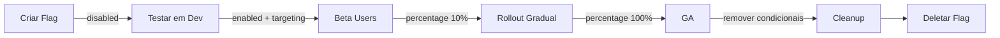

# Prompt: Feature Flags

> **Prioridade**: 🟡 MÉDIA  
> **Aplicável a**: Projetos com deploys frequentes, rollouts graduais, experimentação

---

## O que são Feature Flags?

Feature flags (ou feature toggles) permitem:
- **Rollout gradual** de features (1% → 10% → 50% → 100%)
- **Desligar features** rapidamente sem deploy
- **A/B testing** em produção
- **Trunk-based development** (merge código incompleto)
- **Kill switch** para features problemáticas

---

## Tipos de Feature Flags

| Tipo | Duração | Uso |
|------|---------|-----|
| **Release Flag** | Dias/semanas | Rollout gradual de nova feature |
| **Experiment Flag** | Semanas | A/B testing |
| **Ops Flag** | Permanente | Kill switches, manutenção |
| **Permission Flag** | Permanente | Features por tier/plano |

---

## Prompt Base: Implementar Feature Flags

```text
Atue como engenheiro de software sênior.

Preciso implementar feature flags para:
- Stack: [ex. Node.js + React / Java + Spring]
- Escala: [ex. 10k DAU, 100 req/s]
- Use cases: [ex. rollout gradual, A/B testing, kill switches]

Ferramenta escolhida: [LaunchDarkly / Unleash / Flagsmith / Caseiro com Redis]

Gere uma implementação com:

1. **Setup da Ferramenta**
   - Instalação e configuração
   - SDK client e server-side

2. **Tipos de Flags**
   - Boolean simples
   - Percentage rollout
   - User targeting (por ID, email, etc)
   - Multivariate (A/B/C testing)

3. **Código de Integração**
   - Wrapper/service para acessar flags
   - Uso em backend
   - Uso em frontend
   - Defaults seguros (fallback)

4. **Boas Práticas**
   - Naming convention
   - Documentação de flags
   - Lifecycle (criar → usar → remover)
   - Limpeza de flags antigas

5. **Observabilidade**
   - Logs de qual variant foi servida
   - Métricas por flag
   - Alertas se flag falhar
```

---

## Prompt: Feature Flag Caseiro (Redis)

```text
Não quero usar uma ferramenta externa para feature flags.
Preciso de uma solução simples com Redis.

Requisitos:
- Boolean flags
- Percentage rollout (0-100%)
- User targeting básico
- Admin UI simples para gerenciar

Stack: [DESCREVA]

Gere:
1. Schema Redis para flags
2. Service para avaliar flags
3. API para CRUD de flags
4. Middleware/HOC para usar em código
5. Exemplo de uso em feature real
```

---

## Prompt: Migrar para Feature Flags

```text
Tenho código com lógica condicional hardcoded:
[COLE CÓDIGO COM IFs PARA FEATURES]

Quero migrar para feature flags para:
- Controlar remotamente
- Fazer rollout gradual
- Ter fallback rápido

Refatore o código para:
1. Usar feature flag service
2. Manter defaults seguros
3. Documentar a flag
4. Incluir limpeza futura
```

---

## Exemplo: Feature Flag Service (TypeScript)

```typescript
// src/services/featureFlags.ts
import Redis from 'ioredis';

interface Flag {
  name: string;
  enabled: boolean;
  percentage?: number;        // 0-100 para rollout
  allowedUsers?: string[];    // targeting específico
  allowedGroups?: string[];   // ex: 'beta-testers', 'employees'
  variants?: Record<string, number>; // A/B testing: { 'control': 50, 'treatment': 50 }
}

interface EvaluationContext {
  userId?: string;
  email?: string;
  groups?: string[];
  attributes?: Record<string, any>;
}

class FeatureFlagService {
  private redis: Redis;
  private cache: Map<string, Flag> = new Map();
  private cacheRefreshInterval = 30000; // 30 segundos

  constructor(redis: Redis) {
    this.redis = redis;
    this.startCacheRefresh();
  }

  async isEnabled(flagName: string, context: EvaluationContext = {}): Promise<boolean> {
    const flag = await this.getFlag(flagName);
    
    if (!flag) return false; // Default: desligado se não existe
    if (!flag.enabled) return false;

    // User targeting
    if (flag.allowedUsers?.includes(context.userId || '')) {
      return true;
    }

    // Group targeting
    if (flag.allowedGroups && context.groups) {
      const hasGroup = flag.allowedGroups.some(g => context.groups!.includes(g));
      if (hasGroup) return true;
    }

    // Percentage rollout
    if (flag.percentage !== undefined) {
      const hash = this.hashUser(context.userId || 'anonymous', flagName);
      return hash < flag.percentage;
    }

    return true;
  }

  async getVariant(flagName: string, context: EvaluationContext = {}): Promise<string> {
    const flag = await this.getFlag(flagName);
    
    if (!flag || !flag.variants) return 'control';
    if (!flag.enabled) return 'control';

    const hash = this.hashUser(context.userId || 'anonymous', flagName);
    let cumulative = 0;
    
    for (const [variant, percentage] of Object.entries(flag.variants)) {
      cumulative += percentage;
      if (hash < cumulative) {
        return variant;
      }
    }
    
    return 'control';
  }

  private hashUser(userId: string, flagName: string): number {
    // Hash determinístico para consistência
    const str = `${userId}:${flagName}`;
    let hash = 0;
    for (let i = 0; i < str.length; i++) {
      hash = ((hash << 5) - hash) + str.charCodeAt(i);
      hash = hash & hash;
    }
    return Math.abs(hash) % 100;
  }

  private async getFlag(name: string): Promise<Flag | null> {
    if (this.cache.has(name)) {
      return this.cache.get(name)!;
    }
    
    const data = await this.redis.hget('feature_flags', name);
    if (!data) return null;
    
    const flag = JSON.parse(data) as Flag;
    this.cache.set(name, flag);
    return flag;
  }

  private startCacheRefresh() {
    setInterval(async () => {
      const flags = await this.redis.hgetall('feature_flags');
      this.cache.clear();
      for (const [name, data] of Object.entries(flags)) {
        this.cache.set(name, JSON.parse(data));
      }
    }, this.cacheRefreshInterval);
  }

  // Admin methods
  async createFlag(flag: Flag): Promise<void> {
    await this.redis.hset('feature_flags', flag.name, JSON.stringify(flag));
  }

  async updateFlag(name: string, updates: Partial<Flag>): Promise<void> {
    const existing = await this.getFlag(name);
    if (!existing) throw new Error(`Flag ${name} not found`);
    
    const updated = { ...existing, ...updates };
    await this.redis.hset('feature_flags', name, JSON.stringify(updated));
    this.cache.delete(name);
  }

  async deleteFlag(name: string): Promise<void> {
    await this.redis.hdel('feature_flags', name);
    this.cache.delete(name);
  }

  async listFlags(): Promise<Flag[]> {
    const flags = await this.redis.hgetall('feature_flags');
    return Object.values(flags).map(f => JSON.parse(f));
  }
}

export const featureFlags = new FeatureFlagService(new Redis());
```

---

## Uso no Código

### Backend

```typescript
// Em um controller
app.get('/api/checkout', async (req, res) => {
  const userId = req.user.id;

  const useNewCheckout = await featureFlags.isEnabled('new_checkout_flow', { 
    userId,
    groups: req.user.groups 
  });

  if (useNewCheckout) {
    return handleNewCheckout(req, res);
  }
  
  return handleLegacyCheckout(req, res);
});
```

### Frontend (React)

```typescript
// hooks/useFeatureFlag.ts
import { useEffect, useState } from 'react';

export function useFeatureFlag(flagName: string) {
  const [enabled, setEnabled] = useState(false);
  const [loading, setLoading] = useState(true);

  useEffect(() => {
    fetch(`/api/feature-flags/${flagName}`)
      .then(res => res.json())
      .then(data => {
        setEnabled(data.enabled);
        setLoading(false);
      });
  }, [flagName]);

  return { enabled, loading };
}

// Uso no componente
function CheckoutButton() {
  const { enabled: showNewButton, loading } = useFeatureFlag('new_checkout_button');

  if (loading) return <Skeleton />;

  return showNewButton ? <NewCheckoutButton /> : <LegacyCheckoutButton />;
}
```

---

## Naming Convention

```
{scope}_{feature}_{detail}

Exemplos:
- checkout_new_flow
- checkout_express_enabled
- payment_pix_enabled
- experiment_homepage_hero
- ops_maintenance_mode
- tier_premium_analytics
```

---

## Lifecycle de uma Flag



---

## Checklist

- [ ] Ferramenta/implementação escolhida
- [ ] SDK integrado no backend e frontend
- [ ] Defaults seguros (fallback se flag não existir)
- [ ] Naming convention definida
- [ ] Documentação de cada flag (propósito, owner, prazo)
- [ ] Processo de limpeza de flags antigas
- [ ] Logs de avaliação para debugging
- [ ] Alertas se serviço de flags falhar

---

## Ferramentas Populares

| Ferramenta | Tipo | Prós | Contras |
|------------|------|------|---------|
| **LaunchDarkly** | SaaS | Completo, robusto | Custo |
| **Unleash** | Open Source | Self-hosted, simples | Menos features |
| **Flagsmith** | Híbrido | Open core, UI boa | Algumas features pagas |
| **ConfigCat** | SaaS | Simples, barato | Menos targeting |
| **Caseiro (Redis)** | DIY | Controle total | Manutenção |

---

## Referências

- [Feature Toggles (Martin Fowler)](https://martinfowler.com/articles/feature-toggles.html)
- [LaunchDarkly Best Practices](https://launchdarkly.com/blog/best-practices-for-feature-flags/)
- [Unleash Documentation](https://docs.getunleash.io/)
