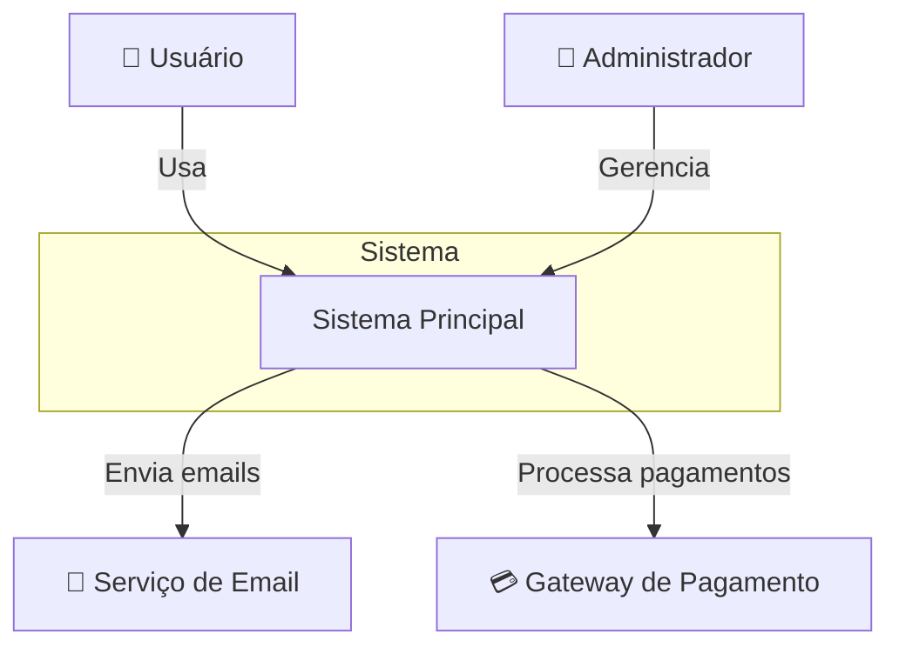
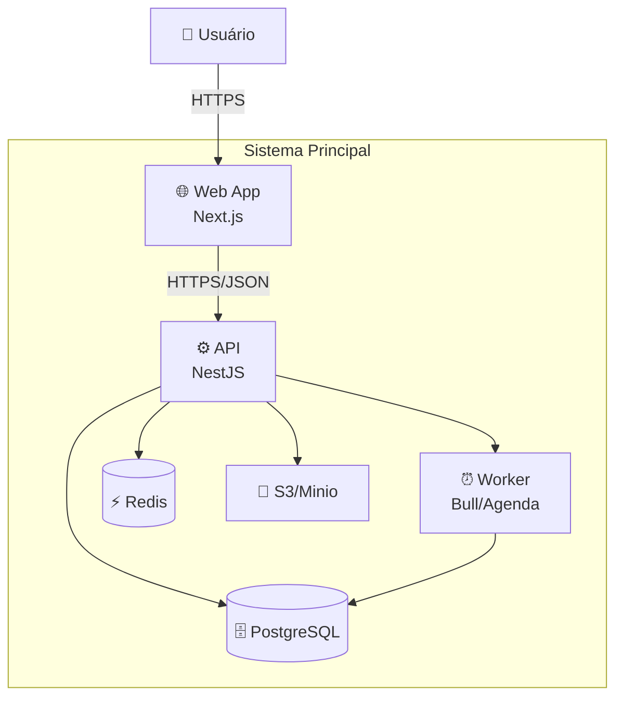
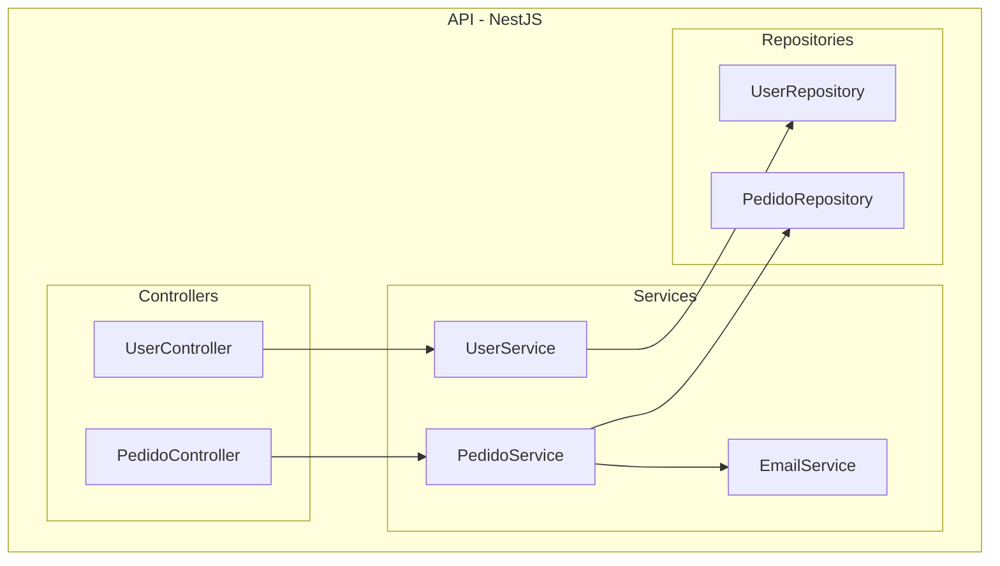

# Arquitetura: [Nome do Sistema]

**Versão:** 1.0  
**Data:** YYYY-MM-DD  
**Arquiteto:** [Nome]  
**Requisitos Relacionados:** [Link]

---

## 1. Visão Geral

### 1.1 Contexto
[Descrição de alto nível do sistema e seu propósito]

### 1.2 Decisões Arquiteturais Chave
| Decisão | Escolha | Justificativa | ADR |
|---|---|---|---|
| Padrão arquitetural | [MVC/Hexagonal/DDD/etc] | [Por quê] | [Link] |
| Banco de dados | [PostgreSQL/MongoDB/etc] | [Por quê] | [Link] |
| Comunicação | [REST/GraphQL/gRPC] | [Por quê] | [Link] |

---

## 2. Diagrama C4

### 2.1 Nível 1: Contexto



**Atores:**
| Ator | Descrição | Interação |
|---|---|---|
| Usuário | Usuário final do sistema | Web/Mobile |
| Administrador | Gerencia configurações | Painel admin |

**Sistemas Externos:**
| Sistema | Descrição | Protocolo |
|---|---|---|
| Serviço de Email | SendGrid/SES | API REST |
| Gateway de Pagamento | Stripe/PagSeguro | API REST + Webhooks |

---

### 2.2 Nível 2: Containers



**Containers:**
| Container | Tecnologia | Responsabilidade | Porta |
|---|---|---|---|
| Web App | Next.js | Interface do usuário | 3000 |
| API | NestJS | Lógica de negócio | 4000 |
| Worker | Bull | Jobs assíncronos | - |
| PostgreSQL | PostgreSQL 15 | Persistência | 5432 |
| Redis | Redis 7 | Cache + Filas | 6379 |

---

### 2.3 Nível 3: Componentes (API)



**Componentes:**
| Componente | Responsabilidade | Dependências |
|---|---|---|
| UserController | Endpoints de usuário | UserService |
| UserService | Lógica de usuário | UserRepository |
| UserRepository | Acesso a dados | Database |

---

## 3. Stack Tecnológica

### 3.1 Backend
| Camada | Tecnologia | Versão | Justificativa |
|---|---|---|---|
| Runtime | Node.js | 20 LTS | Ecosistema, performance |
| Framework | NestJS | 10.x | Estrutura, TypeScript nativo |
| ORM | Prisma | 5.x | Type-safety, migrations |
| Validação | class-validator | - | Decorators, integração NestJS |

### 3.2 Frontend
| Camada | Tecnologia | Versão | Justificativa |
|---|---|---|---|
| Framework | Next.js | 14 | SSR, App Router |
| UI | Tailwind + shadcn/ui | - | Produtividade, customização |
| Estado | Zustand | - | Simplicidade |
| Fetch | TanStack Query | - | Cache, invalidation |

### 3.3 Infraestrutura
| Componente | Tecnologia | Ambiente |
|---|---|---|
| Hospedagem | AWS / Railway | Produção |
| CI/CD | GitHub Actions | - |
| Containers | Docker | Todos |
| Orquestração | Docker Compose / K8s | Dev / Prod |

---

## 4. Padrões e Convenções

### 4.1 Estrutura de Pastas (Backend)
```
src/
├── modules/
│   └── [modulo]/
│       ├── controllers/
│       ├── services/
│       ├── repositories/
│       ├── entities/
│       ├── dtos/
│       └── [modulo].module.ts
├── common/
│   ├── decorators/
│   ├── filters/
│   ├── guards/
│   └── interceptors/
├── config/
└── main.ts
```

### 4.2 Convenções de Código
- **Nomenclatura**: camelCase para variáveis, PascalCase para classes
- **Commits**: Conventional Commits (feat:, fix:, chore:)
- **Branch**: feature/, fix/, hotfix/

---

## 5. Segurança

### 5.1 Autenticação
- **Método**: JWT + Refresh Token
- **Expiração**: Access 15min, Refresh 7 dias
- **Armazenamento**: HttpOnly Cookies

### 5.2 Autorização
- **Modelo**: RBAC (Role-Based Access Control)
- **Roles**: Admin, User, Guest

### 5.3 Proteções
- [ ] Rate limiting
- [ ] CORS configurado
- [ ] Helmet (headers de segurança)
- [ ] Validação de input
- [ ] SQL Injection prevention (ORM)
- [ ] HTTPS obrigatório

---

## 6. Escalabilidade

### 6.1 Pontos de Escala
| Componente | Estratégia | Trigger |
|---|---|---|
| API | Horizontal (réplicas) | CPU > 70% |
| Worker | Horizontal | Queue size > 1000 |
| Database | Read replicas | Queries > X/s |

### 6.2 Caching
| Camada | Tecnologia | TTL | Invalidação |
|---|---|---|---|
| HTTP | CDN | 1h | Deploy |
| API | Redis | 5min | Mutation |
| Query | Redis | 1min | TTL |

---

## 7. Observabilidade

### 7.1 Logging
- **Formato**: JSON estruturado
- **Níveis**: error, warn, info, debug
- **Destino**: CloudWatch / Loki

### 7.2 Métricas
- **Ferramenta**: Prometheus + Grafana
- **Métricas-chave**:
  - Request rate
  - Latência (p50, p95, p99)
  - Error rate
  - CPU/Memory

### 7.3 Tracing
- **Ferramenta**: OpenTelemetry + Jaeger
- **Spans**: HTTP, Database, External calls

### 7.4 Alertas
| Alerta | Condição | Severidade |
|---|---|---|
| API Down | Uptime < 99% em 5min | Critical |
| Latência Alta | p95 > 2s | Warning |
| Erros 5xx | Rate > 1% | Critical |

---

## 8. Disaster Recovery

### 8.1 Backup
| Componente | Frequência | Retenção | Localização |
|---|---|---|---|
| Database | Diário | 30 dias | S3 |
| Files | Contínuo | 90 dias | S3 |

### 8.2 RTO/RPO
- **RTO** (Recovery Time Objective): < 1 hora
- **RPO** (Recovery Point Objective): < 1 hora

---

## 9. ADRs Relacionados

| ID | Título | Status |
|---|---|---|
| ADR-001 | [Escolha do banco de dados](./adr/001-banco-dados.md) | Aceito |
| ADR-002 | [Padrão de autenticação](./adr/002-autenticacao.md) | Aceito |

---

## Changelog

| Versão | Data | Autor | Mudanças |
|---|---|---|---|
| 1.0 | YYYY-MM-DD | [Nome] | Versão inicial |
