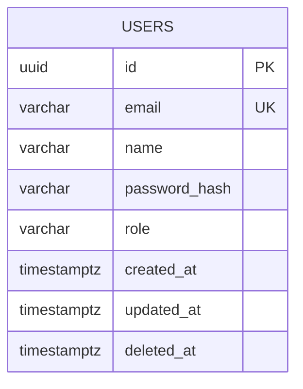

# Design de Banco de Dados

> **Projeto**: [Nome do Projeto]  
> **Versão**: 1.0  
> **Data**: [YYYY-MM-DD]  
> **Autor**: [Nome]

---

## 1. Escolha do Banco de Dados

### 1.1 Banco Selecionado

| Aspecto | Valor |
|---------|-------|
| **Banco** | PostgreSQL 16 |
| **Tipo** | Relacional |
| **Hospedagem** | [Cloud/Self-hosted] |

### 1.2 Justificativa

<!-- Por que este banco foi escolhido? Considere: -->
<!-- - Requisitos de consistência (ACID) -->
<!-- - Padrão de leitura/escrita -->
<!-- - Necessidade de JSON/NoSQL -->
<!-- - Escala esperada -->
<!-- - Expertise do time -->

| Critério | Peso | Score | Justificativa |
|----------|------|-------|---------------|
| Consistência ACID | Alto | ✅ | Transações financeiras requerem atomicidade |
| Performance de leitura | Médio | ✅ | Índices e connection pooling |
| JSON support | Baixo | ✅ | JSONB para dados semi-estruturados |
| Escalabilidade | Médio | ⚠️ | Até 1M registros, suficiente para MVP |

---

## 2. Schema Físico

### 2.1 Convenções Adotadas

| Convenção | Padrão |
|-----------|--------|
| Nomenclatura de tabelas | snake_case, plural |
| Nomenclatura de colunas | snake_case |
| Chave primária | `id` (UUID v7) |
| Timestamps | `created_at`, `updated_at` |
| Soft delete | `deleted_at` (nullable) |
| Foreign keys | `{tabela_singular}_id` |

### 2.2 Tabelas

#### `users`

| Coluna | Tipo | Constraints | Descrição |
|--------|------|-------------|-----------|
| `id` | UUID | PK, DEFAULT uuid_generate_v7() | Identificador único |
| `email` | VARCHAR(255) | NOT NULL, UNIQUE | Email do usuário |
| `name` | VARCHAR(100) | NOT NULL | Nome completo |
| `password_hash` | VARCHAR(255) | NOT NULL | Hash bcrypt da senha |
| `role` | VARCHAR(20) | NOT NULL, DEFAULT 'user' | Papel: user, admin |
| `created_at` | TIMESTAMPTZ | NOT NULL, DEFAULT NOW() | Data de criação |
| `updated_at` | TIMESTAMPTZ | NOT NULL, DEFAULT NOW() | Última atualização |
| `deleted_at` | TIMESTAMPTZ | NULL | Soft delete |

<!-- Adicione mais tabelas conforme necessário -->

### 2.3 DDL Completo

```sql
-- Extensões necessárias
CREATE EXTENSION IF NOT EXISTS "uuid-ossp";
CREATE EXTENSION IF NOT EXISTS "pg_trgm";  -- Para busca textual

-- Tabela: users
CREATE TABLE users (
    id UUID PRIMARY KEY DEFAULT uuid_generate_v7(),
    email VARCHAR(255) NOT NULL,
    name VARCHAR(100) NOT NULL,
    password_hash VARCHAR(255) NOT NULL,
    role VARCHAR(20) NOT NULL DEFAULT 'user',
    created_at TIMESTAMPTZ NOT NULL DEFAULT NOW(),
    updated_at TIMESTAMPTZ NOT NULL DEFAULT NOW(),
    deleted_at TIMESTAMPTZ NULL,
    
    CONSTRAINT users_email_unique UNIQUE (email),
    CONSTRAINT users_role_check CHECK (role IN ('user', 'admin'))
);

-- Índices
CREATE INDEX idx_users_email ON users(email) WHERE deleted_at IS NULL;
CREATE INDEX idx_users_role ON users(role) WHERE deleted_at IS NULL;

-- Trigger para updated_at
CREATE OR REPLACE FUNCTION update_updated_at_column()
RETURNS TRIGGER AS $$
BEGIN
    NEW.updated_at = NOW();
    RETURN NEW;
END;
$$ language 'plpgsql';

CREATE TRIGGER update_users_updated_at
    BEFORE UPDATE ON users
    FOR EACH ROW
    EXECUTE FUNCTION update_updated_at_column();
```

---

## 3. Diagrama ER de Implementação



---

## 4. Índices e Otimização

### 4.1 Índices Planejados

| Tabela | Índice | Tipo | Colunas | Justificativa |
|--------|--------|------|---------|---------------|
| users | idx_users_email | B-tree | email | Login por email |
| users | idx_users_role | B-tree | role | Filtro por papel |

### 4.2 Queries Críticas

```sql
-- Query: Login por email
-- Frequency: Alta
-- Expected time: <5ms
EXPLAIN ANALYZE
SELECT id, email, password_hash, role 
FROM users 
WHERE email = $1 AND deleted_at IS NULL;
```

### 4.3 Particionamento

<!-- Se aplicável -->
| Tabela | Estratégia | Chave | Justificativa |
|--------|------------|-------|---------------|
| - | - | - | Não aplicável para MVP |

---

## 5. Estratégia de Migrações

### 5.1 Ferramenta

| Aspecto | Valor |
|---------|-------|
| **Ferramenta** | Prisma Migrate |
| **Diretório** | `prisma/migrations/` |
| **Ambiente** | Via variável DATABASE_URL |

### 5.2 Convenções

- Migrações são **imutáveis** após merge em main
- Nomenclatura: `YYYYMMDDHHMMSS_descricao_da_mudanca`
- Sempre incluir script de rollback quando possível
- Testar em staging antes de produção

### 5.3 Processo de Deploy


---

## 6. Segurança

### 6.1 Roles de Banco

| Role | Permissões | Uso |
|------|------------|-----|
| `app_user` | SELECT, INSERT, UPDATE, DELETE nas tabelas de app | Conexão da aplicação |
| `app_readonly` | SELECT em todas as tabelas | Relatórios, BI |
| `app_admin` | ALL PRIVILEGES | Migrações, manutenção |

### 6.2 Row-Level Security (RLS)

<!-- Se multi-tenant -->
```sql
-- Habilitar RLS
ALTER TABLE orders ENABLE ROW LEVEL SECURITY;

-- Policy: usuários só veem próprios pedidos
CREATE POLICY orders_isolation ON orders
    FOR ALL
    USING (user_id = current_setting('app.current_user_id')::uuid);
```

### 6.3 Dados Sensíveis

| Tabela | Coluna | Classificação | Proteção |
|--------|--------|---------------|----------|
| users | email | PII | Encryption at rest |
| users | password_hash | Credencial | bcrypt (no app) |

---

## 7. Decisões Técnicas (ADRs)

### ADR-DB-001: UUID v7 como Primary Key

**Status**: Aceito

**Contexto**: Precisamos de IDs únicos, escaláveis e sortáveis.

**Decisão**: Usar UUID v7 (time-ordered) em vez de SERIAL/BIGSERIAL.

**Consequências**:
- ✅ IDs geráveis no app (sem round-trip ao banco)
- ✅ Ordenação temporal natural
- ✅ Merge-friendly para replicação
- ⚠️ 16 bytes vs 8 de BIGSERIAL
- ⚠️ Requer extensão ou função custom

---

### ADR-DB-002: Soft Delete

**Status**: Aceito

**Contexto**: Requisitos de auditoria e recuperação de dados.

**Decisão**: Usar `deleted_at` timestamp em vez de DELETE físico.

**Consequências**:
- ✅ Recuperação de dados deletados
- ✅ Auditoria simplificada
- ⚠️ Todos os queries precisam filtrar `WHERE deleted_at IS NULL`
- ⚠️ Índices parciais necessários

---

## Checklist de Validação

- [ ] Schema físico cobre todas as entidades do modelo de domínio
- [ ] Tipos de dados apropriados para cada campo
- [ ] Índices planejados para queries críticas
- [ ] Estratégia de migrações documentada
- [ ] Roles e permissões definidos
- [ ] Dados sensíveis identificados com proteção
- [ ] Decisões técnicas documentadas como ADRs
