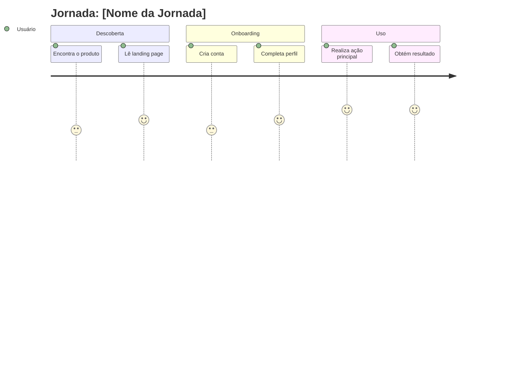
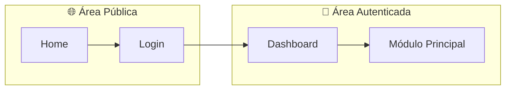
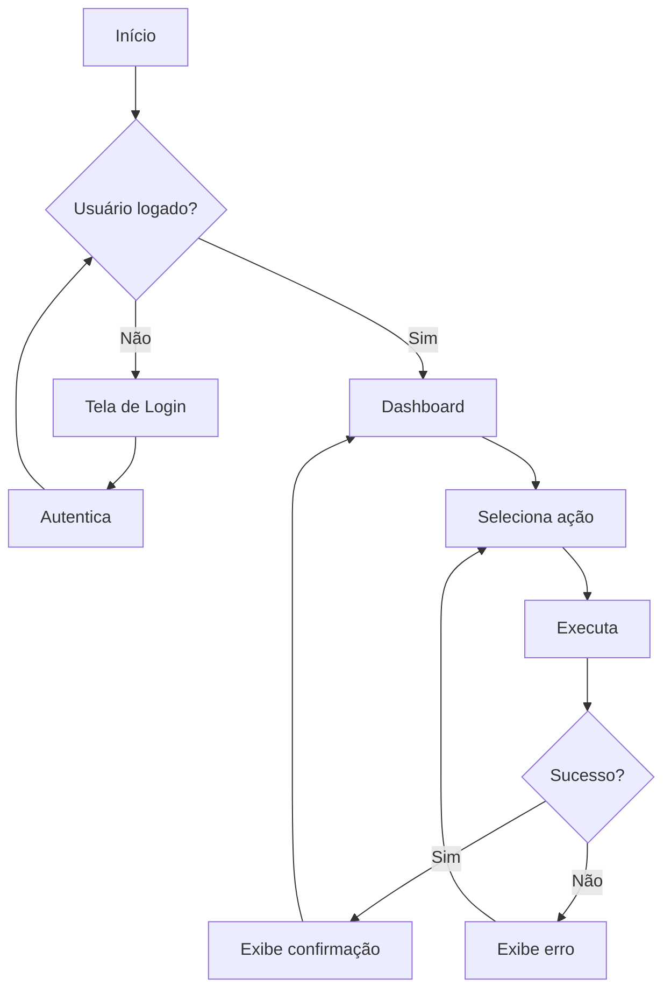

# Design Doc: [Nome do Sistema]

**Versão:** 1.0  
**Data:** YYYY-MM-DD  
**Designer:** [Nome]  
**PRD Relacionado:** [Link]

---

## 1. Visão Geral de UX

### 1.1 Objetivo do Design
[O que este design visa alcançar em termos de experiência do usuário]

### 1.2 Princípios de Design
1. **[Princípio 1]**: [Descrição]
2. **[Princípio 2]**: [Descrição]
3. **[Princípio 3]**: [Descrição]

---

## 2. Personas e Jornadas

### Persona Principal: [Nome]
**Objetivo:** [O que quer alcançar]

#### Jornada do Usuário


---

## 3. Arquitetura de Informação

### 3.1 Mapa do Site
```
├── Home
├── Dashboard
│   ├── Visão Geral
│   └── Relatórios
├── [Módulo 1]
│   ├── Lista
│   ├── Detalhes
│   └── Criar/Editar
├── Configurações
│   ├── Perfil
│   └── Preferências
└── Ajuda
```

### 3.2 Navegação Principal
| Item | Destino | Ícone | Prioridade |
|---|---|---|---|
| Dashboard | /dashboard | 📊 | 1 |
| [Módulo 1] | /modulo1 | 📁 | 2 |
| Configurações | /settings | ⚙️ | 3 |

---

## 5. Mapa de Navegação

### 5.1 Diagrama de Navegação



### 5.2 Inventário de Telas

| ID | Tela | URL | Acesso | RFs |
|----|------|-----|--------|-----|
| T01 | Home | `/` | Público | - |
| T02 | Login | `/login` | Público | RF-001 |
| T03 | Dashboard | `/dashboard` | Auth | RF-002 |

> Para detalhamento completo, veja o [Mapa de Navegação](./mapa-navegacao.md) usando o [template](../06-templates/mapa-navegacao.md).

---

## 6. Fluxos de Usuário

### 4.1 Fluxo: [Nome do Fluxo Principal]



### 4.2 Fluxo: [Outro Fluxo Importante]

[Adicionar diagrama]

---

## 5. Wireframes

### 5.1 Tela: [Nome da Tela]

**Objetivo:** [Para que serve esta tela]

**Elementos:**
- Header com logo e navegação
- [Elemento 1]
- [Elemento 2]
- [Elemento 3]

**Estados:**
- Empty state: [Descrição]
- Loading state: [Descrição]
- Error state: [Descrição]

**Link do wireframe:** [Figma/Whimsical/etc]

### 5.2 Tela: [Outra Tela]

[Repetir estrutura]

---

## 6. Design System / UI

### 6.1 Cores
| Nome | Hex | Uso |
|---|---|---|
| Primary | #XXXXXX | Botões principais, links |
| Secondary | #XXXXXX | Elementos secundários |
| Success | #XXXXXX | Confirmações |
| Error | #XXXXXX | Erros |
| Background | #XXXXXX | Fundo |

### 6.2 Tipografia
| Uso | Fonte | Tamanho | Peso |
|---|---|---|---|
| H1 | [Fonte] | Xpx | Bold |
| H2 | [Fonte] | Xpx | Bold |
| Body | [Fonte] | Xpx | Regular |
| Caption | [Fonte] | Xpx | Regular |

### 6.3 Componentes
- Botões: [Descrição ou link]
- Inputs: [Descrição ou link]
- Cards: [Descrição ou link]
- Modais: [Descrição ou link]

### 6.4 Database Design System (Se aplicável)

> Se este design foi gerado com database `content/design-system/`, preencher:

**Database Usado:** ✅ Sim / ❌ Não

**Database Query:** `[keywords usados para busca]`  
**Exemplo:** `saas productivity modern clean`

**Pattern Recomendado:** [Product-Centric / Hero-Centric / Service-Centric / ...]

**Style Visual:** [Minimalism / Modern Professional / Glassmorphism / ...]

**Referências no Database:**
- Paleta de Cores: `colors.csv` linha [#]
- Par de Fontes: `typography.csv` linha [STT]
- Estilo UI: `styles.csv` linha [STT]

**Ajustes Manuais:**
- [Listar ajustes feitos em relação à sugestão original do database]
- Exemplo: "Mudei CTA de #F97316 para #EA580C (tom mais escuro)"
- Exemplo: "Purple Ban: substituí #7C3AED por #3B82F6"

---

## 7. Acessibilidade

### 7.1 Requisitos WCAG AA
- [ ] Contraste mínimo 4.5:1 para texto
- [ ] Navegação por teclado funcional
- [ ] Labels em todos os inputs
- [ ] Alt text em imagens
- [ ] Hierarquia de headings correta

### 7.2 Tecnologias Assistivas
- Testado com: [NVDA, VoiceOver, etc]

---

## 8. Responsividade

### Breakpoints
| Dispositivo | Largura | Adaptações |
|---|---|---|
| Mobile | < 768px | [Mudanças] |
| Tablet | 768-1024px | [Mudanças] |
| Desktop | > 1024px | Layout completo |

---

## 9. Protótipo

**Link do protótipo interativo:** [URL Figma/Prototype]

---

## Changelog

| Versão | Data | Autor | Mudanças |
|---|---|---|---|
| 1.0 | YYYY-MM-DD | [Nome] | Versão inicial |
