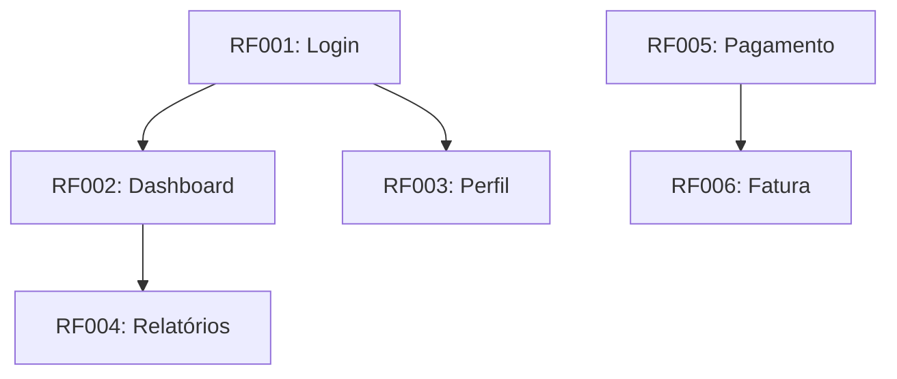

# Matriz de Rastreabilidade: [Nome do Sistema]

**Versão:** 1.0  
**Data:** YYYY-MM-DD  
**Responsável:** [Nome]

---

## Objetivo

Garantir que todos os requisitos estejam cobertos por histórias de usuário e casos de teste, permitindo rastreabilidade completa do requisito até a validação.

---

## Matriz: Requisitos → User Stories → Testes

| ID Requisito | Descrição Resumida | User Stories | Casos de Teste | Status |
|---|---|---|---|---|
| **RF001** | [Descrição curta] | US001, US002 | TC001, TC002, TC003 | ✅ Coberto |
| **RF002** | [Descrição curta] | US003 | TC004, TC005 | ✅ Coberto |
| **RF003** | [Descrição curta] | - | - | ❌ Não coberto |
| **RF004** | [Descrição curta] | US004 | TC006 | 🔄 Em andamento |
| **RNF001** | [Performance] | - | TC-PERF-001 | ⏳ Pendente |
| **RNF002** | [Segurança] | - | TC-SEC-001 | ⏳ Pendente |

---

## Cobertura por Requisito

### Requisitos Funcionais

| Status | Quantidade | % |
|---|---|---|
| ✅ Coberto (US + TC) | X | X% |
| 🔄 Parcial (só US ou só TC) | X | X% |
| ❌ Não coberto | X | X% |
| **Total** | X | 100% |

### Requisitos Não-Funcionais

| Status | Quantidade | % |
|---|---|---|
| ✅ Coberto | X | X% |
| ⏳ Pendente | X | X% |
| **Total** | X | 100% |

---

## Matriz: User Stories → Código → Testes

| US ID | Módulo/Arquivo | Testes Unitários | Testes Integração | Cobertura |
|---|---|---|---|---|
| US001 | `src/modules/user/` | user.service.spec.ts | user.e2e.spec.ts | 85% |
| US002 | `src/modules/order/` | order.service.spec.ts | order.e2e.spec.ts | 78% |
| US003 | `src/modules/payment/` | - | - | 0% |

---

## Gaps Identificados

### Requisitos sem Cobertura

| ID | Descrição | Ação | Responsável | Prazo |
|---|---|---|---|---|
| RF003 | [Descrição] | Criar US e TC | [Nome] | [Data] |
| RNF001 | [Performance] | Criar teste de carga | [Nome] | [Data] |

### User Stories sem Testes

| ID | Descrição | Ação | Responsável | Prazo |
|---|---|---|---|---|
| US003 | [Descrição] | Criar testes | [Nome] | [Data] |

---

## Dependências entre Requisitos

---

## Histórico de Mudanças em Requisitos

| ID | Data | Mudança | Impacto em US | Impacto em TC |
|---|---|---|---|---|
| RF001 | YYYY-MM-DD | [Descrição da mudança] | US001 atualizada | TC001, TC002 revisados |
| RF004 | YYYY-MM-DD | [Novo requisito adicionado] | US005 criada | TC007 criado |

---

## Checklist de Rastreabilidade

- [ ] Todo RF tem pelo menos 1 US associada
- [ ] Toda US tem critérios de aceite em Gherkin
- [ ] Todo critério de aceite tem TC correspondente
- [ ] Todos os TCs estão implementados e passando
- [ ] RNFs têm testes específicos (performance, segurança)
- [ ] Matriz atualizada após cada sprint

---

## Exportação / Links

- Requisitos: [Link para requisitos.md]
- Backlog: [Link para backlog.md]
- Plano de Testes: [Link para plano-testes.md]
- Board (Jira/Linear): [Link]

---

## Changelog

| Versão | Data | Autor | Mudanças |
|---|---|---|---|
| 1.0 | YYYY-MM-DD | [Nome] | Versão inicial |
