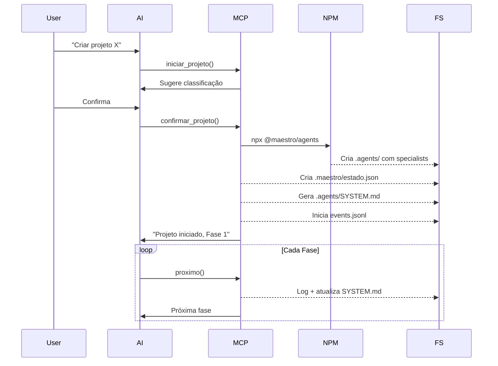

# Próximo Passo: Integração npm + MCP Maestro

> **Status**: Planejado | **Prioridade**: Alta  
> **Objetivo**: Criar pacote npm que carrega arquivos para projetos e MCP executa automaticamente

---

## Arquitetura Definida

```
┌─────────────────────────────────────────────────────────────────┐
│ MCP Maestro (orquestra tudo)                                    │
│                                                                 │
│  confirmar_projeto() ──► executa npx ──► cria .agents/         │
│         │                                                       │
│         ├──► gera SYSTEM.md (contexto para IA)                 │
│         └──► inicia events.jsonl (rastreabilidade)             │
│                                                                 │
│  tools (proximo, validar_gate, etc) ──► append em history      │
└─────────────────────────────────────────────────────────────────┘
                          │
                          ▼
┌─────────────────────────────────────────────────────────────────┐
│ Projeto                                                         │
│                                                                 │
│  .agents/               │  .maestro/          │  docs/         │
│  ├─ specialists/        │  ├─ estado.json     │  ├─ PRD.md     │
│  ├─ templates/          │  └─ resumo.md       │  └─ ...        │
│  ├─ workflows/          │                     │                │
│  ├─ SYSTEM.md (auto)    │                     │                │
│  └─ history/            │                     │                │
│     └─ events.jsonl     │                     │                │
└─────────────────────────────────────────────────────────────────┘
```

---

## Checklist de Implementação

### Parte 1: Pacote npm (`@maestro/agents`)

- [ ] Criar pasta `packages/agents/`
- [ ] Criar `package.json` com bin entry
- [ ] Copiar `content/` (specialists, templates, workflows)
- [ ] Criar CLI simples que copia para `.agents/`
- [ ] Publicar no npm (ou usar `npm link` para teste)

### Parte 2: Modificações no MCP

- [ ] Criar `src/utils/history.ts` (logging de eventos)
- [ ] Criar `src/utils/system-md.ts` (gerador de contexto)
- [ ] Modificar `confirmar_projeto.ts`:
  - Executar `npx @maestro/agents`
  - Logar evento inicial
  - Gerar SYSTEM.md
- [ ] Modificar `proximo.ts`:
  - Logar transição de fase
  - Atualizar SYSTEM.md
- [ ] Modificar `validar-gate.ts`:
  - Logar validação de gate

---

## Arquivos a Criar

### `packages/agents/package.json`
```json
{
  "name": "@maestro/agents",
  "version": "0.1.0",
  "bin": { "maestro-agents": "./dist/cli.js" },
  "files": ["dist", "content"]
}
```

### `packages/agents/src/cli.ts`
```typescript
#!/usr/bin/env node
import { copySync } from 'fs-extra';
import { join } from 'path';

const targetDir = process.argv[2] || process.cwd();
const contentDir = join(__dirname, '..', 'content');
const agentsDir = join(targetDir, '.agents');

copySync(contentDir, agentsDir);
console.log(`✅ .agents/ criado em ${targetDir}`);
```

### `src/utils/history.ts`
```typescript
import { appendFile, mkdir } from 'fs/promises';
import { join } from 'path';

export interface HistoryEvent {
  id?: string;
  ts?: string;
  type: string;
  fase: number;
  actor?: 'user' | 'mcp' | 'ai';
  data: Record<string, unknown>;
}

export async function logEvent(diretorio: string, event: HistoryEvent): Promise<void> {
  const historyPath = join(diretorio, '.agents', 'history');
  await mkdir(historyPath, { recursive: true });
  
  const fullEvent = {
    id: `evt_${Date.now()}`,
    ts: new Date().toISOString(),
    actor: 'mcp',
    ...event
  };
  
  await appendFile(
    join(historyPath, 'events.jsonl'),
    JSON.stringify(fullEvent) + '\n'
  );
}
```

### `src/utils/system-md.ts`
```typescript
import { writeFile, mkdir } from 'fs/promises';
import { join } from 'path';
import type { EstadoProjeto } from '../types/index.js';

export async function gerarSystemMd(
  diretorio: string, 
  estado: EstadoProjeto,
  faseNome?: string,
  especialista?: string,
  checklist?: string[]
): Promise<void> {
  await mkdir(join(diretorio, '.agents'), { recursive: true });
  
  const content = `# Sistema: ${estado.nome}

## Estado Atual
- **Fase**: ${estado.fase_atual}/${estado.total_fases} - ${faseNome || 'Iniciando'}
- **Tipo**: ${estado.tipo_artefato}
- **Tier**: ${estado.tier_gate}
- **Atualizado**: ${new Date().toISOString()}

## Especialista Ativo
→ ${especialista || 'Nenhum definido'}

## O que fazer agora
${checklist?.map((item, i) => `${i + 1}. ${item}`).join('\n') || '- Aguardando configuração'}

## Artefatos Gerados
${Object.entries(estado.entregaveis).map(([k, v]) => `- ${k}: ${v}`).join('\n') || '- Nenhum ainda'}

## Gates Validados
${estado.gates_validados.length > 0 ? estado.gates_validados.map(g => `- ✅ Gate ${g}`).join('\n') : '- Nenhum ainda'}
`;

  await writeFile(join(diretorio, '.agents', 'SYSTEM.md'), content);
}
```

---

## Modificação em `iniciar-projeto.ts`

```diff
+ import { execSync } from 'child_process';
+ import { logEvent } from '../utils/history.js';
+ import { gerarSystemMd } from '../utils/system-md.js';

export async function confirmarProjeto(args: ConfirmarProjetoArgs): Promise<ToolResult> {
    // ... código existente até criar estado ...

+   // Executar npx para criar .agents/
+   try {
+     execSync(`npx @maestro/agents ${diretorio}`, { stdio: 'inherit' });
+   } catch {
+     console.warn('⚠️ Pacote @maestro/agents não encontrado');
+   }

+   // Iniciar histórico
+   await logEvent(diretorio, {
+     type: 'project_init',
+     fase: 0,
+     data: { nome: args.nome, tipo: args.tipo_artefato, nivel: args.nivel_complexidade }
+   });

+   // Gerar SYSTEM.md inicial
+   await gerarSystemMd(diretorio, estado, 'Produto', 'Gestão de Produto', [
+     'Definir visão do produto',
+     'Identificar personas',
+     'Criar PRD'
+   ]);
    
    // ... resto do código ...
}
```

---

## Workflow Esperado



---

## Resultado Esperado

Após executar `confirmar_projeto()`, o projeto terá:

```
projeto/
├── .agents/
│   ├── specialists/          # 21 especialistas
│   ├── templates/            # 21 templates  
│   ├── workflows/            # Slash commands
│   ├── SYSTEM.md             # Contexto para IA
│   └── history/
│       └── events.jsonl      # Rastreabilidade
├── .maestro/
│   ├── estado.json           # Máquina de estados
│   └── resumo.md             # Resumo humano
└── docs/
    └── ...                   # Artefatos do projeto
```
