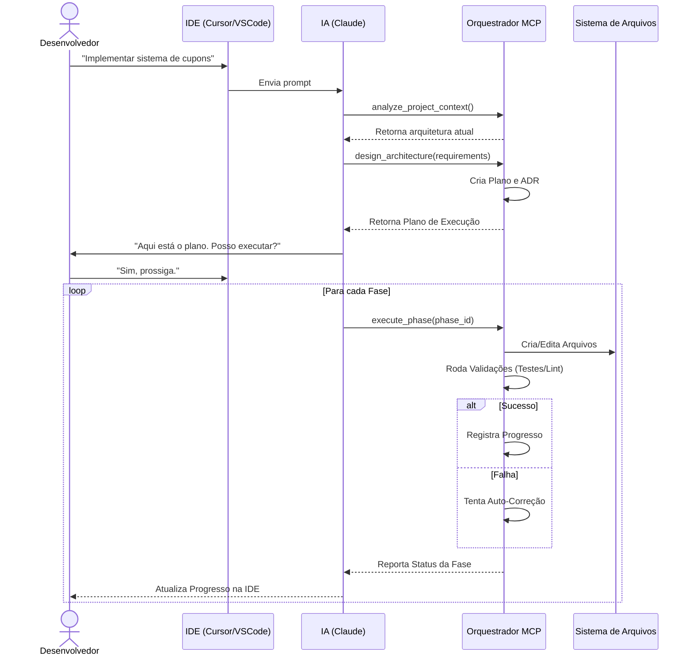

# 🔄 05. Fluxos de Trabalho e Decisão

Este documento detalha como o Orquestrador MCP interage com o usuário e toma decisões autônomas.

## O Fluxo de Interação (The Loop)

A interação não é linear; é um ciclo contínuo de feedback.

## O Motor de Decisão (Decision Engine)

O coração da autonomia do sistema é sua capacidade de decidir *quando* agir sozinho e *quando* pedir ajuda.

### Matriz de Decisão

O orquestrador avalia cada erro ou decisão baseado em três fatores:
1.  **Severidade:** Crítico (para tudo) vs Menor (apenas aviso).
2.  **Confiança:** Tenho certeza da correção? (Baseado em histórico).
3.  **Risco:** Se eu errar, destruo dados?

| Situação | Ação do Sistema | Exemplo |
| :--- | :--- | :--- |
| **Erro de Sintaxe** | 🟢 Auto-Correção | Esquecer um `;` ou import. |
| **Teste Falhando (Lógica)** | 🟡 Auto-Correção (1 tentativa) | Ajustar `if` invertido. |
| **Mudança de Arquitetura** | 🔴 Pedir Confirmação Human | Criar novo microserviço. |
| **Deletar Dados/Arquivos** | 🔴 Pedir Confirmação Human | `DROP TABLE` ou `rm -rf`. |
| **Ambiguidade de Negócio** | 🔴 Pedir Clarificação | "O desconto é % ou fixo?" |

## Interação com a IDE

O MCP utiliza recursos nativos da IDE para feedback não-intrusivo.

### Decorators
O servidor informa à IDE quais arquivos estão sendo trabalhados.
- **Visual:** Ícone de ⚙️ girando ao lado do arquivo no explorador.
- **Visual:** Ícone de ✅ verde quando os testes passam naquele arquivo.

### Notificações
Quando uma decisão humana é necessária, o orquestrador não "trava" silenciosamente. Ele envia um toast/notificação:
> 🔔 **Atenção:** Detectei uma inconsistência nas migrações. Preciso da sua aprovação para recriar o esquema do banco. [Ver Detalhes]

## Rollback Inteligente

O sistema mantém **Checkpoints** antes de cada fase crítica.

- **Cenário:** A implementação da Fase 3 quebrou o build.
- **Ação:** O orquestrador detecta a falha irrecuperável.
- **Resolução:** "Falha crítica na Fase 3. Revertendo para o estado do Checkpoint 'Fim da Fase 2'. Nenhum arquivo corrompido permaneceu."
