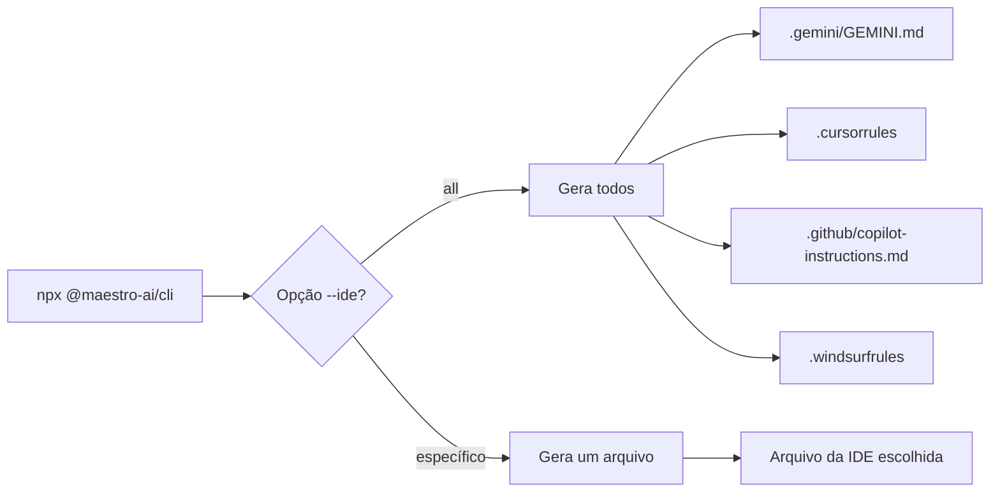

# @maestro-ai/cli

CLI para inicializar projetos com Maestro - Desenvolvimento assistido por IA.

## 🚀 Uso Rápido

```bash
npx @maestro-ai/cli
```

Só isso! O comando injeta automaticamente todos os arquivos na pasta atual.

---

## ⚙️ Opções

| Opção | Descrição |
|-------|-----------|
| `--force` | Sobrescreve arquivos existentes |
| `--minimal` | Instala apenas workflows + rules |
| `--ide <ide>` | IDE alvo: `gemini`, `cursor`, `copilot`, `windsurf`, `all` (default: `all`) |

### Exemplos

```bash
# Instalação completa (todas as IDEs)
npx @maestro-ai/cli

# Apenas para Gemini/Antigravity
npx @maestro-ai/cli --ide gemini

# Apenas para Cursor
npx @maestro-ai/cli --ide cursor

# Apenas para GitHub Copilot
npx @maestro-ai/cli --ide copilot

# Apenas para Windsurf
npx @maestro-ai/cli --ide windsurf

# Sobrescrever arquivos existentes
npx @maestro-ai/cli --force

# Instalação mínima
npx @maestro-ai/cli --minimal
```

---

## 📁 Estrutura Criada

```
projeto/
├── .maestro/
│   ├── config.json          # Configuração do projeto
│   ├── history/             # Histórico de conversas
│   └── content/             # Especialistas, templates, guides, prompts
├── .agent/
│   ├── skills/              # Skills para a IA
│   └── workflows/           # Workflows automatizados
└── [Arquivos de regras por IDE]
```

### Arquivos de Regras por IDE

| IDE | Arquivo Gerado |
|-----|----------------|
| Gemini/Antigravity | `.gemini/GEMINI.md` |
| Cursor | `.cursorrules` |
| GitHub Copilot | `.github/copilot-instructions.md` |
| Windsurf | `.windsurfrules` |

---

## 🔄 Fluxo Esperado



1. **Execute o CLI** no diretório do seu projeto
2. **Escolha a IDE** (ou deixe `all` para suportar todas)
3. **Configure o MCP** na sua IDE
4. **Inicie um projeto Maestro** com `iniciar_projeto`

---

## 📋 Comandos

### `init` (padrão)

```bash
npx @maestro-ai/cli init
npx @maestro-ai/cli init --ide cursor
npx @maestro-ai/cli init --force
```

### `update`

Atualiza content para a última versão:

```bash
npx @maestro-ai/cli update
npx @maestro-ai/cli update --force  # Sobrescreve arquivos modificados
```

---

## ⚡ Após Inicialização

Configure o MCP na sua IDE:

```json
{
  "mcpServers": {
    "maestro": {
      "serverUrl": "https://maestro.deluna.dev.br/mcp"
    }
  }
}
```

Depois inicie um projeto:

```
@mcp:maestro iniciar_projeto
```

---

## 🛠️ Desenvolvimento

```bash
cd packages/cli
npm install
npm run build
npm run dev -- init --ide gemini  # Testar localmente
```

---

## 📦 Publicação

```bash
npm version patch  # ou minor/major
npm publish
```

---

## 📄 Licença

MIT
