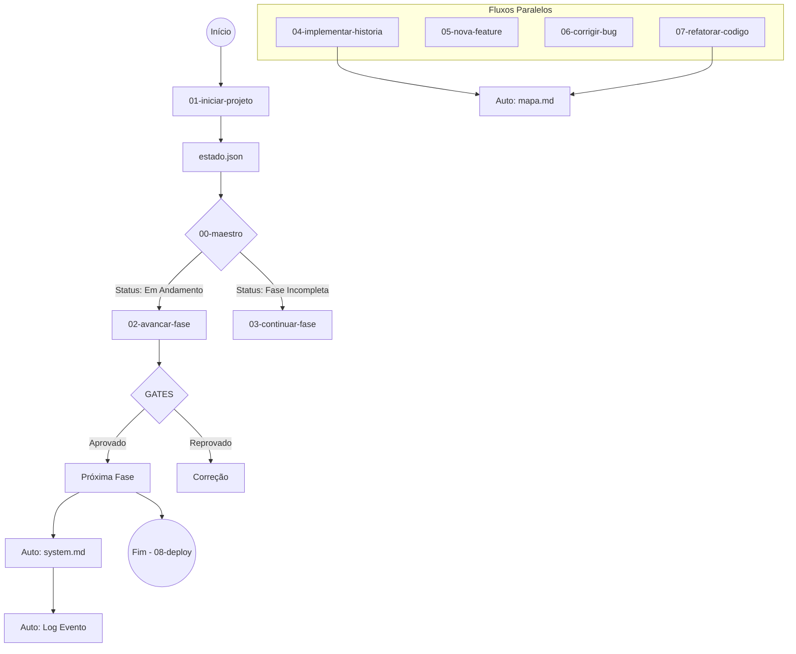

# 🗺️ Mapa do Sistema Maestro FS

> Este documento detalha a arquitetura final e como os workflows interagem com as regras e guias.

---

## 🔄 Visão Geral do Fluxo

---

## 📂 Arquitetura do Knowledge Base

### 1. Workflows (Ação) - `content/workflows/`

Comandos sequenciais que a IA executa para transformar o projeto.

| Comando | Objetivo | Automações Inclusas |
| :--- | :--- | :--- |
| **`/00-maestro`** | Router Inteligente (Status) | Leitura de Estado |
| **`/01-iniciar-projeto`** | Setup Inicial | `guide-brainstorm.md` (Opcional) |
| **`/02-avancar-fase`** | Transição de Fase | `automated-system`, `automated-events`, `automated-stitch` |
| **`/03-continuar-fase`** | Retomada de Trabalho | - |
| **`/04-implementar-historia`** | Código Frontend-First | `automated-map`, `automated-events`, `guide-testes` |
| **`/05-nova-feature`** | Grandes Funcionalidades | `guide-orquestracao` (Opcional) |
| **`/06-corrigir-bug`** | Fix Crítico | `guide-orquestracao` (Opcional) |
| **`/07-refatorar-codigo`** | Melhoria Técnica | `automated-map` |
| **`/08-deploy-projeto`** | Produção | Checklist de Release |

### 2. Automações Internas (Invisíveis) - `content/guides/internal/`

Scripts "mentais" que os workflows chamam obrigatoriamente.

*   `automated-map.md`: Escaneia `src/` e atualiza `.maestro/mapa.md`.
*   `automated-system.md`: Atualiza `.maestro/SYSTEM.md` (Memória de Curto Prazo).
*   `automated-events.md`: Registra logs em `.maestro/history/events.jsonl`.
*   `automated-stitch.md`: Injeta fase de prototipagem se necessário.

### 3. Guias de Referência (Consulta) - `content/guides/`

 manuais que a IA consulta sob demanda ou quando instruída.

*   `guide-brainstorm.md`: Ideação de escopo.
*   `guide-orquestracao.md`: Como operar em modo Squad (Planner/Dev/Reviewer).
*   `guide-testes.md`: Estratégia de testes por camada.
*   `guide-validacao.md`: Como validar um gate manualmente.
*   `guide-troubleshooting.md`: Como resolver bloqueios e erros de estado.

---

## 🧠 Ciclo de Vida do Estado

1.  **Início (`01`)**: Cria `estado.json` (Fonte da Verdade).
2.  **Durante (`04-07`)**: Atualiza `mapa.md` e `events.jsonl`.
3.  **Transição (`02`)**: Atualiza `SYSTEM.md` e `resumo.json`.
4.  **Fim (`08`)**: Consolida a versão.

O sistema é **autônomo** (sabe o que rodar) e **resiliente** (se perder contexto, lê `SYSTEM.md` ou roda `/00-maestro`).
