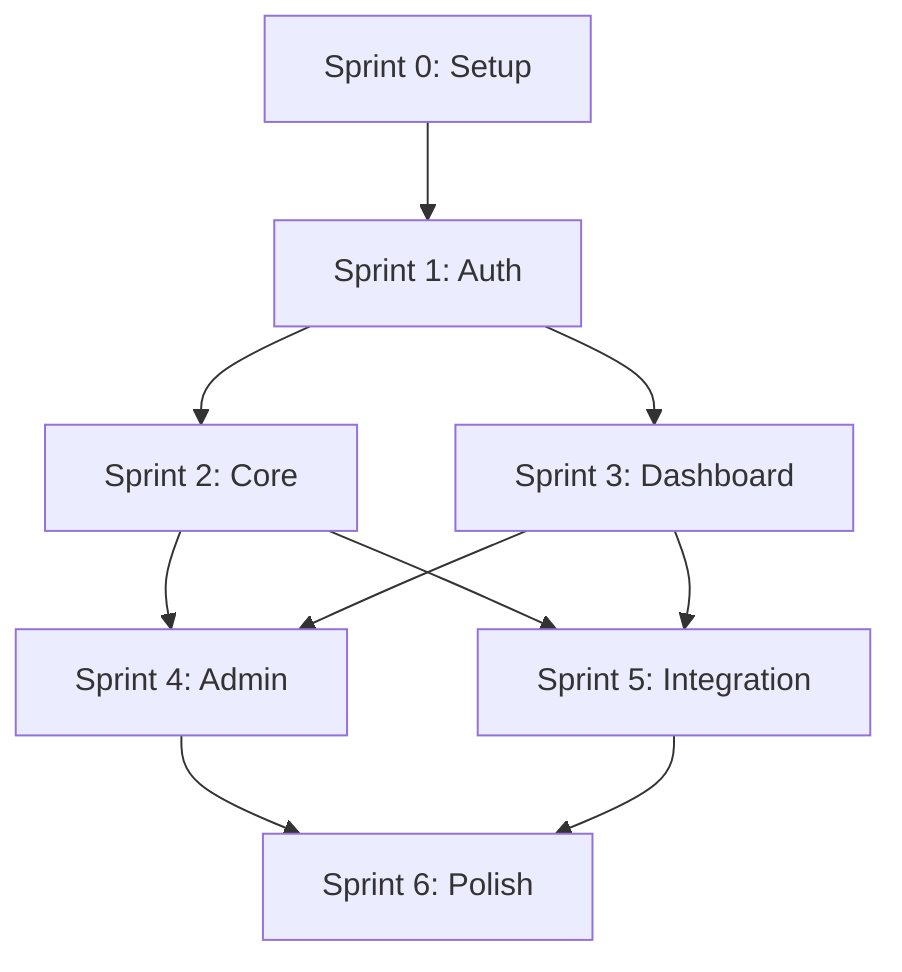

# Prompt: Backlog de Execução

> **Quando usar:** Criar backlog detalhado para implementação  
> **Especialista:** Plano de Execução com IA  
> **Nível:** Médio  
> **Pré-requisitos:** Todos os artefatos das fases 1-8 completos

---

## Fluxo de Contexto
**Inputs:** PRD.md, requisitos.md, design-doc.md, modelo-dominio.md, arquitetura.md, checklist-seguranca.md, plano-testes.md  
**Outputs:** backlog.md, histórias detalhadas, roadmap  
**Especialista anterior:** Análise de Testes  
**Especialista seguinte:** Contrato de API

---

## Prompt Completo

Atue como um **Project Manager Técnico** especializado em criar backlogs executáveis e planejar sprints para desenvolvimento de software.

## Contexto do Projeto
[COLE CONTEÚDO DE docs/CONTEXTO.md]

[COLE CONTEÚDO DE docs/01-produto/PRD.md]

[COLE CONTEÚDO DE docs/02-requisitos/requisitos.md]

[COLE CONTEÚDO DE docs/03-ux/design-doc.md]

[COLE CONTEÚDO DE docs/04-modelo/modelo-dominio.md]

[COLE CONTEÚDO DE docs/06-arquitetura/arquitetura.md]

[COLE CONTEÚDO DE docs/07-testes/plano-testes.md]

## Sua Missão
Criar um **backlog de execução completo** que transforme todos os artefatos de design em histórias de usuário implementáveis, organizadas por prioridade e dependências técnicas.

### Estrutura Obrigatória do Backlog

#### 1. Visão Geral do Backlog
- **Resumo Executivo:** [Objetivo principal do backlog]
- **MVP Scope:** [O que será entregue no MVP]
- **Timeline Estimada:** [Duração total em sprints]
- **Team Capacity:** [Capacidade da equipe]
- **Risk Assessment:** [Principais riscos]

#### 2. Épicos Principais
- **Epic 1:** [Nome claro e objetivo]
- **Epic 2:** [Nome claro e objetivo]
- **Epic 3:** [Nome claro e objetivo]
- **Epic 4:** [Nome claro e objetivo]
- **Epic 5:** [Nome claro e objetivo]

#### 3. Histórias de Usuário Detalhadas
Para cada história incluir:
- **ID:** US001, US002, etc.
- **Formato:** "Como [persona], quero [ação], para [benefício]"
- **Prioridade:** Must/Should/Could/Won't (MoSCoW)
- **Story Points:** Estimativa de complexidade
- **Sprint:** Sprint planejado
- **Dependencies:** Dependências técnicas
- **Acceptance Criteria:** Critérios claros
- **Definition of Done:** Quando está "pronta"

#### 4. Separação Frontend/Backend
- **Frontend Stories:** Histórias específicas de UI
- **Backend Stories:** Histórias de API e lógica
- **Integration Stories:** Histórias de integração
- **Infrastructure Stories:** Histórias de DevOps

#### 5. Roadmap e Sprints
- **Sprint 0:** Setup e configuração
- **Sprint 1-2:** Core features
- **Sprint 3-4:** Features secundárias
- **Sprint 5-6:** Polimento e testes
- **Sprint 7:** Deploy e go-live

### Épicos Obrigatórios

#### Epic 1: Autenticação e Gestão de Usuários
**Objetivo:** Sistema completo de cadastro, login e perfil

**Histórias:**
- US001: Cadastro de novo usuário
- US002: Login com email/senha
- US003: Recuperação de senha
- US004: Edição de perfil
- US005: Logout e sessão

#### Epic 2: Core Business Logic
**Objetivo:** Funcionalidades principais do negócio

**Histórias:**
- US006: [Funcionalidade principal 1]
- US007: [Funcionalidade principal 2]
- US008: [Funcionalidade principal 3]
- US009: [Funcionalidade principal 4]

#### Epic 3: Dashboard e Relatórios
**Objetivo:** Visualização de dados e analytics

**Histórias:**
- US010: Dashboard principal
- US011: Relatório de atividades
- US012: Exportação de dados
- US013: Filtros avançados

#### Epic 4: Administração e Configuração
**Objetivo:** Painel administrativo

**Histórias:**
- US014: Painel admin
- US015: Gestão de usuários
- US016: Configurações do sistema
- US017: Logs e auditoria

#### Epic 5: Integrações e APIs
**Objetivo:** Conexão com sistemas externos

**Histórias:**
- US018: Integração com [sistema 1]
- US019: Webhooks e notificações
- US020: API pública
- US021: Documentação da API

### Template de História Padrão

#### Estrutura Completa
```markdown
## US[XXX]: [Título da História]

**Como** [persona], **quero** [ação], **para** [benefício].

### Prioridade
- **Business Value:** [Alto/Médio/Baixo]
- **Urgency:** [Alta/Média/Baixa]
- **MoSCoW:** [Must/Should/Could/Won't]

### Estimativa
- **Story Points:** [1-13]
- **Complexity:** [Baixa/Média/Alta]
- **Effort:** [horas estimadas]

### Critérios de Aceite
- [ ] **CA1:** [Critério mensurável 1]
- [ ] **CA2:** [Critério mensurável 2]
- [ ] **CA3:** [Critério mensurável 3]
- [ ] **CA4:** [Critério mensurável 4]

### Definition of Done
- [ ] Código desenvolvido e reviewado
- [ ] Testes unitários escritos
- [ ] Testes de integração passando
- [ ] Documentação atualizada
- [ ] Deploy em staging funcionando
- [ ] Aceite do Product Owner

### Dependências
- **Técnicas:** [Dependências de outras histórias]
- **Blockers:** [O que bloqueia esta história]
- **Riscos:** [Riscos identificados]

### Subtarefas
- [ ] **Task 1:** [Subtarefa específica]
- [ ] **Task 2:** [Subtarefa específica]
- [ ] **Task 3:** [Subtarefa específica]

### Notas Técnicas
- **Frontend:** [Requisitos de UI]
- **Backend:** [Requisitos de API]
- **Database:** [Mudanças no schema]
- **Testing:** [Casos de teste específicos]
```

### Exemplos de Histórias Detalhadas

#### Exemplo 1: Frontend
```markdown
## US001: Cadastro de Novo Usuário

**Como** visitante, **quero** criar uma conta, **para** acessar funcionalidades exclusivas.

### Prioridade
- **Business Value:** Alto
- **Urgency:** Alta
- **MoSCoW:** Must

### Estimativa
- **Story Points:** 5
- **Complexity:** Média
- **Effort:** 16 horas

### Critérios de Aceite
- [ ] Formulário de cadastro com campos obrigatórios
- [ ] Validação em tempo real dos campos
- [ ] Feedback visual de sucesso/erro
- [ ] Redirecionamento para dashboard após cadastro
- [ ] Email de confirmação enviado

### Definition of Done
- [ ] Componente de formulário criado
- [ ] Validações implementadas
- [ ] Integração com API de cadastro
- [ ] Testes unitários e E2E
- [ ] Design system aplicado
- [ ] Acessibilidade WCAG AA

### Dependências
- **Técnicas:** API de usuários (US025)
- **Blockers:** Nenhum
- **Riscos:** Validação de email

### Subtarefas
- [ ] Criar componente de formulário
- [ ] Implementar validações
- [ ] Conectar com API
- [ ] Adicionar feedback visual
- [ ] Escrever testes

### Notas Técnicas
- **Frontend:** React Hook Form, Zod validation
- **Backend:** POST /api/users
- **Database:** Insert na tabela users
- **Testing:** Jest + Playwright
```

#### Exemplo 2: Backend
```markdown
## US025: API de Cadastro de Usuários

**Como** sistema, **quero** uma API para criar usuários, **para** persistir dados de cadastro.

### Prioridade
- **Business Value:** Alto
- **Urgency:** Alta
- **MoSCoW:** Must

### Estimativa
- **Story Points:** 3
- **Complexity:** Baixa
- **Effort:** 8 horas

### Critérios de Aceite
- [ ] Endpoint POST /api/users criado
- [ ] Validação de dados de entrada
- [ ] Hash de senha seguro
- [ ] Tratamento de erros adequado
- [ ] Log de auditoria gerado

### Definition of Done
- [ ] Controller implementado
- [ ] Service layer criada
- [ ] Repository pattern aplicado
- [ ] Testes unitários
- [ ] Documentação OpenAPI
- [ ] Performance testado

### Dependências
- **Técnicas:** Database schema (US030)
- **Blockers:** Nenhum
- **Riscos:** Performance com muitos usuários

### Subtarefas
- [ ] Criar controller
- [ ] Implementar service
- [ ] Adicionar repository
- [ ] Escrever testes
- [ ] Documentar API

### Notas Técnicas
- **Backend:** Express.js, Prisma
- **Database:** Insert users table
- **Security:** bcrypt, rate limiting
- **Testing:** Jest, Supertest
```

### Planejamento de Sprints

#### Sprint 0: Setup (1 semana)
**Objetivo:** Configurar ambiente e infraestrutura

**Histórias:**
- US050: Configuração do ambiente de desenvolvimento
- US051: Setup do repositório e CI/CD
- US052: Database design e migrations
- US053: Design system inicial

#### Sprint 1: Autenticação (2 semanas)
**Objetivo:** Implementar sistema de login/cadastro

**Histórias:**
- US001: Cadastro de novo usuário (5 pts)
- US002: Login com email/senha (3 pts)
- US025: API de cadastro (3 pts)
- US026: API de login (3 pts)

**Capacidade:** 14 pontos por sprint

#### Sprint 2: Core Features (2 semanas)
**Objetivo:** Implementar funcionalidades principais

**Histórias:**
- US006: [Funcionalidade principal 1] (8 pts)
- US007: [Funcionalidade principal 2] (5 pts)
- US027: API correspondente (3 pts)

#### Sprint 3: Dashboard (2 semanas)
**Objetivo:** Criar interface principal

**Histórias:**
- US010: Dashboard principal (5 pts)
- US011: Relatório de atividades (3 pts)
- US028: API de dados (5 pts)

### Matriz de Dependências

#### Visualização


#### Tabela de Dependências
| História | Depende de | Bloqueia |
|----------|------------|----------|
| US001 | US025, US050 | US002 |
| US002 | US026, US001 | US006 |
| US006 | US027, US002 | US007 |
| US010 | US028, US002 | US011 |

### Métricas e KPIs

#### Velocity Tracking
- **Sprint 1:** [X] pontos completados
- **Sprint 2:** [Y] pontos completados
- **Média:** [Z] pontos por sprint
- **Tendência:** [Aumentando/Estável/Diminuindo]

#### Quality Metrics
- **Bug Rate:** [X] bugs por sprint
- **Test Coverage:** [Y]% de cobertura
- **Code Review Time:** [Z] horas por PR
- **Deploy Frequency:** [W] deploys por semana

### Risk Management

#### Riscos Identificados
| Risco | Probabilidade | Impacto | Mitigação |
|-------|---------------|---------|-----------|
| Scope creep | Alta | Médio | Change control process |
| Technical debt | Média | Alto | Code review standards |
| Team turnover | Baixa | Alto | Documentation |
| Performance issues | Média | Médio | Performance testing |

#### Contingency Plans
- **Sprint overrun:** Reduzir scope do próximo sprint
- **Technical blocker:** Spike time para pesquisa
- **Resource shortage:** Re-priorizar backlog

## Resposta Esperada

### Estrutura da Resposta
1. **Análise dos artefatos** e identificação de features
2. **Backlog completo** com épicos e histórias
3. **Roadmap detalhado** com sprints
4. **Matriz de dependências** visual
5. **Métricas e KPIs** para acompanhamento
6. **Plano de riscos** e mitigação

### Formato
- **Markdown** com estrutura clara
- **Mermaid diagrams** para visualizações
- **Tabelas** para organização
- **Checklists** para validação
- **Templates** padronizados

## Checklist Pós-Geração

### Validação do Backlog
- [ ] **Épicos claros** e bem definidos
- [ ] **Histórias completas** com todos os campos
- [ ] **Estimativas realistas** baseadas em complexidade
- [ ] **Dependências mapeadas** corretamente
- [ ] **Sprints balanceados** em capacidade

### Qualidade do Conteúdo
- [ ] **Critérios de aceite** mensuráveis
- [ ] **Definition of Done** clara
- [ ] **Separação FE/BE** adequada
- [ ] **Roadmap realista** e alcançável
- [ ] **Riscos identificados** com mitigação

### Implementação
- [ ] **Salvar** em `docs/08-backlog/backlog.md`
- [ ] **Criar** histórias individuais se necessário
- [ ] **Atualizar** `docs/CONTEXTO.md`
- [ ] **Preparar** para próxima fase

---

## Notas Adicionais

### Best Practices
- **INVEST criteria:** Independent, Negotiable, Valuable, Estimable, Small, Testable
- **3 Amigos:** Product Owner, Dev, QA discutem cada história
- **Story mapping:** Visualizar jornada do usuário
- **Velocity planning:** Basear em histórico real

### Armadilhas Comuns
- **Histórias muito grandes:** Quebrar em menores
- **Dependências circulares:** Revisar arquitetura
- **Estimativas otimistas:** Considerar incertezas
- **Scope não definido:** Clarificar critérios

### Ferramentas Recomendadas
- **Jira/Linear:** Para gestão do backlog
- **Miro/Mural:** Para story mapping
- **GitHub Projects:** Para tracking
- **Confluence:** Para documentação
- **Slack:** Para comunicação
