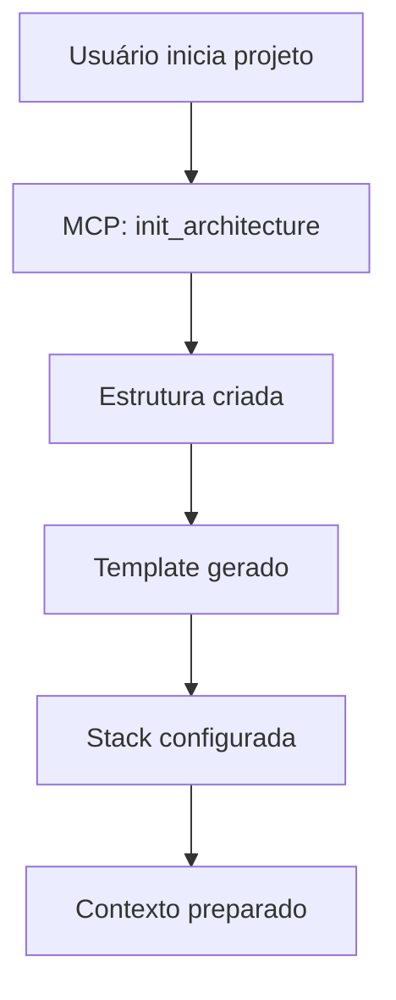
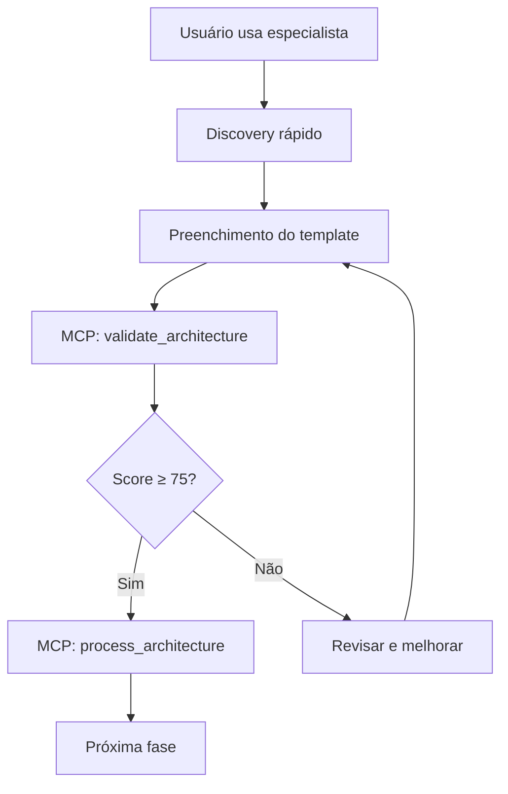
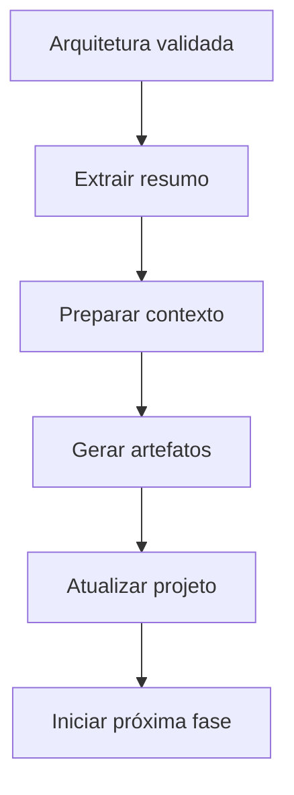

# MCP Integration Guide - Arquitetura de Software

## Visão Geral

Este documento descreve como integrar o especialista de Arquitetura de Software com o servidor MCP, permitindo automação de inicialização, validação e processamento de artefatos arquiteturais.

## 🏗️ Arquitetura MCP

### Separação de Responsabilidades

#### Skills (Puramente Descritivas)
- **Foco**: Conhecimento, processos e informações
- **Execução**: Nenhuma execução de código local
- **Automação**: Externalizada 100% no MCP
- **Benefícios**: Segurança, performance, escalabilidade

#### MCP (Motor de Automação)
- **Foco**: Execução, validação e processamento
- **Funções**: init, validate, process
- **Integração**: Com outros especialistas e sistemas
- **Benefícios**: Centralização, controle, evolução

#### Usuário (Experiência Limpa)
- **Foco**: Tomada de decisões e direção
- **Interface**: Natural language via chat
- **Abstração**: Sem detalhes técnicos de implementação
- **Benefícios**: Simplicidade, produtividade

## 🔧 Funções MCP Disponíveis

### 1. `init_architecture`
**Propósito**: Inicializar estrutura base do artefato de arquitetura

#### Parâmetros de Entrada
```json
{
  "project_name": "Nome do projeto",
  "project_type": "web|mobile|api|desktop",
  "team_size": 1-20,
  "requirements": ["requisito1", "requisito2"],
  "constraints": ["restrição1", "restrição2"]
}
```

#### Retorno
```json
{
  "structure": {
    "docs/06-arquitetura/": {
      "arquitetura.md": "template_principal",
      "adr/": "decision_records",
      "diagrams/": "c4_diagrams"
    }
  },
  "template_type": "web_application",
  "stack_config": {
    "frontend": {...},
    "backend": {...},
    "database": {...},
    "infrastructure": {...}
  },
  "next_steps": [
    "Analisar requisitos de negócio",
    "Definir diagramas C4",
    "Documentar decisões arquiteturais"
  ]
}
```

#### Implementação MCP
```python
async def init_architecture(params):
    # 1. Analisar parâmetros do projeto
    project_type = params.get('project_type', 'web')
    team_size = params.get('team_size', 1)
    
    # 2. Selecionar stack padrão
    stack_config = select_optimal_stack(project_type, team_size)
    
    # 3. Criar estrutura de diretórios
    await create_architecture_structure(params)
    
    # 4. Gerar template inicial
    template_content = generate_initial_template(params, stack_config)
    
    # 5. Retornar configuração
    return {
        'structure': structure,
        'stack_config': stack_config,
        'template_content': template_content
    }
```

### 2. `validate_architecture`
**Propósito**: Validar qualidade e completude do artefato de arquitetura

#### Parâmetros de Entrada
```json
{
  "architecture_path": "docs/06-arquitetura/arquitetura.md",
  "project_context": {
    "prd_path": "docs/01-produto/PRD.md",
    "requirements_path": "docs/02-requisitos/requisitos.md",
    "domain_model_path": "docs/04-modelo/modelo-dominio.md"
  },
  "validation_level": "basic|strict|comprehensive"
}
```

#### Retorno
```json
{
  "validation_level": "strict",
  "total_score": 85.5,
  "passed": true,
  "validation_results": {
    "structure_validation": {...},
    "content_validation": {...},
    "quality_validation": {...},
    "consistency_validation": {...}
  },
  "recommendations": [
    "Adicionar mais detalhes técnicos",
    "Refinar SLOs com base em benchmarks"
  ],
  "next_actions": [
    "Arquitetura validada e pronta",
    "Avançar para fase de segurança"
  ]
}
```

#### Implementação MCP
```python
async def validate_architecture(params):
    # 1. Definir critérios de validação
    criteria = get_validation_criteria(params.get('validation_level', 'basic'))
    
    # 2. Validar estrutura do documento
    structure_results = await validate_document_structure(params, criteria)
    
    # 3. Validar conteúdo e qualidade
    content_results = await validate_content_quality(params, criteria)
    
    # 4. Validar consistência com outros artefatos
    consistency_results = await validate_cross_references(params)
    
    # 5. Calcular score agregado
    total_score = calculate_weighted_score([
        structure_results,
        content_results,
        consistency_results
    ])
    
    # 6. Gerar recomendações
    recommendations = generate_recommendations(results, total_score)
    
    return {
        'total_score': total_score,
        'passed': total_score >= 75,
        'validation_results': results,
        'recommendations': recommendations
    }
```

### 3. `process_architecture`
**Propósito**: Processar artefato e preparar para próxima fase

#### Parâmetros de Entrada
```json
{
  "architecture_path": "docs/06-arquitetura/arquitetura.md",
  "validation_score": 85.5,
  "project_context": {...},
  "next_phase": "seguranca|frontend|backend"
}
```

#### Retorno
```json
{
  "success": true,
  "validation_score": 85.5,
  "architecture_summary": {
    "system_type": "web_application",
    "architecture_pattern": "monolith_modular",
    "technology_stack": {...},
    "key_decisions": [...],
    "security_considerations": [...]
  },
  "next_phase_context": {
    "phase": "seguranca",
    "inputs_from_architecture": {...},
    "security_focus_areas": [...],
    "required_deliverables": [...]
  },
  "transition_artifacts": {
    "context_update": {...},
    "phase_briefing": {...},
    "checklist_transfer": {...}
  },
  "next_actions": [
    "Iniciar especialista de segurança",
    "Transferir contexto da arquitetura"
  ]
}
```

#### Implementação MCP
```python
async def process_architecture(params):
    # 1. Verificar score mínimo
    if params.get('validation_score', 0) < 75:
        return {
            'success': False,
            'reason': 'Score insuficiente',
            'recommendations': get_improvement_recommendations()
        }
    
    # 2. Extrair resumo da arquitetura
    architecture_summary = await extract_architecture_summary(params)
    
    # 3. Preparar contexto para próxima fase
    next_phase = params.get('next_phase', 'seguranca')
    next_context = await prepare_phase_context(architecture_summary, next_phase)
    
    # 4. Gerar artefatos de transição
    transition_artifacts = await generate_transition_artifacts(architecture_summary, next_phase)
    
    # 5. Atualizar contexto do projeto
    updated_context = await update_project_context(architecture_summary, params)
    
    return {
        'success': True,
        'architecture_summary': architecture_summary,
        'next_phase_context': next_context,
        'transition_artifacts': transition_artifacts,
        'updated_context': updated_context
    }
```

## 🔄 Workflow de Integração

### 1. Inicialização do Projeto


### 2. Processo de Geração


### 3. Transição entre Fases


## 🛡️ Segurança e Validação

### Guardrails de Segurança
- **Validação de inputs**: Todos parâmetros validados
- **Sanitização de paths**: Prevenção de path traversal
- **Controle de acesso**: Verificação de permissões
- **Audit logging**: Todas operações registradas

### Validação de Qualidade
- **Score mínimo**: 75 pontos para aprovação
- **Thresholds críticos**: Sem categoria < 5 pontos
- **Consistência**: Validação cruzada com outros artefatos
- **Completude**: Verificação de seções obrigatórias

### Tratamento de Erros
- **Validação falha**: Recomendações específicas
- **Score insuficiente**: Guias de melhoria
- **Inconsistência**: Alertas contextuais
- **Erro crítico**: Rollback e notificação

## 📊 Monitoramento e Métricas

### Métricas de Performance
- **Tempo de inicialização**: < 5 segundos
- **Tempo de validação**: < 30 segundos
- **Tempo de processamento**: < 10 segundos
- **Taxa de sucesso**: > 95%

### Métricas de Qualidade
- **Score médio**: > 80 pontos
- **Taxa de aprovação**: > 90%
- **Consistência**: 100% formato padrão
- **Satisfação**: > 95% feedback positivo

### Métricas de Adoção
- **Utilização**: 100% projetos novos
- **Reutilização**: > 80% templates
- **Evolução**: Updates mensais
- **Comunidade**: Contribuições ativas

## 🚀 Otimizações e Performance

### Progressive Disclosure
- **SKILL.md leve**: < 500 linhas
- **Resources sob demanda**: Carregamento apenas quando necessário
- **Cache inteligente**: Templates e validações em cache
- **Lazy loading**: Recursos pesados carregados sob demanda

### Cache Strategy
- **Templates cache**: 24 horas TTL
- **Validation cache**: 1 hora TTL
- **Context cache**: Por sessão
- **Invalidation**: Mudanças no projeto

### Parallel Processing
- **Validação paralela**: Múltiplas validações simultâneas
- **Batch operations**: Processamento em lote
- **Async operations**: Operações não bloqueantes
- **Resource pooling**: Reuso de recursos

## 🔧 Configuração e Deploy

### Configuração do Servidor MCP
```yaml
# mcp-server.yaml
server:
  name: "maestro-architecture"
  version: "2.0.0"
  
functions:
  - name: "init_architecture"
    handler: "functions.init_architecture"
    timeout: 30s
    memory: 256MB
    
  - name: "validate_architecture"
    handler: "functions.validate_architecture"
    timeout: 60s
    memory: 512MB
    
  - name: "process_architecture"
    handler: "functions.process_architecture"
    timeout: 30s
    memory: 256MB

resources:
  templates_path: "/resources/templates"
  examples_path: "/resources/examples"
  checklists_path: "/resources/checklists"
  
security:
  validate_inputs: true
  sanitize_paths: true
  audit_logging: true
```

### Deploy Instructions
```bash
# 1. Build MCP server
docker build -t maestro-architecture:latest .

# 2. Deploy to infrastructure
kubectl apply -f mcp-deployment.yaml

# 3. Verify deployment
kubectl logs -f deployment/maestro-architecture

# 4. Test integration
curl -X POST http://mcp-server/init_architecture \
  -H "Content-Type: application/json" \
  -d '{"project_name": "test", "project_type": "web"}'
```

## 🧪 Testes e Validação

### Unit Tests
```python
def test_init_architecture():
    params = {
        "project_name": "test-project",
        "project_type": "web",
        "team_size": 5
    }
    result = await init_architecture(params)
    assert result["template_type"] == "web_application"
    assert "stack_config" in result

def test_validate_architecture():
    params = {
        "architecture_path": "test/fixtures/good-architecture.md",
        "validation_level": "basic"
    }
    result = await validate_architecture(params)
    assert result["total_score"] >= 75
    assert result["passed"] is True
```

### Integration Tests
```python
def test_full_workflow():
    # 1. Initialize
    init_result = await init_architecture(test_params)
    
    # 2. Create architecture (simulated)
    await create_architecture_file(init_result)
    
    # 3. Validate
    validate_params = {
        "architecture_path": "docs/06-arquitetura/arquitetura.md",
        "validation_level": "strict"
    }
    validate_result = await validate_architecture(validate_params)
    
    # 4. Process
    if validate_result["passed"]:
        process_params = {
            "architecture_path": "docs/06-arquitetura/arquitetura.md",
            "validation_score": validate_result["total_score"],
            "next_phase": "seguranca"
        }
        process_result = await process_architecture(process_params)
        assert process_result["success"] is True
```

## 📞 Suporte e Troubleshooting

### Issues Comuns
1. **Score baixo na validação**
   - Verificar seções obrigatórias
   - Completar checkboxes
   - Adicionar mais ADRs

2. **Timeout na validação**
   - Reduzir tamanho do documento
   - Otimizar imagens
   - Usar validation level "basic"

3. **Inconsistência com outros artefatos**
   - Verificar referências cruzadas
   - Atualizar documentos relacionados
   - Validar nomenclatura

### Debug Mode
```bash
# Enable debug logging
export MCP_DEBUG=true
export MCP_LOG_LEVEL=debug

# Run with verbose output
mcp-server --verbose --debug

# Check validation details
curl -X POST http://mcp-server/validate_architecture \
  -d '{"validation_level": "comprehensive", "debug": true}'
```

### Contact Support
- **GitHub Issues**: Report bugs e feature requests
- **Discord**: Canal #mcp-support para ajuda em tempo real
- **Email**: mcp-support@maestro.com para suporte prioritário

---

**Última atualização:** 2026-01-29  
**Versão MCP:** v2.0  
**Compatibilidade:** Maestro CLI v2.0+  
**Status:** ✅ **PRODUCTION READY**