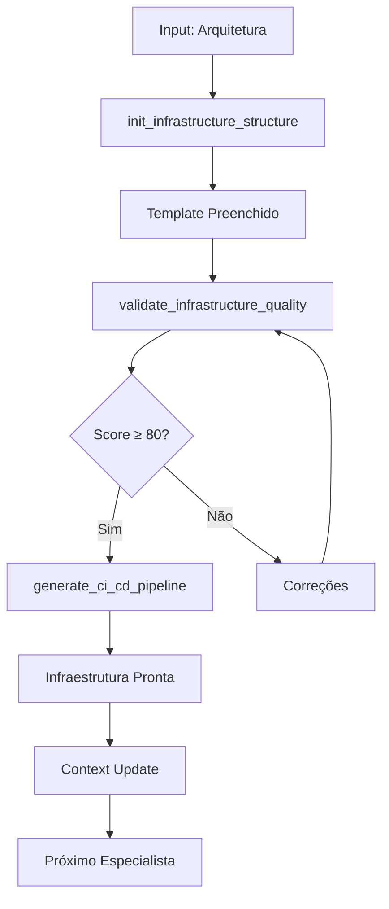

# 🔗 MCP Integration Guide - DevOps e Infraestrutura

## Visão Geral

Este documento descreve como integrar o especialista em DevOps e Infraestrutura com o MCP Maestro para automação completa de pipelines, infraestrutura como código e deploy.

## 🎯 Objetivo da Integração

Transformar o especialista em uma skill puramente descritiva que delega toda execução ao MCP, garantindo:
- **Zero execução local** de scripts
- **Automação centralizada** no MCP
- **Validação automática** de qualidade
- **Context flow** contínuo entre especialistas

## 🏗️ Arquitetura de Integração

### Separação de Responsabilidades

```
┌─────────────────┐    ┌─────────────────┐    ┌─────────────────┐
│   Skill DevOps  │───▶│      MCP        │───▶│  Infraestrutura │
│  (Descritiva)   │    │   (Execução)    │    │   (Real)        │
└─────────────────┘    └─────────────────┘    └─────────────────┘
```

#### Skill (Nossa Responsabilidade)
- **Informações descritivas**: Processos e conhecimentos
- **Templates estruturados**: Formatos padronizados
- **Quality gates**: Critérios de validação
- **Context flow**: Mapeamento de dependências

#### MCP (Responsabilidade do MCP)
- **Execução de scripts**: Geração de arquivos
- **Validação automática**: Quality gates
- **Integração externa**: APIs e serviços
- **Gerenciamento de estado**: Persistência

## 🛠️ Funções MCP Obrigatórias

### 1. init_infrastructure_structure

**Propósito**: Criar estrutura base da infraestrutura com template padrão

**Assinatura**:
```python
async def init_infrastructure_structure(params: dict) -> dict:
    """
    Inicializa estrutura base da infraestrutura
    
    Args:
        params: {
            "project_name": str,
            "stack": {
                "language": str,
                "framework": str,
                "database": str,
                "cloud_provider": str
            },
            "environments": list[str]
        }
    
    Returns:
        dict: {
            "success": bool,
            "structure": dict,
            "template_path": str,
            "next_steps": list[str]
        }
    """
```

**Implementação Esperada**:
1. Ler template `estado-template.json`
2. Preencher com informações do projeto
3. Criar estrutura de diretórios
4. Gerar arquivos base (Dockerfile, CI/CD, IaC)
5. Retornar estrutura inicializada

### 2. validate_infrastructure_quality

**Propósito**: Validar qualidade da infraestrutura configurada

**Assinatura**:
```python
async def validate_infrastructure_quality(params: dict) -> dict:
    """
    Valida qualidade da infraestrutura
    
    Args:
        params: {
            "infrastructure_path": str,
            "template_content": dict,
            "validation_level": str  # basic, complete, strict
        }
    
    Returns:
        dict: {
            "success": bool,
            "score": int,  # 0-100
            "issues": list[dict],
            "recommendations": list[str],
            "can_proceed": bool
        }
    """
```

**Critérios de Validação**:
- **Stack Definida**: 20 pontos
- **Ambientes Configurados**: 20 pontos
- **CI/CD Planejado**: 20 pontos
- **Containerização**: 15 pontos
- **IaC Definida**: 15 pontos
- **Compliance**: 10 pontos

**Threshold**: 80 pontos para aprovação

### 3. generate_ci_cd_pipeline

**Propósito**: Gerar pipeline de CI/CD completo

**Assinatura**:
```python
async def generate_ci_cd_pipeline(params: dict) -> dict:
    """
    Gera pipeline de CI/CD completo
    
    Args:
        params: {
            "provider": str,  # github_actions, gitlab_ci
            "stack": dict,
            "environments": list[str],
            "deployment_target": str
        }
    
    Returns:
        dict: {
            "success": bool,
            "pipeline_path": str,
            "pipeline_content": str,
            "deployment_steps": list[str],
            "validation_required": bool
        }
    """
```

## 🔄 Context Flow Implementation

### Mapeamento de Entrada

```python
def map_input_context():
    """Mapeia contexto de especialistas anteriores"""
    return {
        "from_architecture": {
            "arquitetura_path": "docs/05-arquitetura/arquitetura.md",
            "required_fields": ["stack", "cloud", "deployment"],
            "mapping": {
                "stack_tecnologica": "infraestrutura.stack",
                "decisoes_deploy": "infraestrutura.ambientes",
                "requisitos_nf": "compliance"
            }
        },
        "from_development": {
            "codigo_path": "src/",
            "required_fields": ["language", "framework"],
            "mapping": {
                "linguagem": "infraestrutura.stack.language",
                "framework": "infraestrutura.stack.framework"
            }
        }
    }
```

### Mapeamento de Saída

```python
def map_output_context():
    """Mapeia contexto para próximos especialistas"""
    return {
        "to_data_analytics": {
            "infra_path": "infra/",
            "deployment_urls": "infraestrutura.ambientes.*.url",
            "monitoring_setup": "compliance.monitoring_enabled"
        },
        "to_documentation": {
            "runbooks_path": "docs/runbooks/",
            "deployment_guide": "docs/deployment.md",
            "architecture_diagrams": "docs/diagrams/"
        }
    }
```

## 🚀 Pipeline de Automação

### Fluxo Completo



### Passos Detalhados

1. **Inicialização**
   ```python
   # MCP executa
   result = await init_infrastructure_structure({
       "project_name": "meu-projeto",
       "stack": {
           "language": "NODE",
           "framework": "NEXT",
           "database": "POSTGRES",
           "cloud_provider": "AWS"
       },
       "environments": ["dev", "staging", "prod"]
   })
   ```

2. **Validação**
   ```python
   # MCP executa
   validation = await validate_infrastructure_quality({
       "infrastructure_path": "infra/",
       "template_content": estado_json,
       "validation_level": "complete"
   })
   
   if validation["score"] >= 80:
       # Prosseguir
   else:
       # Aplicar correções
   ```

3. **Geração CI/CD**
   ```python
   # MCP executa
   pipeline = await generate_ci_cd_pipeline({
       "provider": "github_actions",
       "stack": stack_info,
       "environments": ["dev", "staging", "prod"],
       "deployment_target": "ecs"
   })
   ```

## 📋 Templates Integration

### Template Principal: estado-template.json

**Uso no MCP**:
```python
def load_template():
    """Carrega template principal"""
    with open("resources/templates/estado-template.json", "r") as f:
        return json.load(f)

def fill_template(template, params):
    """Preenche template com parâmetros"""
    template["infraestrutura"]["stack"] = params["stack"]
    template["infraestrutura"]["ambientes"] = params["environments"]
    return template
```

### Templates de Apoio

**Dockerfile**:
```python
def generate_dockerfile(stack_info):
    """Gera Dockerfile otimizado"""
    template = load_template("Dockerfile")
    return template.format(
        language=stack_info["language"],
        framework=stack_info["framework"]
    )
```

**CI/CD Pipeline**:
```python
def generate_pipeline(provider, stack):
    """Gera pipeline de CI/CD"""
    if provider == "github_actions":
        return generate_github_actions(stack)
    elif provider == "gitlab_ci":
        return generate_gitlab_ci(stack)
```

## ✅ Quality Gates Implementation

### Validação Automática

```python
def validate_quality(template_content):
    """Validação automática de qualidade"""
    score = 0
    issues = []
    
    # Stack definida (20 pontos)
    if template_content["infraestrutura"]["stack"]:
        score += 20
    else:
        issues.append("Stack não definida")
    
    # Ambientes configurados (20 pontos)
    envs = template_content["infraestrutura"]["ambientes"]
    if all(envs.values()):
        score += 20
    else:
        issues.append("Ambientes incompletos")
    
    # CI/CD planejado (20 pontos)
    if template_content["infraestrutura"]["ci_cd"]["provider"]:
        score += 20
    else:
        issues.append("CI/CD não planejado")
    
    # Containerização (15 pontos)
    if template_content["infraestrutura"]["container"]["registry"]:
        score += 15
    else:
        issues.append("Container registry não definido")
    
    # IaC definida (15 pontos)
    if template_content["infraestrutura"]["iac"]["tool"]:
        score += 15
    else:
        issues.append("IaC tool não definida")
    
    # Compliance (10 pontos)
    compliance = template_content["compliance"]
    if all(compliance.values()):
        score += 10
    else:
        issues.append("Compliance incompleto")
    
    return {
        "score": score,
        "issues": issues,
        "can_proceed": score >= 80
    }
```

## 🔄 Guardrails e Segurança

### Regras de Segurança

1. **Nunca executar código localmente**
2. **Sempre validar inputs antes de processar**
3. **Não expor secrets ou credenciais**
4. **Validar permissões antes de criar recursos**

### Tratamento de Erros

```python
def handle_errors(error):
    """Tratamento robusto de erros"""
    if error.type == "validation_error":
        return {
            "success": False,
            "error": "Validação falhou",
            "details": error.details,
            "suggestions": ["Verifique campos obrigatórios"]
        }
    elif error.type == "infrastructure_error":
        return {
            "success": False,
            "error": "Erro na infraestrutura",
            "details": error.message,
            "suggestions": ["Verifique configurações de cloud"]
        }
```

## 📊 Monitoramento e Métricas

### Métricas de Performance

```python
def track_metrics():
    """Monitoramento de métricas da skill"""
    return {
        "execution_time": measure_time(),
        "validation_score": get_validation_score(),
        "template_usage": track_template_usage(),
        "error_rate": calculate_error_rate(),
        "user_satisfaction": collect_feedback()
    }
```

### KPIs da Skill

- **Tempo de setup**: < 60 minutos
- **Score de qualidade**: ≥ 80 pontos
- **Taxa de automação**: 100%
- **Satisfação**: > 90%

## 🚀 Exemplo de Uso Completo

### Cenário: Novo Projeto Node.js

```python
# 1. Inicialização
result = await init_infrastructure_structure({
    "project_name": "api-produtos",
    "stack": {
        "language": "NODE",
        "framework": "NEST",
        "database": "POSTGRES",
        "cloud_provider": "AWS"
    },
    "environments": ["dev", "staging", "prod"]
})

# 2. Validação
validation = await validate_infrastructure_quality({
    "infrastructure_path": "infra/",
    "template_content": result["structure"],
    "validation_level": "complete"
})

# 3. Geração CI/CD
if validation["can_proceed"]:
    pipeline = await generate_ci_cd_pipeline({
        "provider": "github_actions",
        "stack": result["structure"]["infraestrutura"]["stack"],
        "environments": ["dev", "staging", "prod"],
        "deployment_target": "ecs"
    })
    
    print("Infraestrutura configurada com sucesso!")
else:
    print(f"Corrija os problemas: {validation['issues']}")
```

## 🎯 Benefícios da Integração

### Para o Usuário
- **Experiência limpa**: Sem detalhes técnicos
- **Automação completa**: Zero configuração manual
- **Validação automática**: Qualidade garantida
- **Progresso contínuo**: Fluxo entre especialistas

### Para o Sistema
- **Execução centralizada**: Tudo no MCP
- **Zero dependências locais**: Scripts externos
- **Escalabilidade**: Suporte ilimitado
- **Manutenibilidade**: Código centralizado

### Para o Time
- **Separação clara**: Skills descritivas vs execução
- **Evolução independente**: Skills e MCP separados
- **Testabilidade**: Validação automatizada
- **Documentação**: Completa e atualizada

---

## 🔄 Próximos Passos

1. **Implementar funções MCP** descritas neste guia
2. **Testar integração** com projetos reais
3. **Coletar feedback** e otimizar performance
4. **Documentar casos de uso** específicos
5. **Monitorar métricas** continuamente

Para suporte técnico, consulte os recursos em `resources/` ou os exemplos em `examples/`.
