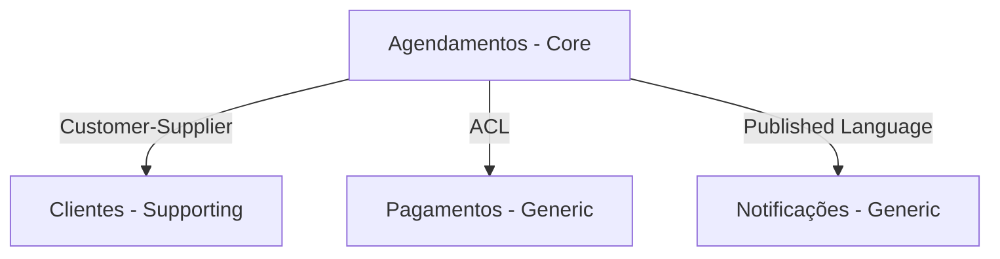

# Prompt: DDD - Bounded Contexts e Strategic Design

> **Quando usar**: Projetos complexos com múltiplos domínios ou equipes
> **Especialista**: [Arquitetura de Software](../../02-especialistas/Especialista%20em%20Arquitetura%20de%20Software.md)
> **Nível**: Complexo (3+ meses, domínio rico)

---

## Fluxo de Contexto

Antes de usar este prompt, tenha em mãos:
- `docs/CONTEXTO.md` - Entendimento atual do projeto
- `docs/04-modelo/modelo-dominio.md` - Modelo de domínio inicial

Após gerar, salve o resultado em:
- `docs/05-arquitetura/bounded-contexts.md`

---

## Prompt Completo

```text
Atue como arquiteto de software especialista em Domain-Driven Design.

## Contexto do Projeto

[COLE O CONTEÚDO DE docs/CONTEXTO.md]

## Modelo de Domínio Atual

[COLE ENTIDADES E RELACIONAMENTOS DE docs/04-modelo/modelo-dominio.md]

## Requisitos de Negócio

[COLE REQUISITOS OU REGRAS DE NEGÓCIO PRINCIPAIS]

---

## Sua Missão

Aplique Strategic DDD e Tactical DDD:

### 1. Strategic Design

#### 1.1 Bounded Contexts
Para cada contexto identificado:
- Nome do contexto
- Classificação: **Core Domain** / **Supporting** / **Generic**
- Responsabilidade principal (1-2 frases)
- Linguagem Ubíqua (termos específicos deste contexto)
- Time responsável sugerido

#### 1.2 Context Map
Mapeie relacionamentos entre contextos:
- **Partnership**: Colaboração mútua
- **Shared Kernel**: Código compartilhado
- **Customer-Supplier**: Upstream → Downstream
- **Conformist**: Downstream adapta-se ao Upstream
- **Anti-Corruption Layer (ACL)**: Proteção contra modelo externo
- **Open Host Service / Published Language**: API pública

#### 1.3 Diagrama de Contextos
Em Mermaid, mostre os bounded contexts e seus relacionamentos.

### 2. Tactical Design

Para cada Bounded Context **Core**:

#### 2.1 Aggregates
- Nome do Aggregate
- Raiz do Aggregate (Aggregate Root)
- Entidades internas
- Value Objects
- Invariantes (regras que SEMPRE devem ser verdade)
- Limites transacionais

#### 2.2 Domain Events
- Evento (nome no passado: PedidoCriado)
- Quando é disparado
- Payload (dados que carrega)
- Quem consome (outros contextos ou serviços)

#### 2.3 Domain Services
Lógica que não pertence a uma entidade específica.

#### 2.4 Repository Interfaces
Interface do repositório para cada Aggregate Root.

### 3. Decisões e Trade-offs
- Por que esses contextos e não outros?
- Riscos de comunicação entre contextos
- Sugestão de tecnologia para integração
```

---

## Exemplo de Uso

```text
Atue como arquiteto de software especialista em Domain-Driven Design.

## Contexto do Projeto

Marketplace de serviços locais conectando prestadores e clientes.
Inclui agendamento, pagamentos e avaliações.

## Modelo de Domínio Atual

- Usuario (id, nome, email, tipo)
- Servico (id, nome, preco, prestadorId)
- Agendamento (id, clienteId, servicoId, data, status)
- Pagamento (id, agendamentoId, valor, status)
- Avaliacao (id, agendamentoId, nota, comentario)

## Requisitos de Negócio

- Prestadores definem disponibilidade
- Clientes agendam e pagam antecipadamente
- Após conclusão do serviço, cliente pode avaliar
- Prestador recebe após 7 dias da conclusão
```

---

## Resposta Esperada

### 1. Bounded Contexts

| Contexto | Tipo | Responsabilidade | Linguagem |
|---|---|---|---|
| **Agendamentos** | Core | Gerenciar agendas e horários | Agendamento, Slot, Confirmação |
| **Clientes** | Supporting | Cadastro e perfil de clientes | Cliente, Preferências |
| **Pagamentos** | Generic | Processar cobranças | Transação, Fatura |
| **Notificações** | Generic | Enviar comunicações | Notificação, Template |

### Context Map



### 2. Aggregate: Agendamento

**Raiz:** Agendamento

**Entidades:**
- Agendamento (raiz)
- Servico (dentro do agregado)

**Value Objects:**
- HorarioSlot { inicio: DateTime, fim: DateTime }
- StatusAgendamento { tipo: enum }

**Invariantes:**
- Um agendamento não pode sobrepor outro do mesmo profissional
- Cancelamento só é permitido até 2h antes
- Agendamento só pode ser confirmado se pagamento estiver aprovado

**Eventos:**
- AgendamentoCriado { id, clienteId, horario }
- AgendamentoCancelado { id, motivo }
- AgendamentoConfirmado { id }
- AgendamentoConcluido { id }

---

## Checklist Pós-Geração

- [ ] 3-5 Bounded Contexts identificados
- [ ] Contextos classificados (Core/Supporting/Generic)
- [ ] Context Map com relações claras
- [ ] Aggregates definidos com invariantes
- [ ] Domain Events listados com payload
- [ ] Linguagem ubíqua definida por contexto
- [ ] Salvar em `docs/05-arquitetura/bounded-contexts.md`
