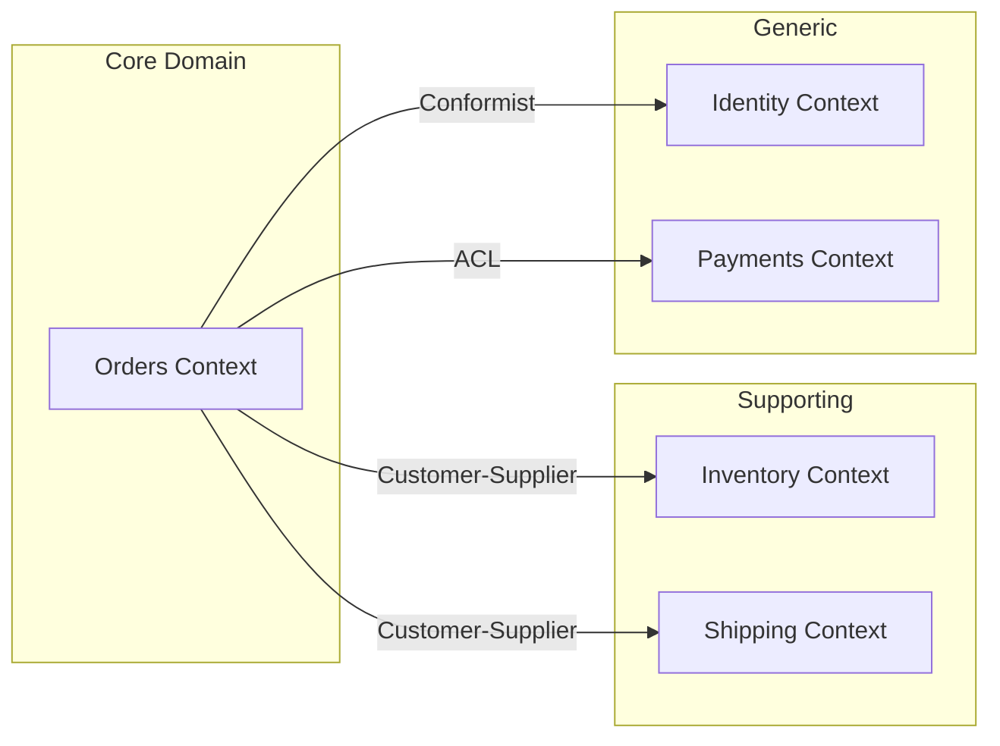

# Prompt: Arquitetura DDD + CQRS

> **Quando usar**: Projetos de nível Complexo (3+ meses, domínio rico, múltiplos contextos)
> **Especialista**: Arquitetura Avançada

---

## Prompt Completo

```text
Atue como arquiteto especialista em Domain-Driven Design e sistemas distribuídos.

## Contexto do Projeto

PRD:
[COLE O CONTEÚDO DE docs/01-produto/PRD.md]

Requisitos:
[COLE O CONTEÚDO DE docs/02-requisitos/requisitos.md]

Modelo de Domínio:
[COLE O CONTEÚDO DE docs/04-modelo/modelo-dominio.md]

Complexidade específica:
- Multi-tenant: [SIM/NÃO]
- Compliance: [LGPD/SOC2/HIPAA/Nenhum]
- SLA disponibilidade: [99%/99.9%/99.99%]
- Pico de usuários: [NÚMERO]

---

## Sua Missão

Proponha uma arquitetura DDD com CQRS considerando:

### 1. Strategic Design (Bounded Contexts)

Identifique e documente:

- **Bounded Contexts** (3-5 contextos):
  - Nome e responsabilidade de cada contexto
  - Ubiquitous Language de cada um
  - Qual é o Core Domain vs Supporting/Generic

- **Context Map**:
  - Relações entre contextos (diagrama)
  - Tipo de integração:
    - Shared Kernel
    - Customer-Supplier
    - Conformist
    - Anti-Corruption Layer
    - Open Host Service / Published Language

### 2. Tactical Design (por Bounded Context)

Para cada contexto, defina:

- **Aggregates**:
  - Aggregate Roots
  - Invariantes que protegem
  - Limites transacionais

- **Entities e Value Objects**:
  - Quais são Entities (identidade)
  - Quais são Value Objects (imutáveis)

- **Domain Events**:
  - Eventos que cada agregado publica
  - Subscribers internos e externos

- **Domain Services**:
  - Operações que não pertencem a uma entidade

### 3. CQRS (Command Query Responsibility Segregation)

Defina:

- **Command Side (Write Model)**:
  - Commands e Command Handlers
  - Agregados que processam
  - Validações

- **Query Side (Read Model)**:
  - Views/Projections otimizadas
  - Como são atualizadas (sync vs async)
  - Tecnologia (mesmo banco vs banco separado)

- **Event Sourcing** (se aplicável):
  - Justificativa para usar ou não
  - Event Store
  - Snapshots

### 4. Integração entre Contextos

- **Message Broker**:
  - Escolha (Kafka/RabbitMQ/SQS) com justificativa
  - Tópicos/Filas por tipo de evento

- **Sagas** (se necessário):
  - Fluxos que cruzam contextos
  - Compensação em caso de falha

- **Consistência Eventual**:
  - Onde é aceitável
  - SLAs de propagação

### 5. Observabilidade

- **Distributed Tracing**:
  - Correlation IDs entre serviços
  - Ferramentas (Jaeger, Zipkin, etc)

- **Métricas de Domínio**:
  - KPIs por bounded context
  - Alertas críticos

### 6. ADRs Obrigatórios

- Por que DDD e não arquitetura mais simples
- Escolha do message broker
- Event Sourcing sim/não
- Estratégia de consistência eventual
- Tecnologia do Event Store

---

## Formato de Saída

Retorne um documento Markdown com:

1. **Context Map** (diagrama Mermaid)
2. **Detalhamento de cada Bounded Context**
3. **Fluxo de eventos entre contextos**
4. **ADRs completos**
5. **Estrutura de projetos/módulos**
6. **Estimativa de complexidade e riscos**
```

---

## Exemplo de Context Map



---

## Checklist Pós-Geração

- [ ] Bounded Contexts identificados (3-5)
- [ ] Context Map com relações claras
- [ ] Aggregates definidos com invariantes
- [ ] Domain Events listados
- [ ] CQRS com Write/Read separados
- [ ] Message broker escolhido e justificado
- [ ] ADRs para decisões críticas
- [ ] Riscos e complexidade documentados
