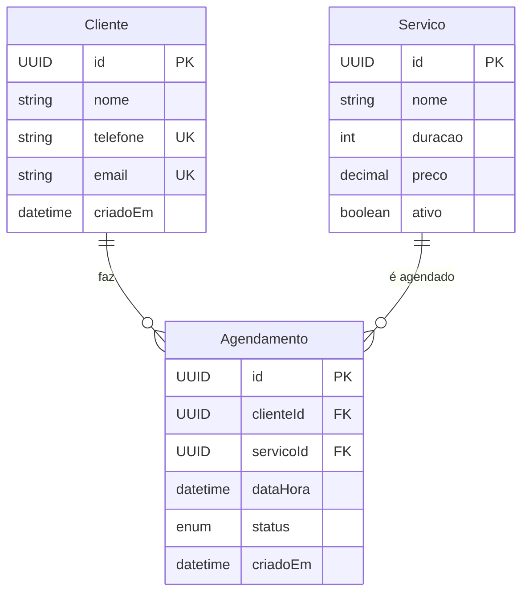

# Prompt: Modelo de Domínio

> **Quando usar**: Início do projeto, após refinar requisitos
> **Especialista**: [Engenharia de Requisitos](../../02-especialistas/Especialista%20em%20Engenharia%20de%20Requisitos%20com%20IA.md) ou [Arquitetura de Software](../../02-especialistas/Especialista%20em%20Arquitetura%20de%20Software.md)
> **Nível**: Simples a Médio

---

## Fluxo de Contexto

Antes de usar este prompt, tenha em mãos:
- `docs/CONTEXTO.md` - Entendimento atual do projeto
- `docs/02-requisitos/requisitos.md` - Requisitos funcionais

Após gerar, salve o resultado em:
- `docs/04-modelo/modelo-dominio.md`

---

## Prompt Completo

```text
Atue como analista de domínio especializado em modelagem de dados.

## Contexto do Projeto

[COLE O CONTEÚDO DE docs/CONTEXTO.md]

## Requisitos

[COLE REQUISITOS DE docs/02-requisitos/requisitos.md]

---

## Sua Missão

Proponha um modelo de domínio inicial completo:

### 1. Entidades Principais
Para cada entidade:
- Nome da entidade
- Descrição (1 frase)
- Atributos com tipos (use tipos genéricos: string, int, decimal, datetime, boolean, UUID)
- Marque campos obrigatórios vs opcionais
- Indique campos únicos (unique)

### 2. Value Objects
Identifique conceitos que são melhor representados como Value Objects:
- Nome
- Atributos
- Regras de validação

### 3. Relacionamentos
- Cardinalidade (1:1, 1:N, N:N)
- Direção da navegação
- Cascade (o que acontece ao deletar)

### 4. Diagrama ER
Gere um diagrama Mermaid do modelo.

### 5. Dúvidas Abertas
Liste perguntas que ainda precisam ser respondidas pelo cliente.

### 6. Considerações Técnicas
- Índices que serão necessários
- Campos que podem crescer muito (text, blob)
- Dados sensíveis que precisam de criptografia
```

---

## Exemplo de Uso

```text
Atue como analista de domínio especializado em modelagem de dados.

## Contexto do Projeto

Sistema de agendamento online para salões de beleza.

## Requisitos

- RF-001: Cliente pode se cadastrar com nome, telefone e email
- RF-002: Salão pode cadastrar serviços com nome, duração e preço
- RF-003: Cliente pode agendar um serviço para uma data/hora
- RF-004: Sistema deve enviar confirmação por WhatsApp
- RF-005: Cliente pode cancelar até 2h antes
- RF-006: Salão pode ver relatório de agendamentos
```

---

## Resposta Esperada

### 1. Entidades

**Cliente**
| Atributo | Tipo | Obrigatório | Único | Notas |
|----------|------|-------------|-------|-------|
| id | UUID | ✓ | ✓ | PK |
| nome | string(100) | ✓ | | |
| telefone | string(20) | ✓ | ✓ | WhatsApp |
| email | string(255) | | ✓ | |
| criadoEm | datetime | ✓ | | default: now |

**Servico**
| Atributo | Tipo | Obrigatório | Único | Notas |
|----------|------|-------------|-------|-------|
| id | UUID | ✓ | ✓ | PK |
| nome | string(100) | ✓ | | |
| duracao | int | ✓ | | minutos |
| preco | decimal(10,2) | ✓ | | |
| ativo | boolean | ✓ | | default: true |

**Agendamento**
| Atributo | Tipo | Obrigatório | Único | Notas |
|----------|------|-------------|-------|-------|
| id | UUID | ✓ | ✓ | PK |
| clienteId | UUID | ✓ | | FK → Cliente |
| servicoId | UUID | ✓ | | FK → Servico |
| dataHora | datetime | ✓ | | |
| status | enum | ✓ | | pendente, confirmado, cancelado, concluido |
| criadoEm | datetime | ✓ | | default: now |

### 2. Value Objects

**Telefone**
- numero: string
- ddi: string (default: +55)
- Validação: formato válido de WhatsApp

**StatusAgendamento**
- Enum: PENDENTE, CONFIRMADO, CANCELADO, CONCLUIDO
- Transições válidas definidas

### 3. Relacionamentos

```
Cliente 1 ──── N Agendamento
Servico 1 ──── N Agendamento
```

- Cliente → Agendamento: Cascade soft delete
- Servico → Agendamento: Não permite deletar serviço com agendamentos futuros

### 4. Diagrama ER



### 5. Dúvidas

- [ ] Um agendamento pode ter múltiplos serviços?
- [ ] Há profissionais diferentes por serviço?
- [ ] Cliente pode ter mais de um telefone?
- [ ] Qual a política de reagendamento?

### 6. Considerações Técnicas

**Índices necessários:**
- `agendamento.dataHora` - Consultas por período
- `agendamento.status` - Filtros por status
- `agendamento(servicoId, dataHora)` - Verificar conflitos

**Dados sensíveis:**
- `cliente.telefone` - Considerar mascarar em logs
- `cliente.email` - Verificar LGPD

---

## Checklist Pós-Geração

- [ ] Todas as entidades têm PK definida
- [ ] Relacionamentos têm cardinalidade clara
- [ ] Campos obrigatórios vs opcionais definidos
- [ ] Diagrama ER gerado em Mermaid
- [ ] Dúvidas listadas para validar com cliente
- [ ] Índices sugeridos para queries principais
- [ ] Salvar em `docs/04-modelo/modelo-dominio.md`
