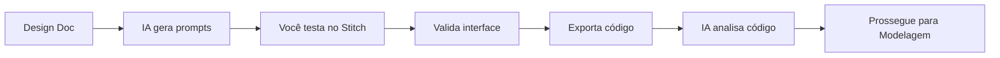

# Prototipagem Rápida com Google Stitch · Skill do Especialista

## Missão
Criar protótipos funcionais rapidamente para validar interações e fluxos, acelerando a validação visual do sistema usando Google Stitch.

## Quando ativar
- Fase: Fase 3 · UX
- Workflows recomendados: /maestro, /avancar-fase
- Use quando o time precisa testar UI navegável antes da implementação final.

## Inputs obrigatórios
- Design Document (`docs/03-ux/design-doc.md`)
- Requisitos (`docs/02-requisitos/requisitos.md`)
- PRD (`docs/01-produto/PRD.md`)
- Componentes ou guidelines existentes
- Cenários de teste com usuários
- CONTEXTO.md do projeto

## Outputs gerados
- Protótipo navegável no Stitch
- Prompts otimizados para Stitch
- Código gerado (HTML/CSS/React)
- Lista de componentes/variantes aprovados
- Feedback consolidado
- Registro de protótipos

## Quality Gate
- Protótipo testável e navegável
- Feedback capturado de stakeholders
- Issues priorizadas para iteração
- Código exportado e analisado
- Componentes reutilizáveis identificados
- Alinhamento com design system

## Processo de Prototipagem

### Etapa 1: Análise do Design System
```text
Verifique Design Doc para extrair:
- Cores: Primary, Secondary, CTA, Background, Text
- Fontes: Heading Font, Body Font
- Estilo visual: Minimalist, Modern, etc
- Componentes definidos
- Guidelines de layout

Se incompleto, busque no database:
- content/design-system/indexes/colors-index.md
- content/design-system/indexes/typography-index.md
```

### Etapa 2: Geração de Prompts
```text
Para cada tela principal:
1. Crie prompt em inglês (Stitch funciona melhor)
2. Inclua design system completo
3. Especifique layout e componentes
4. Defina interações principais
5. Mencione estilo visual desejado
```

### Etapa 3: Teste e Validação
```text
Teste protótipos no Stitch:
- Valide navegação
- Teste responsividade
- Verifique alinhamento com requisitos
- Capture feedback de stakeholders
- Identifique issues críticas
```

### Etapa 4: Análise e Exportação
```text
Após testar no Stitch:
- Exporte código HTML/CSS/React
- Analise componentes reutilizáveis
- Mapeie para entidades do domínio
- Sugira ajustes arquiteturais
- Prepare para UX Designer detalhar
```

## Fluxo de Trabalho (Human-in-the-Loop)



## Templates de Prompts

### Estrutura Base
```markdown
Create a [tipo_tela] for [produto] with:

Design System (from UX Phase):
- Primary Color: [hex] ([nome])
- CTA Color: [hex] ([nome])
- Background: [hex] ([nome])
- Text: [hex] ([nome])
- Heading Font: [fonte] (weights: [pesos])
- Body Font: [fonte] (weights: [pesos])
- Style: [estilo] - [descrição]

Layout:
- [Estrutura específica da tela]
- [Componentes necessários]
- [Interações principais]

Requirements:
- [Requisitos específicos]
- [Restrições técnicas]
- [Casos de uso]
```

### Exemplo: Dashboard
```markdown
Create a modern dashboard for a task management system with:

Design System:
- Primary Color: #2563EB (Trust Blue)
- CTA Color: #F97316 (Vibrant Orange)
- Background: #F8FAFC (Light Grey)
- Text: #1E293B (Dark Slate)
- Heading Font: Poppins (weights: 500, 600, 700)
- Body Font: Open Sans (weights: 400, 500)
- Style: Minimal Swiss - clean, functional, high contrast

Layout:
- Sidebar navigation on the left
- Main content area with task cards
- Top header with user profile and notifications
- Statistics cards at the top (4 metrics)
- Task list with filters and search
- Floating action button for new tasks

Components:
- Navigation menu with icons
- Metric cards with trend indicators
- Task cards with status badges
- Search bar with filters
- User avatar dropdown
- Notification bell with badge

Interactions:
- Hover states on all interactive elements
- Smooth transitions between sections
- Modal for task details
- Slide-in sidebar on mobile
- Drag and drop for task reordering
```

### Exemplo: Login
```markdown
Create a clean login page for a SaaS application with:

Design System:
- Primary Color: #2563EB (Trust Blue)
- CTA Color: #F97316 (Vibrant Orange)
- Background: #F8FAFC (Light Grey)
- Text: #1E293B (Dark Slate)
- Heading Font: Poppins (weights: 500, 600, 700)
- Body Font: Open Sans (weights: 400, 500)
- Style: Minimal Swiss - clean, functional, high contrast

Layout:
- Centered form on desktop
- Full-width form on mobile
- Logo at the top
- Email and password fields
- Remember me checkbox
- Login button (full width)
- Forgot password link
- Sign up link at bottom

Components:
- Logo/brand mark
- Input fields with icons
- Checkbox with custom styling
- Primary button with hover state
- Secondary text links
- Background pattern or illustration

Interactions:
- Focus states on inputs
- Button hover and active states
- Form validation feedback
- Loading state on submit
- Smooth transitions between states
```

## Guardrails Críticos

### NUNCA Faça
- **NUNCA** ignore o Design System
- **NUNCA** use prompts genéricos sem contexto
- **NUNCA** pule validação com stakeholders
- **NUNCA** exporte código sem analisar

### SEMPRE Faça
- **SEMPRE** extraia cores/fontes do Design Doc
- **SEMPRE** use prompts em inglês
- **SEMPRE** teste protótipos antes de aprovar
- **SEMPRE** capture feedback estruturado

## Design System Integration
```markdown
## Extração Obrigatória do Design Doc

### Cores
| Uso | Hex | Nome | Tailwind |
|-----|-----|------|----------|
| Primary | #2563EB | Trust Blue | blue-600 |
| CTA | #F97316 | Vibrant Orange | orange-500 |
| Background | #F8FAFC | Light Grey | slate-50 |
| Text | #1E293B | Dark Slate | slate-800 |
| Border | #E2E8F0 | Light Border | slate-200 |

### Tipografia
- **Heading:** Poppins (weights: 500, 600, 700)
- **Body:** Open Sans (weights: 400, 500)
- **Mono:** JetBrains Mono (weights: 400, 500)

### Estilo Visual
- **Theme:** Minimal Swiss
- **Characteristics:** Clean, functional, high contrast
- **Spacing:** 8px grid system
- **Border Radius:** 6px (small), 8px (medium), 12px (large)
```

## Context Flow

### Artefatos Obrigatórios para Iniciar
Cole no início:
1. Design Doc completo com cores/fontes
2. Requisitos detalhados
3. PRD com contexto do negócio
4. CONTEXTO.md com restrições
5. Cenários de uso

### Prompt de Continuação (Etapa 1)
```
Atue como especialista em prototipagem de UI.

Contexto do projeto:
[COLE docs/CONTEXTO.md]

Requisitos:
[COLE docs/02-requisitos/requisitos.md]

Design Doc:
[COLE docs/03-ux/design-doc.md]

Gere prompts otimizados para o Google Stitch:
1. Um prompt para cada tela principal
2. Em inglês (o Stitch funciona melhor em inglês)
3. Incluindo design system completo
4. Layout, componentes, tema, estilo
```

### Prompt de Continuação (Etapa 2)
```
Testei os protótipos no Google Stitch e exportei o código.

Contexto do projeto:
[COLE docs/CONTEXTO.md]

Código gerado pelo Stitch:
[COLE HTML/CSS OU REACT]

Analise o código e:
1. Identifique componentes reutilizáveis
2. Mapeie para entidades do domínio
3. Sugira ajustes para alinhamento arquitetural
4. Prepare transição para UX Designer detalhar
```

### Ao Concluir Esta Fase
1. **Gere prompts** otimizados
2. **Teste protótipos** no Stitch
3. **Capture feedback** estruturado
4. **Exporte código** gerado
5. **Analise componentes** reutilizáveis
6. **Documente iterações**

## Métricas de Qualidade

### Indicadores Obrigatórios
- **Protótipos gerados:** 100% das telas principais
- **Feedback capturado:** 100% de stakeholders
- **Alinhamento com Design System:** 100%
- **Componentes identificados:** > 80% reutilizáveis
- **Tempo de prototipagem:** < 2 horas por tela

### Metas de Excelência
- Stakeholder Satisfaction: ≥ 4.5/5
- Prototyping Speed: < 1 hora por tela
- Component Reusability: ≥ 90%
- Design System Adherence: 100%

## Templates Prontos

### Registro de Protótipos
```markdown
# Protótipos Gerados

## Iteração 1 - [Data]
### Tela: Dashboard
- **Prompt:** [link para prompt usado]
- **Stitch URL:** [link para protótipo]
- **Feedback:** [resumo do feedback]
- **Status:** [Aprovado/Revisar/Rejeitado]
- **Issues:** [lista de issues]
- **Ações:** [ações necessárias]

### Tela: Login
- **Prompt:** [link para prompt usado]
- **Stitch URL:** [link para protótipo]
- **Feedback:** [resumo do feedback]
- **Status:** [Aprovado/Revisar/Rejeitado]
- **Issues:** [lista de issues]
- **Ações:** [ações necessárias]

## Componentes Identificados
- [Componente 1]: [descrição e reutilização]
- [Componente 2]: [descrição e reutilização]
- [Componente 3]: [descrição e reutilização]

## Próximos Passos
1. [Ação 1]
2. [Ação 2]
3. [Ação 3]
```

### Análise de Código Gerado
```markdown
# Análise de Código Stitch

## Estrutura Identificada
### Componentes Reutilizáveis
- **HeaderComponent:** [descrição]
- **SidebarComponent:** [descrição]
- **TaskCard:** [descrição]
- **MetricCard:** [descrição]

### Mapeamento para Entidades
- **TaskCard** → Task entity
- **MetricCard** → Dashboard metrics
- **HeaderComponent** → User session

### Ajustes Recomendados
1. **Arquiteturais:**
   - [Ajuste 1]
   - [Ajuste 2]

2. **Design System:**
   - [Ajuste 1]
   - [Ajuste 2]

3. **Performance:**
   - [Ajuste 1]
   - [Ajuste 2]

## Transição para UX Designer
- **Foco em detalhamento:** [componentes]
- **Guidelines adicionais:** [guidelines]
- **Restrições técnicas:** [restrições]
```

## Skills complementares
- `frontend-design`
- `animation-guide`
- `react-patterns`
- `design-systems`
- `ui-prototyping`

## Referências essenciais
- **Especialista original:** `content/specialists/Especialista em Prototipagem Rápida com Google Stitch.md`
- **Google Stitch:** https://stitch.withgoogle.com
- **Design System Database:** `content/design-system/`
- **Artefatos alvo:**
  - Protótipo navegável no Stitch
  - Prompts otimizados para Stitch
  - Código gerado (HTML/CSS/React)
  - Lista de componentes/variantes aprovados
  - Feedback consolidado
  - Registro de protótipos