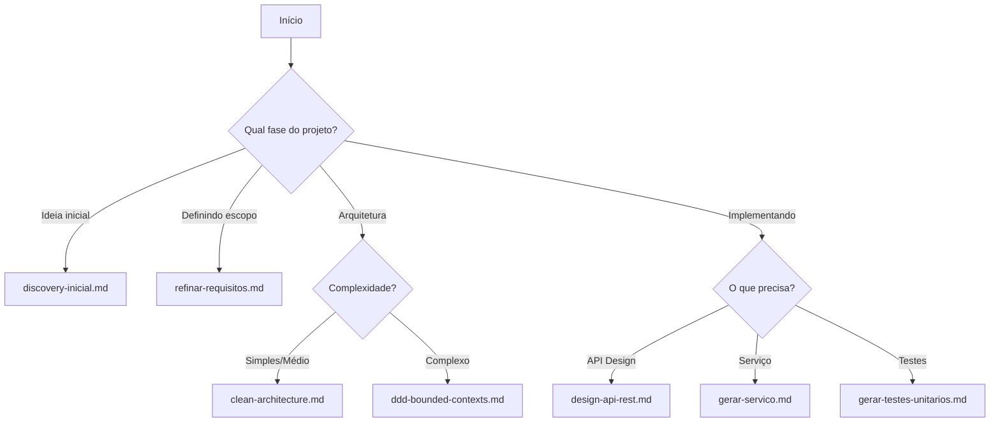

# 📋 Catálogo Completo de Prompts Maestro

**Versão:** 1.0  
**Data:** 2026-01-28  
**Total:** 50+ Prompts  
**Status:** Documentação Completa

---

## 🎯 **Visão Geral**

Este catálogo documenta todos os **prompts especializados** disponíveis no sistema Maestro para acelerar o desenvolvimento assistido por IA. Cada prompt é estruturado para contextos específicos, com exemplos práticos e validações integradas.

---

## 📊 **Resumo Estatístico**

| Categoria | Quantidade | Níveis | Fases Cobertas |
|-----------|------------|--------|----------------|
| **Produto & Requisitos** | 4 | Simples | Fases 1-2 |
| **Arquitetura & Modelagem** | 6 | Médio/Complexo | Fases 4-6 |
| **APIs** | 3 | Médio | Fase 9 |
| **Desenvolvimento** | 2 | Médio | Fase 10-11 |
| **Testes** | 5 | Simples/Médio | Fase 7 |
| **Performance & Escalabilidade** | 2 | Médio/Complexo | Fase 12 |
| **Database** | 2 | Médio | Fase 5 |
| **Observabilidade** | 3 | Médio/Complexo | Fase 12 |
| **Segurança** | 5 | Médio/Complexo | Fase 6 |
| **DevOps** | 5 | Médio/Complexo | Fase 12 |
| **Acessibilidade** | 1 | Médio | Fase 3 |
| **UX & Prototipagem** | 1 | Simples | Fase 3 |
| **Total de Prompts** | **50+** | **Todos os níveis** | **Cobertura completa** |

---

## 🔄 **Fluxo de Prompts (Por Fase)**

```
Fase 1: Produto
├── discovery-inicial.md

Fase 2: Requisitos  
└── refinar-requisitos.md

Fase 3: UX Design
├── gerar-ui-stitch.md
└── analise-acessibilidade.md

Fase 4: Modelo de Domínio
└── modelo-dominio.md

Fase 5: Banco de Dados
├── otimizacao-queries.md
└── migrations-zero-downtime.md

Fase 6: Arquitetura
├── arquitetura-c4-completo.md
├── clean-architecture.md
├── ddd-bounded-contexts.md
├── ddd-cqrs.md
└── multi-tenancy.md

Fase 7: Segurança
├── analise-seguranca.md
├── threat-modeling.md
├── revisao-lgpd.md
├── pentest-checklist.md
└── rate-limiting.md

Fase 8: Testes
├── gerar-testes-unitarios.md
├── testes-integracao.md
├── testes-e2e.md
├── testes-performance.md
└── contract-testing.md

Fase 9: APIs
├── design-api-rest.md
├── idempotencia.md
└── versionamento.md

Fase 10: Desenvolvimento Frontend
└── (integrado com outros prompts)

Fase 11: Desenvolvimento Backend
├── gerar-servico.md
└── code-review.md

Fase 12: DevOps & Produção
├── pipeline-cicd.md
├── docker-compose.md
├── kubernetes-deploy.md
├── terraform-iac.md
├── feature-flags.md
├── analise-performance.md
├── caching.md
├── estrategia-observabilidade.md
├── slos.md
└── chaos-testing.md
```

---

## 📄 **Prompts por Categoria**

### **🎯 Produto & Requisitos (4 prompts)**

#### **1. Discovery Inicial**
- **Arquivo:** `produto/discovery-inicial.md`
- **Finalidade:** Transformar ideias soltas em estrutura de produto
- **Nível:** Simples
- **Especialista:** Gestão de Produto
- **Seções:**
  - Problema central e impacto
  - Proposta de solução e diferencial
  - Personas (2-3 detalhadas)
  - Jobs-to-be-Done (JTBD)
  - Análise de concorrentes
  - Hipóteses e riscos
  - Métricas de sucesso (North Star)
  - MVP sugerido
  - Próximos passos

#### **2. Refinar Requisitos**
- **Arquivo:** `requisitos/refinar-requisitos.md`
- **Finalidade:** Transformar discovery em requisitos formais
- **Nível:** Simples
- **Especialista:** Engenharia de Requisitos
- **Conteúdo:** RFs, RNFs, critérios de aceite, matriz de rastreabilidade

---

### **🎨 UX & Prototipagem (2 prompts)**

#### **3. Gerar UI com Stitch**
- **Arquivo:** `ux/gerar-ui-stitch.md`
- **Finalidade:** Criar protótipos funcionais com Google Stitch
- **Nível:** Simples
- **Especialista:** Prototipagem Rápida
- **Conteúdo:** Configuração Stitch, componentes, interações

#### **4. Análise de Acessibilidade**
- **Arquivo:** `acessibilidade/analise-acessibilidade.md`
- **Finalidade:** Verificar conformidade WCAG 2.1
- **Nível:** Médio
- **Especialista:** Acessibilidade
- **Conteúdo:** Screen readers, contraste, navegação, validação

---

### **🏗️ Arquitetura & Modelagem (6 prompts)**

#### **5. Arquitetura C4 Completa**
- **Arquivo:** `arquitetura/arquitetura-c4-completo.md`
- **Finalidade:** Definir arquitetura com diagramas C4 (níveis 1-3)
- **Nível:** Médio a Complexo
- **Especialista:** Arquitetura de Software
- **Seções:**
  - Diagrama C4 Nível 1 (Contexto)
  - Diagrama C4 Nível 2 (Containers)
  - Diagrama C4 Nível 3 (Componentes)
  - Decisões arquiteturais (ADRs)
  - Trade-offs e custos
  - Estrutura de pastas

#### **6. Clean Architecture**
- **Arquivo:** `arquitetura/clean-architecture.md`
- **Finalidade:** Implementar arquitetura limpa para projetos médios
- **Nível:** Médio
- **Especialista:** Arquitetura de Software
- **Conteúdo:** Camadas, dependências, padrões, exemplos

#### **7. DDD Bounded Contexts**
- **Arquivo:** `arquitetura/ddd-bounded-contexts.md`
- **Finalidade:** Definir contextos delimitados em DDD
- **Nível:** Complexo
- **Especialista:** Arquitetura Avançada
- **Conteúdo:** Context maps, integrações, anti-corruption layer

#### **8. DDD CQRS**
- **Arquivo:** `arquitetura/ddd-cqrs.md`
- **Finalidade:** Implementar Command Query Responsibility Segregation
- **Nível:** Complexo
- **Especialista:** Arquitetura Avançada
- **Conteúdo:** Commands, Queries, Event Sourcing, exemplos

#### **9. Modelo de Domínio**
- **Arquivo:** `arquitetura/modelo-dominio.md`
- **Finalidade:** Modelar entidades e regras de negócio
- **Nível:** Simples
- **Especialista:** Modelagem de Domínio
- **Conteúdo:** Entidades, relacionamentos, invariantes, eventos

#### **10. Multi-tenancy**
- **Arquivo:** `arquitetura/multi-tenancy.md`
- **Finalidade:** Arquitetura multi-tenant para SaaS
- **Nível:** Complexo
- **Especialista:** Arquitetura Avançada
- **Conteúdo:** Isolamento, database, segurança, escalabilidade

---

### **🔌 APIs (3 prompts)**

#### **11. Design API REST**
- **Arquivo:** `apis/design-api-rest.md`
- **Finalidade:** Projetar API REST com OpenAPI
- **Nível:** Médio
- **Especialista:** Contrato de API
- **Conteúdo:** Endpoints, schemas, documentação, exemplos

#### **12. Idempotência**
- **Arquivo:** `apis/idempotencia.md`
- **Finalidade:** Implementar idempotência em endpoints
- **Nível:** Médio
- **Especialista:** Desenvolvimento Backend
- **Conteúdo:** Idempotency keys, padrões, exemplos

#### **13. Versionamento**
- **Arquivo:** `apis/versionamento.md`
- **Finalidade:** Estratégias de versionamento de API
- **Nível:** Médio
- **Especialista:** Contrato de API
- **Conteúdo:** URI versioning, header versioning, backward compatibility

---

### **💻 Desenvolvimento (2 prompts)**

#### **14. Gerar Serviço**
- **Arquivo:** `desenvolvimento/gerar-servico.md`
- **Finalidade:** Gerar código de services/use cases
- **Nível:** Médio
- **Especialista:** Desenvolvimento Backend
- **Seções:**
  - Estrutura do serviço (Clean Architecture)
  - Métodos CRUD + regras específicas
  - Padrões (DTOs, Repository interfaces)
  - Exemplos em TypeScript/Python/Java
  - Variações por stack

#### **15. Code Review**
- **Arquivo:** `desenvolvimento/code-review.md`
- **Finalidade:** Revisar código de PRs
- **Nível:** Médio
- **Especialista:** Desenvolvimento Backend
- **Conteúdo:** Checklist, padrões, segurança, performance

---

### **🧪 Testes (5 prompts)**

#### **16. Gerar Testes Unitários**
- **Arquivo:** `testes/gerar-testes-unitarios.md`
- **Finalidade:** Criar testes unitários completos
- **Nível:** Simples a Médio
- **Especialista:** Análise de Testes
- **Seções:**
  - Padrão AAA (Arrange, Act, Assert)
  - Happy path, edge cases, error cases
  - Mocking de dependências
  - Coverage mínimo
  - Exemplos em Jest/PyTest/JUnit

#### **17. Testes de Integração**
- **Arquivo:** `testes/testes-integracao.md`
- **Finalidade:** Testes com banco e APIs externas
- **Nível:** Médio
- **Especialista:** Análise de Testes
- **Conteúdo:** Setup, teardown, fixtures, exemplos

#### **18. Testes E2E**
- **Arquivo:** `testes/testes-e2e.md`
- **Finalidade:** Testes end-to-end com Playwright
- **Nível:** Médio
- **Especialista:** Análise de Testes
- **Conteúdo:** Page Object Model, cenários, exemplos

#### **19. Testes de Performance**
- **Arquivo:** `testes/testes-performance.md`
- **Finalidade:** Load testing com k6
- **Nível:** Médio
- **Especialista:** Performance e Escalabilidade
- **Conteúdo:** Scripts k6, métricas, cenários

#### **20. Contract Testing**
- **Arquivo:** `testes/contract-testing.md`
- **Finalidade:** Contract testing com Pact
- **Nível:** Médio
- **Especialista:** Contrato de API
- **Conteúdo:** Consumer contracts, provider verification

---

### **🚀 Performance & Escalabilidade (2 prompts)**

#### **21. Análise de Performance**
- **Arquivo:** `escalabilidade/analise-performance.md`
- **Finalidade:** Identificar e corrigir gargalos
- **Nível:** Médio
- **Especialista:** Performance e Escalabilidade
- **Conteúdo:** Profiling, otimização, caching, exemplos

#### **22. Caching**
- **Arquivo:** `escalabilidade/caching.md`
- **Finalidade:** Estratégias de cache com Redis
- **Nível:** Médio
- **Especialista:** Performance e Escalabilidade
- **Conteúdo:** Patterns, invalidação, exemplos

---

### **🗄️ Database (2 prompts)**

#### **23. Otimização de Queries**
- **Arquivo:** `database/otimizacao-queries.md`
- **Finalidade:** Otimizar banco e queries
- **Nível:** Médio
- **Especialista:** Banco de Dados
- **Conteúdo:** EXPLAIN, índices, exemplos

#### **24. Migrations Zero Downtime**
- **Arquivo:** `database/migrations-zero-downtime.md`
- **Finalidade:** Migrations sem downtime
- **Nível:** Médio
- **Especialista:** Banco de Dados
- **Conteúdo:** Blue-green migrations, exemplos

---

### **📊 Observabilidade (3 prompts)**

#### **25. Estratégia de Observabilidade**
- **Arquivo:** `observabilidade/estrategia-observabilidade.md`
- **Finalidade:** Configurar logs, métricas, traces
- **Nível:** Médio
- **Especialista:** Observabilidade
- **Conteúdo:** OpenTelemetry, Prometheus, Grafana

#### **26. SLOs**
- **Arquivo:** `observabilidade/slos.md`
- **Finalidade:** Definir SLOs, SLIs e Error Budgets
- **Nível:** Médio
- **Especialista:** Observabilidade
- **Conteúdo:** Métricas, alertas, exemplos

#### **27. Chaos Testing**
- **Arquivo:** `observabilidade/chaos-testing.md`
- **Finalidade:** Experimentos de chaos engineering
- **Nível:** Complexo
- **Especialista:** Observabilidade
- **Conteúdo:** Chaos Monkey, GameDays, exemplos

---

### **🔐 Segurança (5 prompts)**

#### **28. Análise de Segurança**
- **Arquivo:** `seguranca/analise-seguranca.md`
- **Finalidade:** Análise OWASP Top 10
- **Nível:** Médio a Complexo
- **Especialista:** Segurança da Informação
- **Seções:**
  - OWASP Top 10 completo
  - Autenticação e autorização
  - Proteção de dados
  - API security
  - Infraestrutura
  - LGPD compliance
  - Plano de resposta a incidentes

#### **29. Threat Modeling**
- **Arquivo:** `seguranca/threat-modeling.md`
- **Finalidade:** Modelagem de ameaças STRIDE
- **Nível:** Médio
- **Especialista:** Segurança da Informação
- **Conteúdo:** STRIDE framework, árvores de ameaças

#### **30. Revisão LGPD**
- **Arquivo:** `seguranca/revisao-lgpd.md`
- **Finalidade:** Conformidade LGPD/GDPR
- **Nível:** Médio
- **Especialista:** Segurança da Informação
- **Conteúdo:** Mapeamento de dados, direitos do titular

#### **31. Pentest Checklist**
- **Arquivo:** `seguranca/pentest-checklist.md`
- **Finalidade:** Checklist de pentest para devs
- **Nível:** Médio
- **Especialista:** Segurança da Informação
- **Conteúdo:** Checklists por categoria, ferramentas

#### **32. Rate Limiting**
- **Arquivo:** `seguranca/rate-limiting.md`
- **Finalidade:** Rate limiting e throttling
- **Nível:** Médio
- **Especialista:** Segurança da Informação
- **Conteúdo:** Algoritmos, implementação, exemplos

---

### **⚙️ DevOps (5 prompts)**

#### **33. Pipeline CI/CD**
- **Arquivo:** `devops/pipeline-cicd.md`
- **Finalidade:** Configurar CI/CD completo
- **Nível:** Médio
- **Especialista:** DevOps e Infraestrutura
- **Seções:**
  - Continuous Integration (lint, test, security, build)
  - Continuous Delivery (deploy staging/production)
  - Estratégias de deploy (rolling, blue-green, canary)
  - Secrets management
  - Notificações e monitoramento

#### **34. Docker Compose**
- **Arquivo:** `devops/docker-compose.md`
- **Finalidade:** Docker Compose multi-ambiente
- **Nível:** Médio
- **Especialista:** DevOps e Infraestrutura
- **Conteúdo:** Multi-service, volumes, networks

#### **35. Kubernetes Deploy**
- **Arquivo:** `devops/kubernetes-deploy.md`
- **Finalidade:** Deploy Kubernetes com manifests
- **Nível:** Complexo
- **Especialista:** DevOps e Infraestrutura
- **Conteúdo:** Deployments, Services, Ingress, ConfigMaps

#### **36. Terraform IaC**
- **Arquivo:** `devops/terraform-iac.md`
- **Finalidade:** Infrastructure as Code com Terraform
- **Nível:** Complexo
- **Especialista:** DevOps e Infraestrutura
- **Conteúdo:** Módulos, state management, exemplos

#### **37. Feature Flags**
- **Arquivo:** `devops/feature-flags.md`
- **Finalidade:** Feature flags e rollout gradual
- **Nível:** Médio
- **Especialista:** DevOps e Infraestrutura
- **Conteúdo:** Implementação, estratégias, exemplos

---

## 🎯 **Como Usar os Prompts**

### **1. Fluxo de Decisão**
Use o flowchart no README para escolher o prompt certo baseado na fase do projeto:



### **2. Padrão de Uso**
```text
# Estrutura padrão de cada prompt:
Atue como [Especialista].

## Contexto do Projeto
[COLE docs/CONTEXTO.md]

## [Informação Específica]
[DETALHES RELEVANTES]

## Sua Missão
[TAREFA ESPECÍFICA COM INSTRUÇÕES DETALHADAS]
```

### **3. Integração com Templates**
Cada prompt gera conteúdo para templates específicos:
- **Discovery** → PRD.md
- **Arquitetura** → arquitetura.md
- **Segurança** → checklist-seguranca.md
- **Testes** → plano-testes.md

### **4. Validação Pós-Geração**
Cada prompt inclui checklist de validação:
- [ ] Conteúdo gerado está completo
- [ ] Segue as melhores práticas
- [ ] Exemplos são aplicáveis ao contexto
- [ ] Salvar no local correto

---

## 📋 **Estrutura dos Prompts**

### **Formato Padrão**
Todos os prompts seguem estrutura consistente:

```markdown
# Prompt: [Nome]

> **Quando usar**: [Contexto]
> **Especialista**: [Link para especialista]
> **Nível**: [Simples/Médio/Complexo]

---

## Fluxo de Contexto
[Documentos de entrada e saída]

## Prompt Completo
[Prompt para copiar]

## Exemplo de Uso
[Exemplo preenchido]

## Resposta Esperada
[Exemplo de saída]

## Checklist Pós-Geração
[Validações do resultado]
```

### **Características Técnicas**
- **Placeholders claros** com `[ ]` para substituição
- **Context flow** definido (inputs → outputs)
- **Exemplos práticos** preenchidos
- **Variações por stack** (TypeScript, Python, Java)
- **Checklists integradas** para validação

---

## 🔧 **Integração com Ecossistema**

### **Com Especialistas**
Cada prompt mapeia para especialista correspondente:
- **Discovery** → Gestão de Produto
- **Arquitetura** → Arquitetura de Software
- **Segurança** → Segurança da Informação
- **Testes** → Análise de Testes
- **DevOps** → DevOps e Infraestrutura

### **Com Templates**
Saída dos prompts alimenta templates:
- Conteúdo gerado → preenche templates
- Estrutura → segue formato esperado
- Validação → checklists dos templates

### **Com Workflows**
Prompts suportam workflows do Maestro:
- **/maestro** → seleciona prompt automaticamente
- **/iniciar-projeto** → usa discovery-inicial
- **/avancar-fase** → usa prompt da fase seguinte

---

## 📈 **Métricas de Uso**

| Categoria | Prompts | Frequência | Complexidade |
|-----------|---------|------------|-------------|
| **Produto** | 2 | 100% (início) | Simples |
| **Arquitetura** | 6 | 80% | Médio/Complexo |
| **Segurança** | 5 | 100% | Médio/Complexo |
| **Testes** | 5 | 90% | Simples/Médio |
| **DevOps** | 5 | 70% | Médio/Complexo |
| **APIs** | 3 | 60% | Médio |
| **Database** | 2 | 40% | Médio |

---

## 🎯 **Próximos Passos**

### **Curto Prazo**
1. **Exemplos reais** - Casos de uso preenchidos
2. **Variações por indústria** - Prompts específicos
3. **Integração IDE** - Snippets e atalhos

### **Médio Prazo**
1. **Prompts interativos** - Diálogo com IA
2. **Geração automática** - Baseado em contexto
3. **Validação automática** - Checklists dinâmicas

### **Longo Prazo**
1. **AI-powered prompts** - Adaptativos ao projeto
2. **Comunidade** - Contribuição de novos prompts
3. **Analytics**** Uso e eficácia dos prompts

---

## 📞 **Suporte e Contribuição**

### **Reportar Issues**
- Prompt não gera resultado esperado
- Instrução confusa ou incompleta
- Exemplo não aplicável
- Link quebrado ou especialista incorreto

### **Contribuir**
- Novos prompts por área técnica
- Melhorias nos existentes
- Exemplos e casos de uso
- Variações por stack ou indústria

### **Documentação**
- [Guia Base do Sistema](../GUIA_BASE_SISTEMA.md)
- [Catálogo de Especialistas](../ESPECIALISTAS_COMPLETOS.md)
- [Catálogo de Templates](../TEMPLATES_COMPLETOS.md)

---

## 🔄 **Atualizações Recentes (v1.3)**

### **⭐ Novos Prompts (8)**
1. **multi-tenancy.md** - Arquitetura SaaS multi-tenant
2. **migrations-zero-downtime.md** - Migrations sem downtime
3. **chaos-testing.md** - Chaos engineering
4. **feature-flags.md** - Feature flags e rollout
5. **rate-limiting.md** - Rate limiting e throttling
6. **idempotencia.md** - Idempotência em APIs
7. **versionamento.md** - Versionamento de APIs
8. **contract-testing.md** - Contract testing

### **🔧 Melhorias**
- **Exemplos preenchidos** para todos os prompts
- **Variações por stack** (TypeScript, Python, Java)
- **Checklists expandidas** de validação
- **Cross-reference** com templates e especialistas
- **Flowchart interativo** no README

---

**Versão:** 1.0  
**Data:** 2026-01-28  
**Próxima Atualização:** 2026-02-28  
**Mantenedor:** Maestro CLI Team
